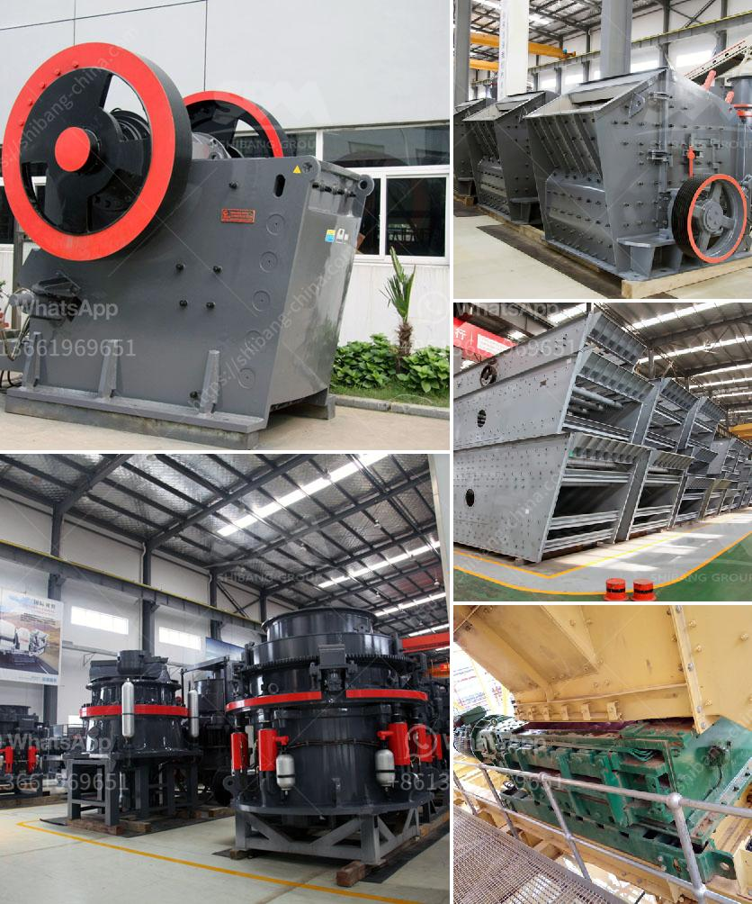

<h3>for sale used mobile jaw crusher philippines</h3>
In recent years, mobile crushing plant is easily the most popular plant in today's mining, quarrying, construction, aggregate production, and so on. In some cases, the stationary plant might be unable to fulfill the necessary demands of the sector, and it may be necessary to employ a mobile unit for immediate transportation. However, buying a brand new mobile jaw crusher can be expensive, so many people are looking for a used option. Luckily, the Philippines is blessed with abundant mineral resources, and its primary industries are mining and quarrying. Used mobile jaw crushers for sale in the Philippines are a suitable choice for those who are in a tight budget and want to buy a mobile jaw crusher plant for their construction waste recycling project, cement manufacturing project, sand and stone quarries, and so on.

To learn more about mobile jaw crusher plant price, composition, and functions, I will explain it in detail in the following parts.

Firstly, the mobile jaw crushing plant integrates the crushing and screening processes, relieving the manual operation, thus enhancing the efficiency and ensuring the safety of the operators. Secondly, it can be moved freely, allowing customers to put it into production immediately or quickly transfer it to another construction site, which saves time and effort.

Thirdly, the mobile jaw crusher is equipped with a crushing unit, which can be called jaw crusher, in order to meet the different needs of customers. Mobile jaw crusher is equipped with a high-performance mobile jaw crusher, and vehicle-mounted feeder vibrating screen and high-intensity short length, light weight; mobility strong adaptability, reduce material transportation cost flexible combination. Whether crushing, crushing or sand making operations, its design philosophy is fully adapted to the various mobile crushing sorting, eliminating the broken ground, environment, the complex infrastructure and complex logistics to customers, reducing the consumption of materials, with flexible combination of direct and efficient, provide a complementary space for users, can quickly and efficiently overcome different conditions such as "broken ground", to the user "broken after the first line", declining to the customer's logistics and time-saving. Truly provide customers with efficient and low-cost operation of the project hardware facilities.

In conclusion, the used mobile jaw crusher plant not only brings great economic benefits but also enhances the environmental protection. Compared with the stationary crushing plant, the mobile crushing and screening plant is easy to move. Its advantages are flexible configuration, low transportation cost, flexible combine, and high adaptability. For the environmentally friendly people, the used mobile jaw crusher plant can be said to be their first choice.
<h3>Contact us</h3><ul><li><strong>Whatsapp:&nbsp;<a href="https://wa.me/8613661969651">+8613661969651</a></strong></li><li><a href="https://swt.shibang-china.com/?git&amp;zhl&amp;for sale used mobile jaw crusher philippines"><strong>Online Service(chat now)</strong></a></li></ul><h3>Related</h3><ul><li><a href='cement mill plant design drawings.md'>cement mill plant design drawings</a></li><li><a href='kenya granite stone crushing plant.md'>kenya granite stone crushing plant</a></li><li><a href='ball mill battery lead pdf.md'>ball mill battery lead pdf</a></li><li><a href='prices continuous ball mill.md'>prices continuous ball mill</a></li><li><a href='crushed aggregates supplier in negros.md'>crushed aggregates supplier in negros</a></li></ul>