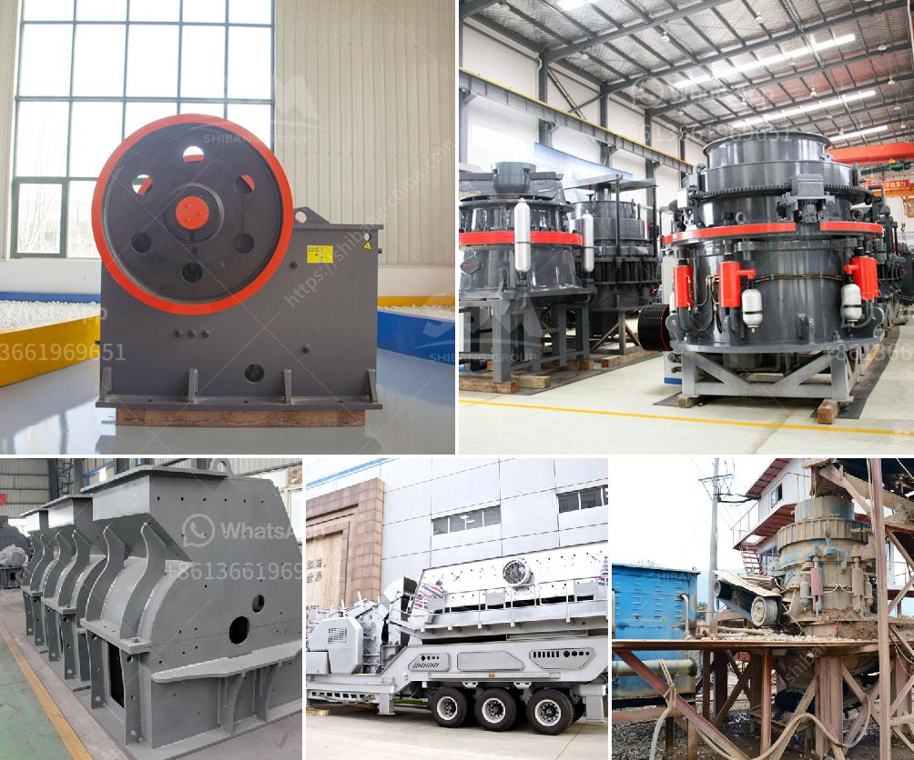

<h3>fortius roller mill</h3>
The milling industry has witnessed several innovations over the years, and the Fortius Roller Mill stands tall as one of the most impressive advancements in the field. Developed by a team of experts at a leading manufacturing company, the Fortius Roller Mill has revolutionized the way grains are processed, delivering exceptional performance and high-quality results. In this article, we will delve into the remarkable features and benefits of this innovative milling solution.

At the heart of the Fortius Roller Mill is an advanced roller system that sets it apart from traditional milling machinery. This cutting-edge technology enhances milling efficiency, producing refined flour with remarkable consistency. The roller system is designed with precision, ensuring optimal grain retention and flour extraction rates. This allows millers to achieve higher yields and increase overall profitability.

The Fortius Roller Mill boasts exceptional durability, thanks to its robust construction and high-quality materials. Each component is carefully engineered to withstand the heavy demands of commercial milling operations. This longevity translates into significant cost savings for millers, as they can avoid frequent equipment maintenance and replacement expenses.

One of the key advantages of the Fortius Roller Mill is its versatility. This milling solution is capable of handling a wide range of grains, from wheat and corn to barley and rice. The adjustable settings allow millers to achieve desired flour characteristics, such as fineness or coarseness, according to specific market demands. This flexibility empowers millers to meet diverse customer preferences, expanding their business potential.

Furthermore, the Fortius Roller Mill prioritizes operational efficiency. The user-friendly interface simplifies the milling process, reducing the training time required for operators. The machine is equipped with intuitive controls, allowing for seamless adjustments to meet varying production needs. Additionally, the Fortius Roller Mill incorporates advanced automation features that optimize throughput, minimize downtime, and improve overall productivity.

Safety is another paramount aspect of the Fortius Roller Mill. The machine is equipped with state-of-the-art safety features that protect operators and maintain operational integrity. Emergency stop buttons, safety interlocks, and comprehensive safety shields are just a few of the mechanisms incorporated into the design. These measures minimize the risk of accidents and ensure a safe working environment.

The Fortius Roller Mill also addresses environmental concerns, featuring an energy-efficient motor that reduces power consumption. Millers can minimize their carbon footprint while maximizing productivity, contributing to a greener future. The machine's efficient design and low energy requirements make it a sustainable choice for millers looking to optimize their operations.

In conclusion, the Fortius Roller Mill is a game-changer in the milling industry. Its advanced roller system, durability, versatility, operational efficiency, safety features, and environmental sustainability make it a top choice for millers worldwide. With its ability to consistently produce high-quality flour and maximize yields, this innovative milling solution sets the bar high for the milling industry. As technology continues to evolve, it is innovations like the Fortius Roller Mill that drive progress and shape the future of the milling industry.
<h3>Contact us</h3><ul><li><strong>Whatsapp:&nbsp;<a href="https://wa.me/8613661969651">+8613661969651</a></strong></li><li><a href="https://swt.shibang-china.com/?git&amp;zhl&amp;fortius roller mill"><strong>Online Service(chat now)</strong></a></li></ul><h3>Related</h3><ul><li><a href='gold ore milling machine.md'>gold ore milling machine</a></li><li><a href='buy 450 kw stone crusher.md'>buy 450 kw stone crusher</a></li><li><a href='crusher plant for sale china.md'>crusher plant for sale china</a></li><li><a href='talc powder conveying systems.md'>talc powder conveying systems</a></li><li><a href='100tpd cement plant project cost.md'>100tpd cement plant project cost</a></li></ul>