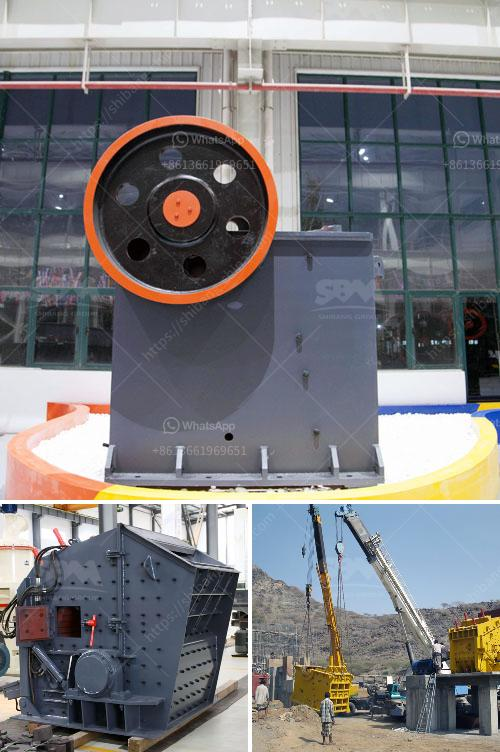

<h3>france used conveyor belts for sale</h3>
France, renowned for its rich history, stunning architecture, and world-class cuisine, is also a hub for various industries and businesses. One such industry that plays a crucial role in the nation's economy is the manufacturing sector. As the demand for efficient transportation systems continues to grow, the use of conveyor belts has become essential. In France, there are numerous options available when it comes to purchasing used conveyor belts, which can provide significant cost savings for businesses.

Conveyor belts offer numerous advantages for industrial operations, allowing for the smooth movement of goods and materials from one location to another. They are commonly used in industries such as food processing, automotive manufacturing, mining, and logistics. By automating the transportation process, conveyor belts enhance efficiency, reduce labor costs, and increase productivity.

When it comes to acquiring conveyor belts, businesses often have two options - purchasing new or used ones. While new conveyor belts may seem like the obvious choice, they come with a considerable price tag, which might not always be feasible for all businesses. This is where used conveyor belts come into the picture, providing a cost-effective alternative without compromising on quality.

In France, there is a wide market for used conveyor belts, catering to the diverse needs of different industries. These belts are usually sourced from companies that have upgraded their equipment or are no longer in operation. Before being sold, these belts undergo a thorough inspection to ensure they are free from any damage or defects. This ensures that businesses can acquire conveyor belts that are in good working condition, saving them from potential breakdowns or costly repairs.

The availability of used conveyor belts opens up opportunities for businesses of all sizes to streamline their operations without breaking the bank. Whether it is a small-scale manufacturing facility or a large logistics center, purchasing used conveyor belts enables businesses to optimize their processes while staying within their budget.

In addition to the cost advantage, buying used conveyor belts also promotes sustainability and environmental responsibility. By giving these belts a second life, businesses contribute to reducing industrial waste and carbon emissions. This aligns with France's commitment to sustainable practices and the global drive towards a greener future.

However, when considering the purchase of used conveyor belts, it is essential for businesses to engage with reputable suppliers. These suppliers should have a track record of providing quality products and offering comprehensive customer support. By partnering with trusted suppliers, businesses can ensure that they are investing in reliable and durable conveyor belts that meet their specific requirements.

In conclusion, France offers a range of options for businesses seeking used conveyor belts. These belts provide a cost-effective solution for enhancing operational efficiency and streamlining transportation processes. By choosing to purchase used conveyor belts, businesses can not only save on costs but also contribute to sustainability efforts. With careful selection and partnership with reputable suppliers, French businesses can effectively optimize their operations and stay competitive in today's fast-paced industrial landscape.
<h3>Contact us</h3><ul><li><strong>Whatsapp:&nbsp;<a href="https://wa.me/8613661969651">+8613661969651</a></strong></li><li><a href="https://swt.shibang-china.com/?git&amp;zhl&amp;france used conveyor belts for sale"><strong>Online Service(chat now)</strong></a></li></ul><h3>Related</h3><ul><li><a href='stone crusher machine for rent or lease india.md'>stone crusher machine for rent or lease india</a></li><li><a href='stone crusher machine manufacturer in ethiopia.md'>stone crusher machine manufacturer in ethiopia</a></li><li><a href='cost new jaw crusher.md'>cost new jaw crusher</a></li><li><a href='high crushing ratio low cost jaw crusher machine.md'>high crushing ratio low cost jaw crusher machine</a></li><li><a href='ball mill 100tph catalog.md'>ball mill 100tph catalog</a></li></ul>