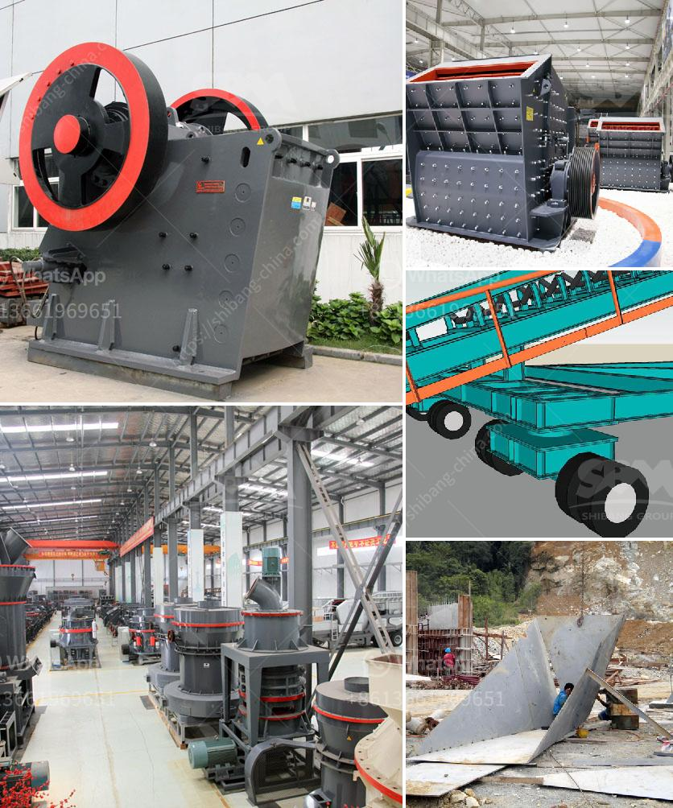

<h3>functions of a mobile crushing plant</h3>
A mobile crushing plant is a unique machine that includes three stages of crushing. It has been around for many years, but the mobile crushing plant is finally reaching its peak. The main characteristics of the mobile crushing plant are: little space required, improved production capacity, environment protection and of course, great mobility.

Currently, it is the most advanced crushing equipment available on the market. The mobile crushing plant is mostly used in mining fields and urban construction waste job sites, for both screening and crushing. The three stages of the crushing process are the primary crushing, secondary crushing, and tertiary crushing.

The primary crushing process will be carried out by a jaw crusher, which consists of a mobile jaw crusher plant. The jaw crusher has the capability to crush 100-300 tons of material per hour. The primary stage will involve the use of a vibrating feeder and a vibrating screen.

The secondary stage of crushing will be carried out by a cone crusher, which will have a screen configured to separate the material. The cone crusher can crush materials up to 1800 mm in diameter.

Finally, the tertiary stage of crushing will occur at the final site, which will be a portable crusher with a screen that is powered by diesel. It will break up the material and further separate it into two categories.

The mobile crushing plant is commonly found in mining fields and construction job sites, with 50-200 tons/hour capacity. However, it can be customized to reach even higher production capacity.

The crushers, vibrating feeders, and vibrating screens are synonymous with high quality and performance. The machine can be assembled quickly and easily without any problems.

With a mobile crushing plant, you will experience an efficient and easy process. Simply choose the size and hardness of the material, select the desired output size of the crushed product, and go! It's as easy as that.

In conclusion, the mobile crushing plant is a reliable and efficient piece of equipment that can process a wide range of materials. It not only simplifies the process but also saves time and money. Users looking for a mobile crushing plant should consider their needs and conduct thorough research before making a final decision.
<h3>Contact us</h3><ul><li><strong>Whatsapp:&nbsp;<a href="https://wa.me/8613661969651">+8613661969651</a></strong></li><li><a href="https://swt.shibang-china.com/?git&amp;zhl&amp;functions of a mobile crushing plant"><strong>Online Service(chat now)</strong></a></li></ul><h3>Related</h3><ul><li><a href='price list coal crusher plant 1500 ton hour.md'>price list coal crusher plant 1500 ton hour</a></li><li><a href='carbon black grinding.md'>carbon black grinding</a></li><li><a href='hammer mill zimbabwe.md'>hammer mill zimbabwe</a></li><li><a href='continuous or discontinuous ball mills.md'>continuous or discontinuous ball mills</a></li><li><a href='mobile stone crusher price south africa for cement in usa.md'>mobile stone crusher price south africa for cement in usa</a></li></ul>