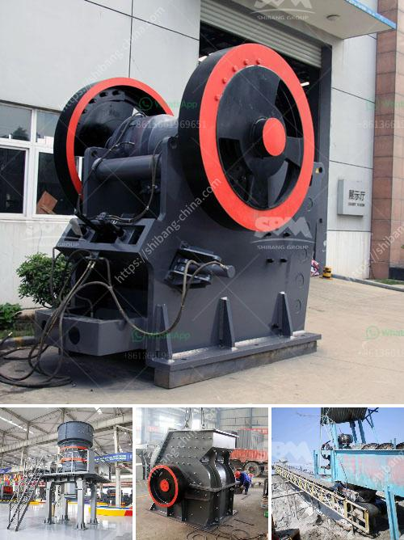

<h3>german crushing stone plant</h3>
Germany, a leading global manufacturer of crushing and screening equipment, has implemented a new modernization and expansion of its facility in Dülmen. This state-of-the-art system has been significantly upgraded and now allows the plant to manufacture crushing and screening equipment for industries including recycling, construction, mining, and demolition.

The crushing stone plants are used for crushing stones and rocks into gravel, aggregate, or other materials for road construction or building purposes. The crushing plants have the capacity to produce a total of approximately 600 tons per hour, ensuring that the plant can handle even the largest feed materials. The engineered machines are specifically designed to be durable and efficient, reducing downtime and increasing productivity.

One of the key features of the German crushing stone plant is being environmentally friendly. The facility is equipped with advanced dust suppression systems that minimize dust emissions during the crushing process. This not only ensures a healthier work environment for the employees but also reduces the impact on the surrounding area. Additionally, the plant utilizes energy-efficient technologies and has incorporated recycling systems for water and other resources, further minimizing its carbon footprint.

The equipment produced at the German crushing stone plant is renowned for its high-quality construction, reliability, and durability. German engineering expertise combined with rigorous quality control ensures that every machine leaving the plant meets the highest industry standards. This makes the equipment highly sought after by customers worldwide who demand superior performance and longevity in their crushing and screening equipment.

The German crushing stone plant is constantly innovating to stay ahead of the competition and meet the evolving needs of its customers. The plant invests heavily in research and development to introduce new technologies, enhancing its range of products and improving overall efficiency. This commitment to innovation has earned the plant a reputation as a market leader in the crushing and screening industry.

Employing a highly skilled workforce, the German crushing stone plant ensures that each machine is meticulously assembled and tested before being dispatched to customers. The plant also provides comprehensive after-sales service and support, offering technical assistance, spare parts, and maintenance programs. This dedication to customer satisfaction has resulted in a loyal customer base that continues to rely on the German crushing stone plant for their crushing and screening needs.

In conclusion, the German crushing stone plant is a leading manufacturer of crushing and screening equipment for the construction, mining, and recycling industries. The plant offers a wide range of robust and reliable machines, designed to handle even the toughest applications. With a commitment to quality, innovation, and environmental sustainability, the German crushing stone plant sets the benchmark for excellence in the industry.
<h3>Contact us</h3><ul><li><strong>Whatsapp:&nbsp;<a href="https://wa.me/8613661969651">+8613661969651</a></strong></li><li><a href="https://swt.shibang-china.com/?git&amp;zhl&amp;german crushing stone plant"><strong>Online Service(chat now)</strong></a></li></ul><h3>Related</h3><ul><li><a href='standard operating procedure for cement manufacturing.md'>standard operating procedure for cement manufacturing</a></li><li><a href='complete ore mining processing line.md'>complete ore mining processing line</a></li><li><a href='specification for stone crushing for roads.md'>specification for stone crushing for roads</a></li><li><a href='roller crusher brick making machine.md'>roller crusher brick making machine</a></li><li><a href='stone crusher plant.md'>stone crusher plant</a></li></ul>