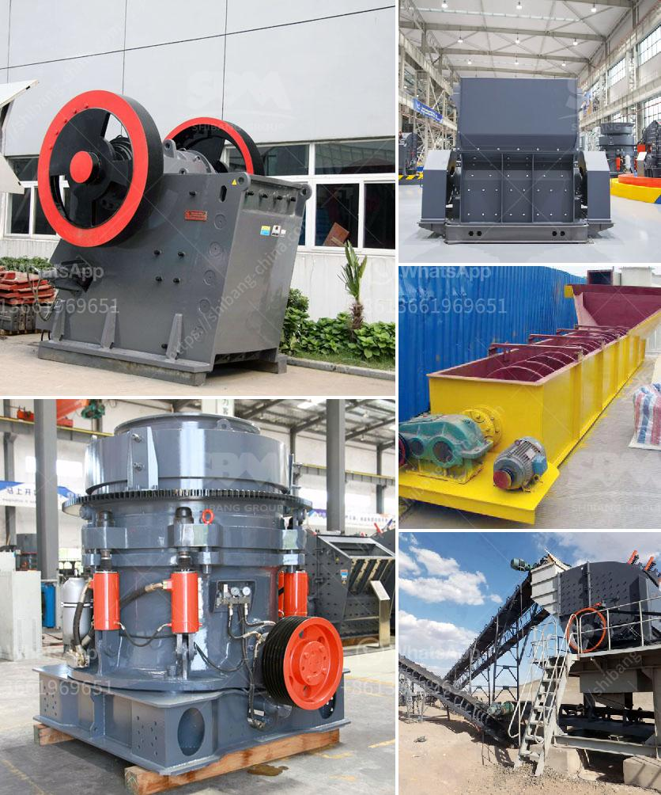

<h3>german technical semi mobile crusher</h3>
German technical semi mobile crusher is used for primary, secondary and fine crushing of all kinds of stones and rocks with compressive strength less than 350 MPa such as granite, marble, and limestone. The mobile crusher is equipped with a crawler track-mounted design for efficient transportation. Easy to operate and environmentally friendly, it allows for fast set-up and dismantling, making it perfect for mobile applications.

The German technical semi mobile crusher is manufactured with advanced technology and stringent quality control at every stage of the manufacturing process, to meet the rigorous demands of aggregate and mining operations. It is known for its reliable performance and high productivity.

The semi mobile crusher offers a flexible mobile solution for processing and recycling construction waste. It can be easily moved from one location to another, reducing the need for multiple equipment setups. This saves time and costs for transportation and allows for maximum efficiency in material processing.

The crusher features a sturdy construction with heavy-duty components, ensuring superior durability and longevity. It is designed to withstand harsh working conditions and heavy materials, making it suitable for various applications.

With its advanced technology and innovative design, the German technical semi mobile crusher provides high-performance crushing capabilities, increasing productivity and reducing operational costs. Its versatile design allows for quick and efficient changing of crusher configurations, providing a wide range of options for different applications.

Overall, the German technical semi mobile crusher is a reliable and efficient solution for crushing and recycling materials. Its advanced technology and robust construction make it an ideal choice for construction, quarrying, and mining industries. Whether for primary, secondary, or fine crushing applications, this mobile crusher delivers high-quality results.
<h3>Contact us</h3><ul><li><strong>Whatsapp:&nbsp;<a href="https://wa.me/8613661969651">+8613661969651</a></strong></li><li><a href="https://swt.shibang-china.com/?git&amp;zhl&amp;german technical semi mobile crusher"><strong>Online Service(chat now)</strong></a></li></ul><h3>Related</h3><ul><li><a href='total cost of machinery of stone crusher.md'>total cost of machinery of stone crusher</a></li><li><a href='harga stone crusher plant merk.md'>harga stone crusher plant merk</a></li><li><a href='small scale iron ore processing plants sale.md'>small scale iron ore processing plants sale</a></li><li><a href='price of mobile crusher in the philippines.md'>price of mobile crusher in the philippines</a></li><li><a href='china clay processing.md'>china clay processing</a></li></ul>