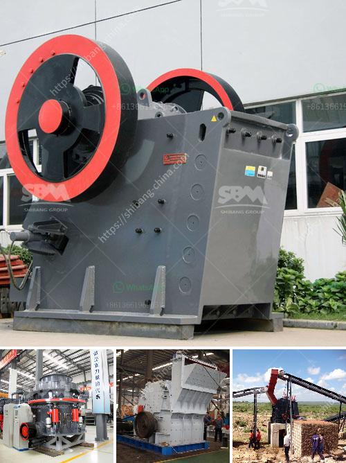

<h3>germany stone crusher</h3>
Germany is renowned for its engineering prowess, making it a popular choice for manufacturing robust and efficient stone crushers. This nation has consistently been at the forefront of technological advancements and, as a result, boasts some of the most advanced stone crushing machinery available. In this article, we will delve into the key aspects that make these German stone crushers stand out from the competition.

One of the primary reasons why German stone crushers enjoy high demand is their exceptional performance capabilities. Unlike many other crushers on the market, German crushers are designed with a unique combination of features that enable them to process even the hardest rocks and stones with ease. Their powerful motors and robust construction allow for high throughput rates and reliable operation, ensuring maximum productivity for construction professionals.

Additionally, German stone crushers prioritize user safety, making them highly sought-after in the industry. These machines are equipped with cutting-edge safety features that minimize the risk of accidents and injuries. For instance, they often come with advanced automation systems that enable remote operation and monitoring. This allows operators to control the crusher from a safe distance, reducing the chance of accidents caused by human error.

Durability is yet another key aspect that sets German stone crushers apart. These machines are engineered to withstand heavy use and harsh working conditions. Whether it is crushing rocks in quarries or processing concrete on construction sites, German stone crushers are built to last. High-quality materials and meticulous manufacturing processes ensure that these crushers can withstand years of demanding operation without losing their performance or structural integrity.

Moreover, German stone crushers are known for their environmentally friendly features. These machines often come with advanced dust suppression systems that reduce air pollution and improve the working environment for operators. Additionally, many German crushers are powered by energy-efficient engines that minimize fuel consumption and contribute to reducing carbon emissions. By choosing a German stone crusher, companies can not only benefit from their exceptional performance but also contribute to a more sustainable future.

In conclusion, German stone crushers are unrivaled when it comes to their performance, safety, durability, and environmental friendliness. These machines are designed to deliver exceptional crushing capabilities, ensuring high productivity and reduced downtime. With cutting-edge safety features, operators can work with peace of mind, knowing that their well-being is prioritized. The durability of German stone crushers means that they will remain operational for years, even in the most demanding conditions. Lastly, the environmentally friendly features of these machines make them a responsible choice for companies looking to reduce their ecological footprint. So, if you are in need of a powerful and reliable stone crusher, look no further than Germany.
<h3>Contact us</h3><ul><li><strong>Whatsapp:&nbsp;<a href="https://wa.me/8613661969651">+8613661969651</a></strong></li><li><a href="https://swt.shibang-china.com/?git&amp;zhl&amp;germany stone crusher"><strong>Online Service(chat now)</strong></a></li></ul><h3>Related</h3><ul><li><a href='coltan milling equipment in south africa.md'>coltan milling equipment in south africa</a></li><li><a href='ball mill pulverizer price.md'>ball mill pulverizer price</a></li><li><a href='clinker powder machine.md'>clinker powder machine</a></li><li><a href='machine de fabrication de sable de platre.md'>machine de fabrication de sable de platre</a></li><li><a href='stone grinding plant.md'>stone grinding plant</a></li></ul>