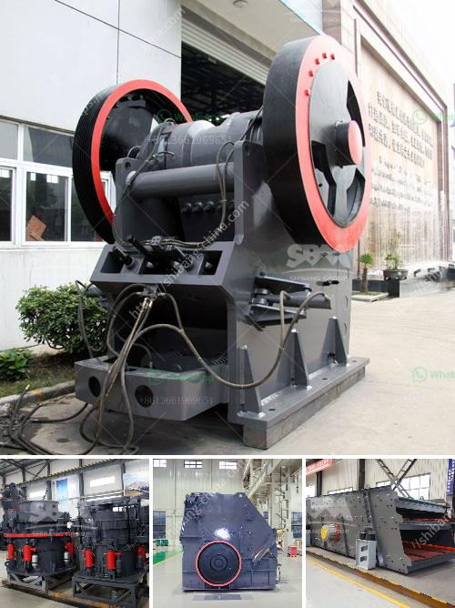

<h3>gold mill three stamp suppliers in south africa</h3>
Gold mining is a booming industry in South Africa, with several large-scale mines dotting the landscape and producing tons of gold each year. However, not all gold miners are able to process their ore at the local mines. Many choose to send it to centralized processing facilities known as gold mills, where the ore is crushed, ground, and processed to extract the valuable gold.

One of the key equipment used in these gold mills is the three-stamp mill. This mill consists of three horizontal cylinders or stamps that are lifted and dropped repeatedly by a mechanism to crush the ore into fine particles. The crushed ore is then mixed with water and further ground to extract the gold.

South Africa is home to several prominent suppliers of these three-stamp mills, which are crucial in the gold mining process. These suppliers are equipped with advanced technology and machinery to ensure efficient and precise crushing and grinding of the ore.

One of the leading suppliers in South Africa is ABC Mining Solutions. They have been operating for over two decades and have earned a reputation for providing high-quality equipment and excellent customer service. ABC Mining Solutions' three-stamp mills are known for their durability and reliability, ensuring minimal downtime and maximum productivity.

Another reputable supplier in the country is XYZ Gold Equipment. Their three-stamp mills are highly sought after by gold mining companies due to their innovative design and efficient performance. XYZ Gold Equipment also offers comprehensive after-sales support and maintenance services to ensure the smooth running of their mills.

In conclusion, gold mills and three-stamp mills are integral in the gold mining process in South Africa. The suppliers of these mills play a crucial role in ensuring the efficiency and productivity of gold mining operations. With their advanced technology and reliable machinery, these suppliers contribute significantly to the country's thriving gold mining industry.
<h3>Contact us</h3><ul><li><strong>Whatsapp:&nbsp;<a href="https://wa.me/8613661969651">+8613661969651</a></strong></li><li><a href="https://swt.shibang-china.com/?git&amp;zhl&amp;gold mill three stamp suppliers in south africa"><strong>Online Service(chat now)</strong></a></li></ul><h3>Related</h3><ul><li><a href='mill grinder for sale.md'>mill grinder for sale</a></li><li><a href='hammer mill zimbabwe.md'>hammer mill zimbabwe</a></li><li><a href='mobile stone crusher price in india.md'>mobile stone crusher price in india</a></li><li><a href='silica washing plant.md'>silica washing plant</a></li><li><a href='jaw crusher pe 250 x 400.md'>jaw crusher pe 250 x 400</a></li></ul>