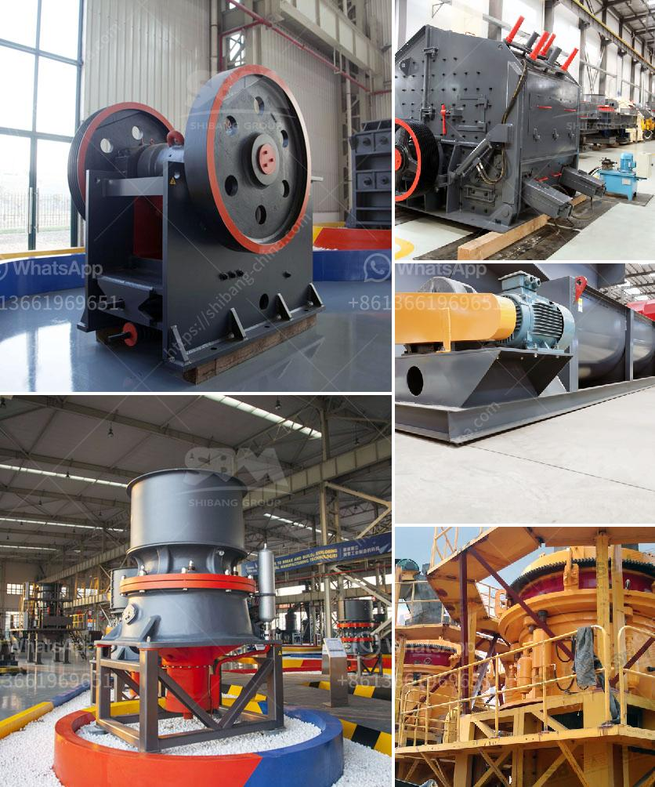

<h3>gold milling equipment prices</h3>
Gold has long been considered a valuable asset and a safe investment option. For centuries, people have been mining and milling this precious metal to extract its pure form, which can be used for various purposes, including jewelry, electronics, and even currency. However, the process of gold milling requires specialized equipment and machinery, which can come at a cost. In this article, we will discuss the prices of gold milling equipment and the factors that influence them.

The prices of gold milling equipment can vary significantly, depending on several factors. Firstly, the type and size of the equipment play a crucial role in determining its cost. Smaller, portable units are generally more affordable compared to larger, industrial-grade machinery. Additionally, the complexity of the milling process also impacts the prices. Sophisticated equipment that can efficiently extract gold from ore tends to be more expensive due to the advanced technology involved.

Another factor influencing the prices of gold milling equipment is the market demand. During periods of high demand and favorable market conditions, the prices tend to rise. Conversely, when the demand decreases or market conditions decline, the prices might fall. It is crucial for buyers to consider the market dynamics and conduct thorough research to make informed decisions about purchasing gold milling equipment.

Moreover, the quality and reliability of the equipment also determine its price. Established brands with a proven track record of producing durable and efficient machinery may command higher prices due to their reputation and customer trust. Conversely, cheaper equipment may be less reliable and prone to breakdowns, eventually leading to additional maintenance and repair costs.

Furthermore, the availability and accessibility of raw materials required for gold milling equipment play a role in pricing. If there is a shortage of raw materials or logistical challenges in obtaining them, it can drive up the prices of equipment.

In conclusion, the prices of gold milling equipment depend on various factors, including the type and size of the equipment, market demand, the quality and reliability of the machinery, and the availability of raw materials. Aspiring buyers should consider these factors and conduct thorough research to make an informed decision. Investing in high-quality equipment from reputed brands might be more expensive initially but can prove to be cost-effective in the long run due to better efficiency and reliability.
<h3>Contact us</h3><ul><li><strong>Whatsapp:&nbsp;<a href="https://wa.me/8613661969651">+8613661969651</a></strong></li><li><a href="https://swt.shibang-china.com/?git&amp;zhl&amp;gold milling equipment prices"><strong>Online Service(chat now)</strong></a></li></ul><h3>Related</h3><ul><li><a href='balance calculations in vertical roller mill.md'>balance calculations in vertical roller mill</a></li><li><a href='crusher and wash plant for sale in china.md'>crusher and wash plant for sale in china</a></li><li><a href='price of stone crusher machine in pakistan.md'>price of stone crusher machine in pakistan</a></li><li><a href='talc mining crusher process.md'>talc mining crusher process</a></li><li><a href='granite processing plant.md'>granite processing plant</a></li></ul>