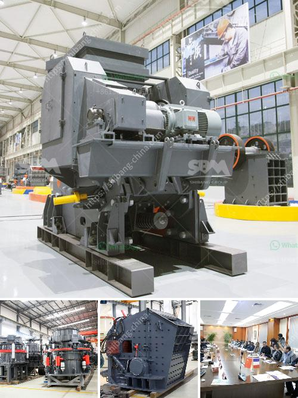

<h3>gold milling plant on small scale</h3>
Gold milling plant on small scale: Prospecting for gold has become increasingly popular in recent years, with many individuals and small-scale miners venturing into various gold-rich areas in search of the precious metal. To facilitate the extraction process, small-scale gold milling plants have become essential, offering a more efficient and profitable way to process gold ore.

A gold milling plant on a small scale refers to a setup with a crushing and milling unit capable of processing a maximum of 100 to 300 tons of ore per day. The potential of such a plant is undeniable, providing a substantial boost to local economies and creating employment opportunities for individuals residing in gold-rich regions.

One of the main advantages of a gold milling plant on a small scale is its affordability and adaptability. Unlike larger-scale operations, small-scale plants are cost-effective and can be easily set up in remote locations without the need for extensive infrastructure. This allows prospectors to access otherwise untapped gold deposits, contributing to the overall gold production.

Another key benefit of small-scale plants is their ability to extract gold efficiently. By crushing the ore into smaller particles, the gold milling plant maximizes the surface area available for the subsequent extraction processes. The finely ground ore can then be processed using traditional methods such as gravity separation, amalgamation, or cyanidation. These techniques help separate and recover gold particles from the ore, enabling miners to extract the maximum amount of gold from their operations.

Furthermore, the establishment of small-scale gold milling plants can reduce the reliance on mercury, a highly toxic substance commonly used in artisanal and small-scale gold mining. By utilizing alternative methods such as gravity separation or cyanidation, miners can minimize their environmental footprint and mitigate the health hazards associated with mercury exposure.

In conclusion, a gold milling plant on a small scale holds great potential for both the miners and the local communities. It offers an affordable and adaptable solution for extracting gold, boosting the local economy, and creating employment opportunities. By embracing these plants, the mining industry can promote sustainable practices and minimize the environmental impact while maximizing the extraction of this precious metal.
<h3>Contact us</h3><ul><li><strong>Whatsapp:&nbsp;<a href="https://wa.me/8613661969651">+8613661969651</a></strong></li><li><a href="https://swt.shibang-china.com/?git&amp;zhl&amp;gold milling plant on small scale"><strong>Online Service(chat now)</strong></a></li></ul><h3>Related</h3><ul><li><a href='mobile crushing unit.md'>mobile crushing unit</a></li><li><a href='suppliers chrome mining equipment in zimbabwe.md'>suppliers chrome mining equipment in zimbabwe</a></li><li><a href='rock crushing equipment price.md'>rock crushing equipment price</a></li><li><a href='trommel small mobile wash plants for sale.md'>trommel small mobile wash plants for sale</a></li><li><a href='mobile crusher equipment manufacturer.md'>mobile crusher equipment manufacturer</a></li></ul>