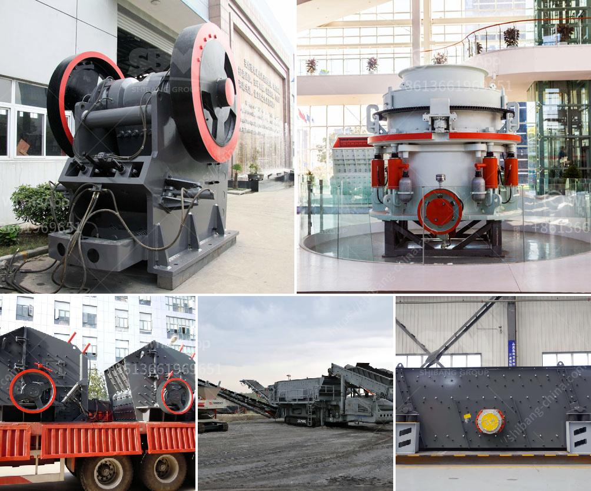

<h3>gold mining and washing machine usa</h3>
Gold mining has always been a popular and lucrative venture in the United States. Today, technological advancements have made the extraction of gold much easier and efficient than ever before. One such tool that has revolutionized gold mining is the washing machine.

In the past, traditional methods of mining gold involved simple tools like pans and sluice boxes. Miners would manually dig up gold-bearing gravel and wash it in a pan, allowing the heavier gold particles to settle to the bottom. While effective, this process was time-consuming and required a significant amount of physical labor.

Fast forward to the present, and we now have washing machines specifically designed for gold mining. These machines are equipped with advanced features and technologies, enabling miners to extract gold more efficiently and in larger quantities. They save time, effort, and increase profits.

So, how exactly does a gold mining washing machine work? The machine is designed to mimic the process of manual gold panning but at a much larger scale. It consists of a drum or a cylinder with small holes along the sides. The gold-bearing gravel is loaded into the drum, and then the machine agitates and spins, similar to the motion of a conventional washing machine.

As the drum rotates, water is continuously added to create a slurry, which helps in the separation process. The slurry then passes through the small holes, allowing the water and lighter sediments to escape, while the heavier gold particles settle at the bottom. The gold-rich sediment is collected and further processed to extract the precious metal.

The advantages of using a gold mining washing machine are numerous. Firstly, it significantly reduces the need for manual labor. A single machine can process a large volume of material in a short amount of time, which means more gold can be extracted with less effort. This not only increases productivity but also decreases the strain on miners' bodies.

Secondly, the machine ensures a higher rate of gold recovery compared to traditional methods. The advanced design and technology optimize the separation process, resulting in a more efficient recovery of gold particles. This means less gold is lost, and miners can maximize their profits.

Lastly, the use of a gold mining washing machine makes the process more environmentally friendly. The machine is equipped with water recycling capabilities, which means that the same water can be reused multiple times. This reduces water consumption and minimizes the impact on local water sources, preserving this precious resource for future generations.

In conclusion, the combination of gold mining and washing machine technology in the USA has revolutionized the industry. These machines have made the extraction of gold quicker, easier, and more efficient, saving miners time, effort, and increasing their profits. With their advanced design, high recovery rates, and eco-friendly features, gold mining washing machines are undoubtedly a winning combination in the quest for gold.
<h3>Contact us</h3><ul><li><strong>Whatsapp:&nbsp;<a href="https://wa.me/8613661969651">+8613661969651</a></strong></li><li><a href="https://swt.shibang-china.com/?git&amp;zhl&amp;gold mining and washing machine usa"><strong>Online Service(chat now)</strong></a></li></ul><h3>Related</h3><ul><li><a href='suppliers of crusher equipment in south africa.md'>suppliers of crusher equipment in south africa</a></li><li><a href='silica sand plant construction.md'>silica sand plant construction</a></li><li><a href='sand making plant.md'>sand making plant</a></li><li><a href='bentonite powder mill manufacturers.md'>bentonite powder mill manufacturers</a></li><li><a href='small scale gold cip processing.md'>small scale gold cip processing</a></li></ul>