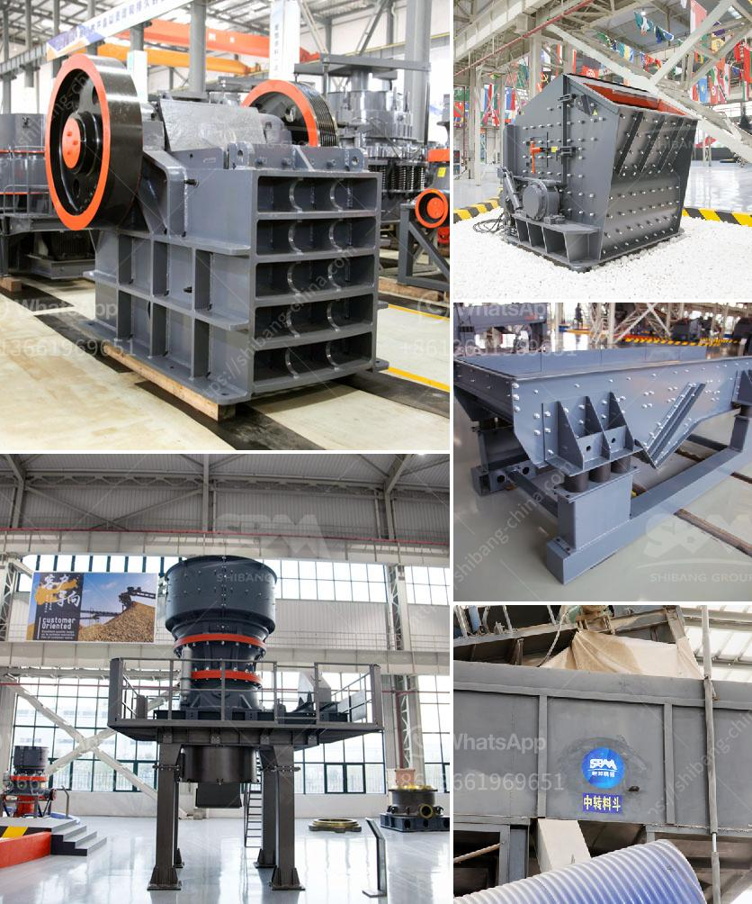

<h3>gold mining equipment companies in china</h3>
Gold mining in China has been steadily increasing over the years, with an annual output of around 450 metric tons in 2020. Known as the world's largest gold producer, China also holds vast reserves of the precious metal. To facilitate this thriving industry, several well-established gold mining equipment companies in China have emerged and are playing a crucial role in the country's mining sector.

One of the leading companies in this industry is Sinolinking. Established in 2002, Sinolinking specializes in the research, development, and production of gold mining equipment. The company offers a wide range of products, including gold trommel wash plants, centrifugal concentrators, gold mineral jig, pulsating sluice boxes, and shaking tables. Sinolinking's equipment is designed for efficient and effective gold recovery and is highly regarded for its durability and reliability.

Another prominent player in the Chinese gold mining equipment market is Shandong Gold-Mining. Founded in 1975, Shandong Gold-Mining has been at the forefront of technological innovation in the industry. The company produces a variety of equipment, such as flotation machines, magnetic separators, and ball mills, to assist in the extraction and processing of gold.

Additionally, Beijing HOT Mining Tech Co., Ltd. is also a notable player in the gold mining equipment sector. The company specializes in the design and manufacture of mining and mineral processing equipment, including gold concentrators, shaking tables, and crushers. With a focus on providing high-quality solutions to its customers, Beijing HOT Mining Tech Co., Ltd. has gained a reputation for its technical expertise and excellent after-sales service.

Apart from these major players, numerous other companies contribute to the gold mining equipment industry in China. For example, Qingzhou Julong Environment Technology Co., Ltd. specializes in the production of dredging, mining, and cleaning equipment. Their gold mining machinery includes cutter suction dredgers, bucket chain dredgers, gold dredging vessels, and gold separation systems.

These gold mining equipment companies in China not only provide advanced and efficient machinery but also offer comprehensive services to their customers. Many of them have established global networks to ensure smooth delivery and technical support.

Moreover, some companies are committed to environmentally friendly mining practices. For instance, Qingzhou Keda Environment Protection Machinery Co., Ltd. focuses on producing eco-friendly gold mining equipment. Their products incorporate advanced technologies to minimize pollution, reduce energy consumption, and optimize resource utilization.

As the gold mining industry continues to thrive in China, these equipment companies play a crucial role in ensuring efficient operations and sustainable practices. Their cutting-edge technology and commitment to customer satisfaction have contributed significantly to the development and growth of the sector. With their continued efforts, China is expected to maintain its position as the top gold producer worldwide.
<h3>Contact us</h3><ul><li><strong>Whatsapp:&nbsp;<a href="https://wa.me/8613661969651">+8613661969651</a></strong></li><li><a href="https://swt.shibang-china.com/?git&amp;zhl&amp;gold mining equipment companies in china"><strong>Online Service(chat now)</strong></a></li></ul><h3>Related</h3><ul><li><a href='prices of stone crushers from nigeria.md'>prices of stone crushers from nigeria</a></li><li><a href='cement clinker processing plant.md'>cement clinker processing plant</a></li><li><a href='canadia crusher portable chassis.md'>canadia crusher portable chassis</a></li><li><a href='jaw crusher for sale in harare.md'>jaw crusher for sale in harare</a></li><li><a href='crush calcite equipment.md'>crush calcite equipment</a></li></ul>