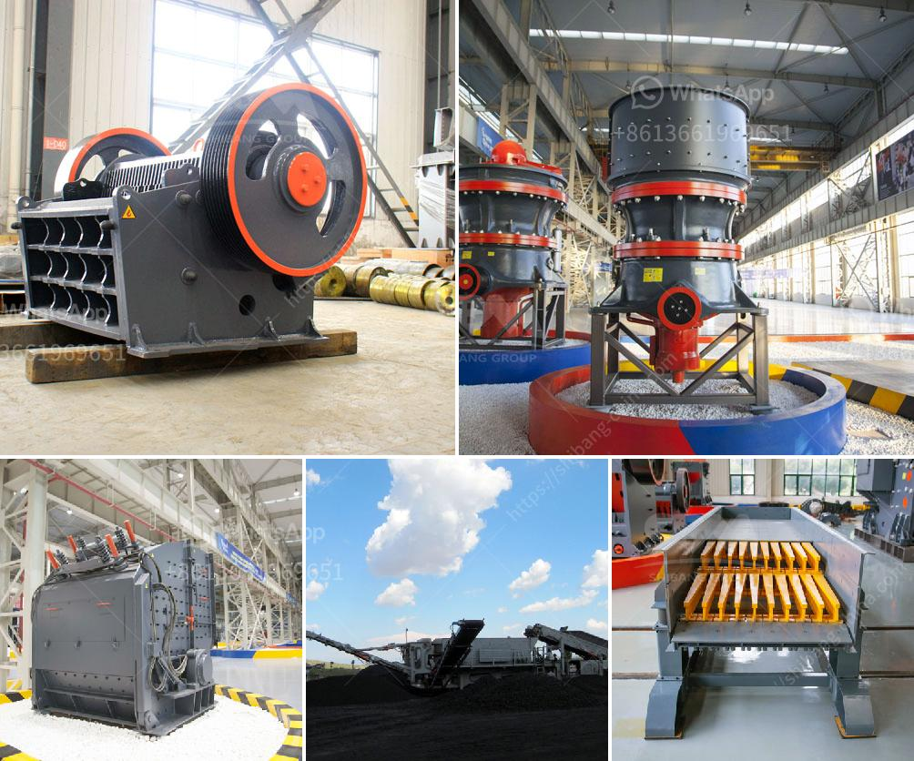

<h3>gold mining equipment south africa</h3>
Gold mining in South Africa has a rich history dating back to the ancient times, and South Africa's gold rush in the late 19th century and early 20th century resulted in the establishment of numerous mines across the country. Today, mining in South Africa is a multimillion-dollar industry and the country is one of the world's top producers of gold.

One of the reasons behind South Africa's dominance in the gold mining sector is the extensive supply of gold mining equipment available in the country. Gold mining equipment is used for extracting, smelting, refining, purifying gold ore. These equipment are specifically designed for gold mining operations and are crucial for mining projects to be successful.

One of the essential pieces of equipment in gold mining operations is a gold detector. These detectors are used to detect the presence of gold in the ground, allowing miners to identify potential gold-rich areas. Gold detectors come in various types and models, including handheld detectors and ground penetrating radar (GPR) systems. These detectors are extremely sensitive and can detect even tiny traces of gold, allowing miners to maximize their chances of finding gold deposits.

Once potential gold-rich areas are identified, the next step in gold mining is the extraction of gold from the ground. This is typically done using heavy machinery such as excavators, bulldozers, and dump trucks. These machines are used to remove the overburden (the soil and rock covering the gold ore), making it accessible for further processing.

After the gold ore is extracted from the ground, it is then crushed into smaller pieces using crushers. The crushed ore is then sent to a mill, where it is ground into a fine powder. The fine powder is then mixed with water and chemicals to create a slurry. This slurry is then pumped into a gold beneficiation plant, where further processing takes place.

Gold beneficiation plants typically include various processes such as gravity separation, flotation, and cyanidation. Gravity separation utilizes the difference in densities between gold and other minerals to separate them. Flotation involves selectively separating gold from other minerals using chemical agents. Cyanidation is the most commonly used method for extracting gold from the ore, where cyanide is added to the slurry to dissolve the gold.

To support these mining operations, South Africa has a vast network of suppliers and manufacturers of gold mining equipment. These companies offer a wide range of equipment, including crushers, screens, mills, and chemical processing equipment, all specifically designed for gold mining operations. These suppliers also provide maintenance, repair, and training services to ensure the safe and efficient operation of the mining equipment.

In conclusion, the success of gold mining in South Africa relies heavily on the availability of reliable and efficient gold mining equipment. Gold detectors, heavy machinery for excavation, and processing equipment are crucial for the successful extraction and refining of gold ore. South Africa is fortunate to have a vast network of suppliers and manufacturers that provide this essential equipment to support the country's gold mining industry. With continued advancements in technology and equipment, South Africa is poised to remain a major player in the global gold mining sector for years to come.
<h3>Contact us</h3><ul><li><strong>Whatsapp:&nbsp;<a href="https://wa.me/8613661969651">+8613661969651</a></strong></li><li><a href="https://swt.shibang-china.com/?git&amp;zhl&amp;gold mining equipment south africa"><strong>Online Service(chat now)</strong></a></li></ul><h3>Related</h3><ul><li><a href='how to make ganpati with marble powdee.md'>how to make ganpati with marble powdee</a></li><li><a href='petitpierre 20tph rapport de projet.md'>petitpierre 20tph rapport de projet</a></li><li><a href='roller mill for gravel.md'>roller mill for gravel</a></li><li><a href='cost of stone crusher production line in china.md'>cost of stone crusher production line in china</a></li><li><a href='quartz grit making machine.md'>quartz grit making machine</a></li></ul>