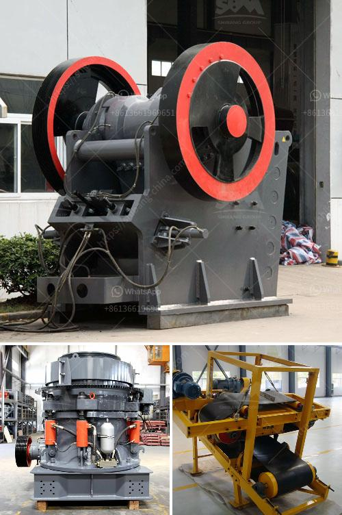

<h3>gold ore ball mill output tph</h3>
Gold ore ball mill is a key equipment to grind the crushed materials, and therefore, the output of this machine has always been an important consideration factor for mining project owners. After outlining some important parameters, it is worthwhile to discuss the factors affecting the output of gold ore ball mill in general. 

To begin with, the hardness and fineness of the ore will affect the output. In general, the harder the ore, the longer it takes to grind, which leads to a lower output. Similarly, fine ore requires more grinding time, resulting in reduced output. Therefore, it is crucial to select the appropriate grinding media and adjust the grinding time to optimize the efficiency and output of the ball mill.

Additionally, the speed of the ball mill rotation will significantly impact its output. Increasing the speed enhances the impact force between the grinding media and ore particles, thus improving grinding efficiency and output. However, when the speed exceeds a certain limit, the centrifugal force becomes dominant, resulting in insufficient grinding and lower output. Therefore, it is vital to find the optimal speed that maximizes the ball mill's output.

Another factor that affects the output of gold ore ball mills is the moisture content in the ore. High moisture content often leads to sticky and agglomerated ores, making it difficult for the balls and ore particles to separate during the grinding process. This leads to a decrease in grinding efficiency and ultimately reduces the output. It is advisable to dry the ore adequately before grinding to ensure optimal grinding efficiency and output.

In conclusion, achieving a high output in gold ore ball mills requires careful consideration of various parameters. These include ore hardness and fineness, grinding media selection, grinding time, rotation speed, and ore moisture content. By optimizing these factors, mining project owners can maximize the efficiency and output of their gold ore grinding processes, thereby increasing their overall productivity and profitability.
<h3>Contact us</h3><ul><li><strong>Whatsapp:&nbsp;<a href="https://wa.me/8613661969651">+8613661969651</a></strong></li><li><a href="https://swt.shibang-china.com/?git&amp;zhl&amp;gold ore ball mill output tph"><strong>Online Service(chat now)</strong></a></li></ul><h3>Related</h3><ul><li><a href='chrome washing machine plant eluvial.md'>chrome washing machine plant eluvial</a></li><li><a href='feasibility on quarry business.md'>feasibility on quarry business</a></li><li><a href='4 rolar raymond mill productions.md'>4 rolar raymond mill productions</a></li><li><a href='ball mill dry grinding 100mt hr capacity.md'>ball mill dry grinding 100mt hr capacity</a></li><li><a href='european stone crusher.md'>european stone crusher</a></li></ul>