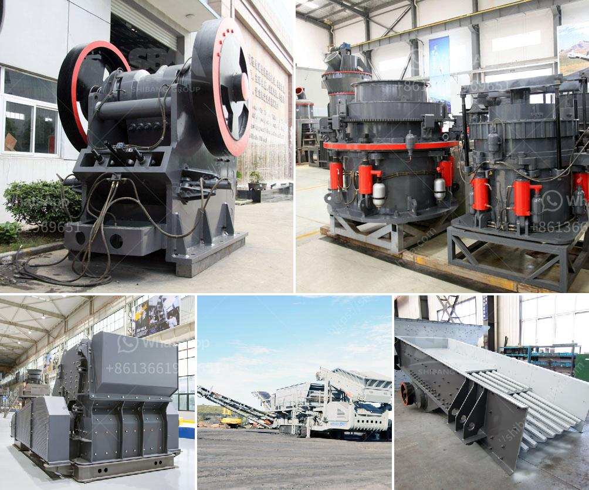

<h3>gold ore mill for sale in canada</h3>
Gold is one of the most precious metals and has been sought after for centuries. Its scarcity and durability make it highly valuable, making the mining and processing of gold a lucrative industry. One crucial piece of equipment used in this industry is the gold ore mill.

The gold ore mill is a specialized piece of equipment specifically designed to pulverize gold-bearing ore into fine particles for further processing. The mill uses steel balls to break down the precious metal-rich rocks into smaller, more manageable sizes. This process allows for efficient gold extraction, as the finer particles are easier to separate from the waste material.

In Canada, a country known for its abundant natural resources, there are several gold ore mills for sale. These mills are typically found in mining towns or regions where gold mining operations are prevalent. Some of the most productive areas for gold mining in Canada include British Columbia, Ontario, and Quebec.

The gold ore mills for sale in Canada come in various sizes, capacities, and power outputs, allowing buyers to choose the right mill for their specific processing needs. Many of these mills are portable and can be transported to remote mining sites, making them ideal for small-scale operations. Additionally, some mills are equipped with advanced technology, such as automatic feeders and control systems, to enhance productivity and efficiency.

Investing in a gold ore mill can be a sound financial decision for individuals or companies looking to enter the gold mining industry or expand their existing operations. However, it is essential to carefully assess the quality and condition of the mill before making a purchase. Conducting thorough inspections, consulting with experts, and reviewing the mill's operational history can help ensure a successful acquisition.

In conclusion, the gold ore mill plays a vital role in the gold mining industry. The availability of gold ore mills for sale in Canada presents an excellent opportunity for investors and mining companies. With proper research and due diligence, buyers can find the right mill for their needs and potentially unlock a wealth of opportunities in the lucrative gold mining sector.
<h3>Contact us</h3><ul><li><strong>Whatsapp:&nbsp;<a href="https://wa.me/8613661969651">+8613661969651</a></strong></li><li><a href="https://swt.shibang-china.com/?git&amp;zhl&amp;gold ore mill for sale in canada"><strong>Online Service(chat now)</strong></a></li></ul><h3>Related</h3><ul><li><a href='stone quarry equipment germany.md'>stone quarry equipment germany</a></li><li><a href='impact crusher manufacturers in saudi.md'>impact crusher manufacturers in saudi</a></li><li><a href='prices of industrial mills prices of crushing plant.md'>prices of industrial mills prices of crushing plant</a></li><li><a href='used crusher machines in sweden.md'>used crusher machines in sweden</a></li><li><a href='crusher unit manufacturer india.md'>crusher unit manufacturer india</a></li></ul>