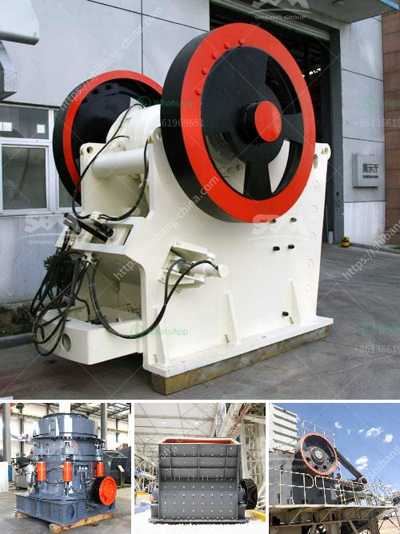

<h3>gold ore milling machine</h3>
Gold ore milling machine is one of the essential tools for gold mining industries, owing to its ability to crush and grind ore into finer particles. Gold ore particles can be efficiently sorted and separated from gangue materials, boosting the productivity of the mine. The gold ore milling machine also known as a gold milling equipment or gold grinding mill is an efficient tool for fine powder processing.

Gold ore milling machine has many types, such as an edge runner wet mill, open mill, roller mill, Raymond mill, superfine grinding machine, trapezium mill, etc. Depending on the size and application, these machines can be used for grinding or crushing gold ore.

The most popular gold ore milling machine is the ball mill. It is used to grind 60mm-100mm gold ore to 0.5mm-10mm particles suitable for gravity separation or flotation. In addition, this machine is equipped with a secondary grinding mill, where the finely ground ore is further processed to improve gold recovery rate.

Gold ore milling machines are often used in small scale mining operations, which is affordable for miners and helps them increase their overall production. With gold prices hitting new highs, smaller operations are becoming more profitable, leading to a surge in demand for gold milling machines.

However, it is crucial to choose the right gold ore milling machine for your operation. Factors such as the type of ore, feed size, desired product size, and milling capacity should be considered. It is also essential to ensure that the machine is reliable, durable, and easy to maintain.

In conclusion, gold ore milling machine is a vital tool for gold mining industries. It can efficiently crush and grind gold ore particles, increasing the overall productivity of the mine. Various options are available, such as ball mills, edge runner mills, Raymond mills, etc., to cater to different needs. It is essential to choose the right milling machine to maximize gold recovery and ensure operational efficiency. With the rising gold prices and increased profitability of smaller operations, the demand for gold ore milling machines is on the rise.
<h3>Contact us</h3><ul><li><strong>Whatsapp:&nbsp;<a href="https://wa.me/8613661969651">+8613661969651</a></strong></li><li><a href="https://swt.shibang-china.com/?git&amp;zhl&amp;gold ore milling machine"><strong>Online Service(chat now)</strong></a></li></ul><h3>Related</h3><ul><li><a href='ultra fine calcium carbonate powder production equipment.md'>ultra fine calcium carbonate powder production equipment</a></li><li><a href='machinery for copper plant.md'>machinery for copper plant</a></li><li><a href='manufacturer of crusher plant of bajri from rajkot.md'>manufacturer of crusher plant of bajri from rajkot</a></li><li><a href='operating parameter of vertical roller mill.md'>operating parameter of vertical roller mill</a></li><li><a href='china clay processing.md'>china clay processing</a></li></ul>