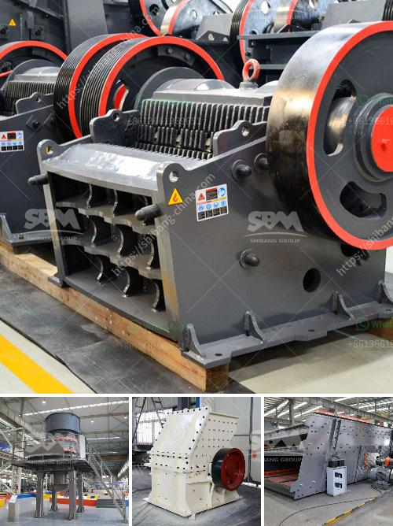

<h3>gold ore refinery portable machinery maker china</h3>
Gold ore refinery portable machinery maker China is a leading global producer of gold, with abundant reserves and a huge market demand. To meet this demand, gold ore refinery portable machinery makers in China have evolved to cater to the changing needs of the industry. These portable machines make the refining process faster, more efficient, and more cost-effective.

China's gold industry has experienced tremendous growth over the years due to its stable economy, high gold consumption, and favorable government policies. As a result, the demand for gold refining machinery has also increased. Portable machinery makers in China have seized this opportunity and developed state-of-the-art equipment to meet the needs of the industry.

One of the key advantages of gold ore refinery portable machinery in China is their mobility. These machines can be easily transported to various mining sites, allowing for on-site processing. This eliminates the need for shipping the raw materials to a centralized refining facility, thereby reducing transportation costs and saving time.

Another key feature of these portable machines is their efficiency. Gold ore refinery portable machinery in China incorporates the latest technological advancements to ensure that the refining process yields high-quality gold at a faster rate. This not only improves productivity but also reduces production costs.

Furthermore, these portable machines are designed to be user-friendly, making them suitable for both large-scale mining operations and small-scale artisanal miners. The simplicity of operation allows miners to easily operate and maintain the machinery, even without extensive technical training.

In addition to their efficiency and mobility, gold ore refinery portable machinery in China is also renowned for its durability and reliability. These machines are built with high-quality materials and undergo rigorous quality control tests to ensure longevity, even in harsh mining environments.

The government of China has also supported the growth of the gold industry by implementing favorable policies, such as tax incentives and simplified regulations. This has attracted numerous manufacturers to invest in the production of gold ore refinery portable machinery in the country.

In conclusion, the gold ore refinery portable machinery maker China has become a vital part of the global gold industry. With their mobility, efficiency, user-friendliness, durability, and reliability, these machines have revolutionized the gold refining process. As the demand for gold continues to rise, the portable machinery makers in China are continuously innovating and improving their products to meet the evolving industry needs.
<h3>Contact us</h3><ul><li><strong>Whatsapp:&nbsp;<a href="https://wa.me/8613661969651">+8613661969651</a></strong></li><li><a href="https://swt.shibang-china.com/?git&amp;zhl&amp;gold ore refinery portable machinery maker china"><strong>Online Service(chat now)</strong></a></li></ul><h3>Related</h3><ul><li><a href='second hand quarry equipment price philippines.md'>second hand quarry equipment price philippines</a></li><li><a href='pakistan quarry crusher manufacturer.md'>pakistan quarry crusher manufacturer</a></li><li><a href='ball mill projects for slag in india.md'>ball mill projects for slag in india</a></li><li><a href='ball milling price.md'>ball milling price</a></li><li><a href='uses of stone crusher equipment pdf.md'>uses of stone crusher equipment pdf</a></li></ul>