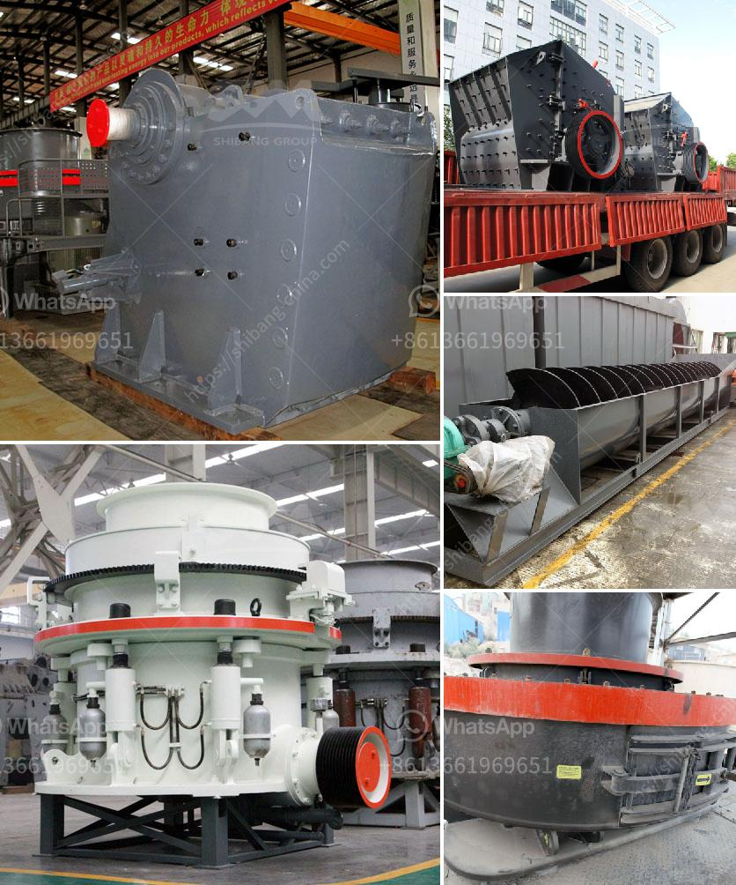

<h3>gold refining and essay report equipment</h3>
Gold refining is the process of purifying gold to remove any impurities or undesirable elements, thus obtaining a high-quality and valuable final product. This process has been practiced for thousands of years, with various methods and technologies evolving over time. Today, modern equipment is widely used in gold refining operations to ensure efficiency, accuracy, and safety.

One of the essential pieces of equipment in gold refining is the gold melting furnace. This device is designed to heat gold to its melting point, typically around 1,064 degrees Celsius (1,947 degrees Fahrenheit). By melting the gold, impurities such as metals and other foreign materials are separated from the precious metal, allowing for further purification.

The gold melting furnace commonly used in gold refining operations is the induction furnace. This type of furnace uses electromagnetic induction to generate heat directly in the gold material. It provides precise temperature control and fast heating, ensuring efficient and uniform melting. Induction furnaces are highly preferred due to their reliability, ease of use, and ability to melt large quantities of gold at once.

Once the gold is melted, further purification is achieved using another crucial piece of equipment called the gold refining crucible. This vessel is durable and resistant to high temperatures, allowing for the separation of impurities from the molten gold. The gold refining crucible accomplishes this through a process called cupellation.

During cupellation, the gold sample is mixed with a substance called cupel, typically made of bone ash or a similar material. The cupel helps absorb impurities as the gold is heated in the crucible. Gradually, the impurities are oxidized and combine with the cupel, leaving behind pure gold. Modern crucibles are often made of high-quality materials like ceramic or graphite, which offer excellent resistance to extreme temperatures and chemical reactions.

To ensure accurate and precise refining results, gold refining equipment often includes sophisticated analytical tools. One common instrument used in gold refining is the spectrometer. This device analyzes the composition of the gold sample, determining the percentage of precious metals such as gold, silver, or platinum present. Spectrometers can also identify trace elements and impurities, enabling refineries to monitor and improve their refining processes.

In addition to the specialized equipment mentioned above, gold refining operations require other essential tools such as crucible tongs, scrap gold recovery systems, and filtration systems. These tools contribute to the efficiency and safety of the refining process.

In conclusion, gold refining is a meticulous process that relies on modern equipment to achieve high-quality and pure gold. The use of gold melting furnaces, refining crucibles, spectrometers, and other tools ensures efficient purification and accurate analysis. As technology continues to advance, gold refining equipment will continue to evolve, providing refineries with enhanced capabilities to produce the most valuable and refined gold possible.
<h3>Contact us</h3><ul><li><strong>Whatsapp:&nbsp;<a href="https://wa.me/8613661969651">+8613661969651</a></strong></li><li><a href="https://swt.shibang-china.com/?git&amp;zhl&amp;gold refining and essay report equipment"><strong>Online Service(chat now)</strong></a></li></ul><h3>Related</h3><ul><li><a href='feasibility study of palm kernel crushing plant.md'>feasibility study of palm kernel crushing plant</a></li><li><a href='mining belt conveyor price.md'>mining belt conveyor price</a></li><li><a href='crusher operator salary in uae and dubai.md'>crusher operator salary in uae and dubai</a></li><li><a href='sand making machine roller mill.md'>sand making machine roller mill</a></li><li><a href='3 roller raymond mill details process.md'>3 roller raymond mill details process</a></li></ul>