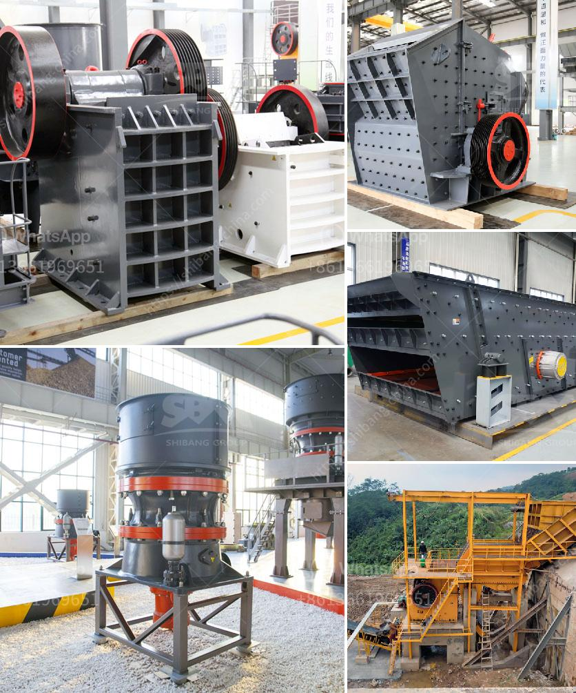

<h3>gold refining plant italia setup</h3>
Italy has long been known for its rich history and cultural contributions. However, it is also making significant strides in the field of gold refining. With the establishment of gold refining plants in the country, Italy is positioning itself as a key player in the production of responsibly sourced and sustainable gold.

Setting up a gold refining plant requires careful planning and adherence to strict regulations. The first step involves obtaining the necessary permits and licenses from the relevant authorities. This ensures that the plant operates in compliance with environmental and safety standards.

The next crucial step is to choose the right location for the plant. An ideal location would have easy access to transportation networks, such as ports and airports, to facilitate the import of raw materials and export of finished products. Additionally, factors such as proximity to reliable power sources and availability of skilled labor must also be considered.

Once the location is finalized, the plant setup can begin. This entails constructing the various processing units, such as crushers, mills, and smelters, needed to extract and refine gold from the raw ore. It is essential to invest in state-of-the-art technology and equipment to ensure efficient and environmentally friendly operations.

One of the main advantages of setting up a gold refining plant in Italy is access to expertise. Italy has a long history of craftsmanship and mastery in jewelry making, which translates into a well-established knowledge base in gold refining techniques. This expertise not only ensures high-quality production but also contributes to the development of innovative and sustainable practices.

Moreover, the establishment of gold refining plants in Italy fosters local economic growth. It creates job opportunities, both directly in the plant and indirectly in support industries. Additionally, it encourages the development of a local supply chain, benefiting local suppliers and businesses.

In conclusion, the setup of gold refining plants in Italy represents a significant step towards sustainable and responsible gold production. By adhering to strict regulations, investing in advanced technology, and leveraging local expertise, Italy is playing a vital role in ensuring that gold is sourced and refined in an environmentally friendly and socially responsible manner. Through this, Italy is not only contributing to its own economic growth but also to the global gold industry as a whole.
<h3>Contact us</h3><ul><li><strong>Whatsapp:&nbsp;<a href="https://wa.me/8613661969651">+8613661969651</a></strong></li><li><a href="https://swt.shibang-china.com/?git&amp;zhl&amp;gold refining plant italia setup"><strong>Online Service(chat now)</strong></a></li></ul><h3>Related</h3><ul><li><a href='vibrating screen price philippines.md'>vibrating screen price philippines</a></li><li><a href='gypsum mines in pakistan.md'>gypsum mines in pakistan</a></li><li><a href='rock crushers for sale ghana.md'>rock crushers for sale ghana</a></li><li><a href='gold separator table for africa.md'>gold separator table for africa</a></li><li><a href='crusher price of nigeria.md'>crusher price of nigeria</a></li></ul>