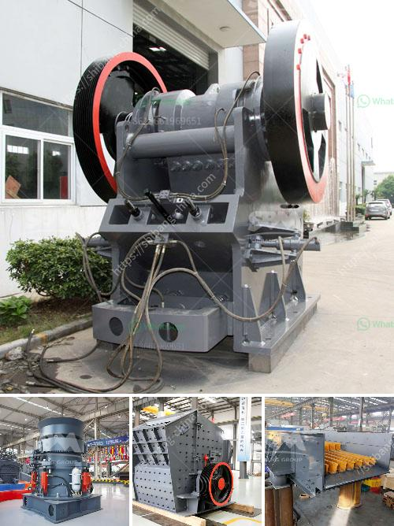

<h3>gold separator table for africa</h3>
The vast mineral-rich lands of Africa have long been recognized for their bountiful resources, including gold. The gold mining industry in Africa has played a crucial role in the continent's economic development, attracting both local and international investors. To maximize gold extraction and achieve higher levels of efficiency, significant advancements have been made in mining equipment and technologies. One such breakthrough is the gold separator table, a game-changer in the industry.

A gold separator table, also known as a shaking table or gravity table, is a technologically advanced device used in gold mining. It works on the principle of gravity separation, where the valuable metals are separated from the gangue materials based on their specific weight and density.

The functioning of a gold separator table is relatively simple and highly effective. The device consists of a slightly inclined table surface that is continuously shaken along its length by a motor-driven mechanism. The shaking motion causes the dense gold particles to settle along the ridges and grooves on the table surface, while the lighter gangue materials are carried away by the water flow.

1. Table surface: Made of reinforced fiberglass, the table surface is designed with riffles, ridges, and grooves that enhance the settling and separation process.

2. Vibratory mechanism: A motor-driven shaking or vibrating mechanism is responsible for creating the necessary motion required to separate gold from other materials.

3. Water supply and discharge system: A consistent water flow is crucial for the efficient operation of a gold separator table. A water supply system provides the necessary amount of water, while a discharge system removes the excess water and discharged materials.

1. Increased Gold Recovery: Gold separator tables have significantly improved the recovery rates, allowing miners to extract more gold from the same amount of ore. This increased efficiency translates into higher profits for both individual miners and larger mining operations.

2. Cost-effectiveness: The use of gold separator tables eliminates the need for complex and expensive chemical processes, making it a cost-effective solution for gold extraction.

3. Environmental Friendliness: Compared to other gold extraction methods, such as amalgamation or cyanide leaching, gold separator tables are much more environmentally friendly. They minimize the use of hazardous chemicals and reduce water and energy consumption.

4. Accessibility: Due to their compact size and ease of installation, gold separator tables are accessible to both large-scale mining companies and smaller, artisanal miners. They can be easily transported and set up in remote areas, contributing to the economic growth of rural communities.

The introduction of gold separator tables has revolutionized the gold mining industry in Africa. These cutting-edge devices have significantly improved the recovery rates, reduced costs, and minimized environmental risks associated with gold extraction. By integrating this innovative technology into their operations, African mining professionals are unlocking new possibilities for the growth and prosperity of the industry on the continent. As the gold separator table continues to gain prominence, Africa's rich mineral reserves can be tapped, bringing economic benefits to both local communities and the continent as a whole.
<h3>Contact us</h3><ul><li><strong>Whatsapp:&nbsp;<a href="https://wa.me/8613661969651">+8613661969651</a></strong></li><li><a href="https://swt.shibang-china.com/?git&amp;zhl&amp;gold separator table for africa"><strong>Online Service(chat now)</strong></a></li></ul><h3>Related</h3><ul><li><a href='grinding and sorting equipment sand gravel.md'>grinding and sorting equipment sand gravel</a></li><li><a href='operation and maintenance manuals of cone crusher.md'>operation and maintenance manuals of cone crusher</a></li><li><a href='cost of belt conveyor coal transport.md'>cost of belt conveyor coal transport</a></li><li><a href='crusher machine manufacturers in india.md'>crusher machine manufacturers in india</a></li><li><a href='conveyor belts in horizontal position.md'>conveyor belts in horizontal position</a></li></ul>