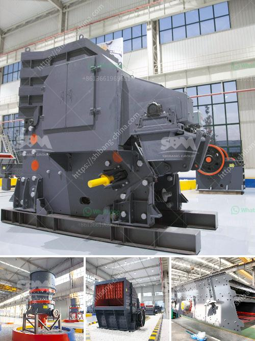

<h3>gold stamping mill prices in south africa</h3>
South Africa is known for its rich deposits of gold, making it a country synonymous with gold mining. In recent years, however, the country's gold mining industry has been on the decline. As a result, many local mining companies have shifted their focus to other precious metals such as platinum and palladium. Still, gold mining remains an important and historical part of South Africa's economy.

One of the key tools used by miners in the early days of gold mining was the stamp mill. These massive machines were used to crush ore and extract gold, and played an important role in the development of the South African mining industry. Today, stamp mills are no longer commonly used, but their historical significance and the stories of hard work and determination associated with them make them an intriguing part of South Africa's heritage.

As for the prices of gold stamping mills, they vary depending on various factors. The condition of the mill, its size, and the materials used in its construction all play a role in determining its value. Additionally, market conditions and the demand for gold can impact the price of a stamp mill.

It is worth noting that while gold stamping mills may no longer be in use in South Africa's mining industry, the country is still home to vast gold reserves. Modern mining methods, including mechanized techniques and chemical extraction processes, have largely replaced stamp mills. However, the legacy of stamp mills lives on, serving as a reminder of the pioneering spirit and determination of those who contributed to South Africa's rich mining history.

In conclusion, gold stamping mills in South Africa have played a crucial role in the development of the country's gold mining industry. While they may no longer be in use, their historical significance and the stories associated with them make them an important part of South Africa's heritage. The prices of stamp mills vary depending on factors such as condition, size, and market demand for gold. Regardless, the value they symbolize is immeasurable, as they remind us of the hard work and perseverance of the early miners who shaped South Africa's mining legacy.
<h3>Contact us</h3><ul><li><strong>Whatsapp:&nbsp;<a href="https://wa.me/8613661969651">+8613661969651</a></strong></li><li><a href="https://swt.shibang-china.com/?git&amp;zhl&amp;gold stamping mill prices in south africa"><strong>Online Service(chat now)</strong></a></li></ul><h3>Related</h3><ul><li><a href='stone crushing machines for brick making.md'>stone crushing machines for brick making</a></li><li><a href='high crushing ratio low cost jaw crusher machine.md'>high crushing ratio low cost jaw crusher machine</a></li><li><a href='ball mill koppers.md'>ball mill koppers</a></li><li><a href='ball mill mesh size.md'>ball mill mesh size</a></li><li><a href='carbonate grinding plant feasibility study.md'>carbonate grinding plant feasibility study</a></li></ul>