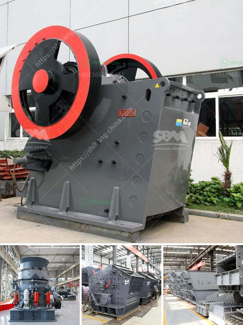

<h3>gold wash plant price in nigeria</h3>
Gold mining has been a significant economic activity in Nigeria for several years. With vast reserves of gold, the country has attracted local and international investors interested in the lucrative business. To effectively mine gold, a wash plant is required to separate the valuable mineral from the waste materials.

A gold wash plant is a machine designed to separate gold-bearing material from the surrounding gravel or soil. It is commonly used in placer mining operations, where gold nuggets or particles are found in loose sediment. The plant uses water and various mechanical processes to separate the valuable gold from the waste material.

The price of a gold wash plant in Nigeria varies depending on the specific model and size. However, the larger and more sophisticated the wash plant, the higher the price tag. Various factors contribute to the variation in price, including the capacity of the plant, the brand, the efficiency of gold recovery, and additional features offered by the manufacturer.

The capacity of a gold wash plant refers to the amount of material it can process within a specific period. Larger wash plants have a higher capacity and can process more material, resulting in higher gold recovery rates. As a result, these plants come with a heftier price tag compared to smaller wash plants.

The brand of the wash plant also plays a role in determining its price. Well-established and reputable brands often come with a higher price due to their quality and reliability. Investing in a trusted brand ensures that the wash plant you purchase is durable and efficient, minimizing potential breakdowns and maximizing gold recovery.

The efficiency of gold recovery is another important factor in determining the price of a wash plant. Higher efficiency means a higher recovery rate of gold from the ore or sediment being processed. Wash plants with sophisticated recovery systems, such as centrifugal concentrators or sluice boxes, tend to be more expensive because of their enhanced gold recovery capabilities.

Additional features, such as automatic feeding systems, water recycling mechanisms, or remote control capabilities, can also increase the price of a wash plant. These features are designed to improve ease of operation and maximize gold recovery efficiency. However, they come at an additional cost.

In Nigeria, the price range for a gold wash plant can vary from a few hundred thousand Naira to several million Naira, depending on the factors mentioned above. It is crucial for potential buyers to carefully consider their budget, mining needs, and long-term goals before investing in a wash plant.

Furthermore, it is advisable to consult with reputable suppliers and manufacturers in the industry to get accurate pricing information and ensure the purchase of a reliable and efficient gold wash plant. Additionally, conducting thorough research and seeking advice from experienced miners can help avoid costly mistakes and maximize return on investment.

In conclusion, gold wash plant prices in Nigeria vary based on the specific model and size, capacity, brand, efficiency of gold recovery, and additional features. Potential buyers should carefully consider their budget and mining needs to make an informed decision before investing in a gold wash plant. Consulting with reputable suppliers and manufacturers is crucial to getting accurate pricing information and finding a reliable and efficient wash plant for gold mining operations in Nigeria.
<h3>Contact us</h3><ul><li><strong>Whatsapp:&nbsp;<a href="https://wa.me/8613661969651">+8613661969651</a></strong></li><li><a href="https://swt.shibang-china.com/?git&amp;zhl&amp;gold wash plant price in nigeria"><strong>Online Service(chat now)</strong></a></li></ul><h3>Related</h3><ul><li><a href='cement factory plant cost.md'>cement factory plant cost</a></li><li><a href='ball milling price.md'>ball milling price</a></li><li><a href='rolling mill raw material.md'>rolling mill raw material</a></li><li><a href='small gravel crushers.md'>small gravel crushers</a></li><li><a href='operating a granite quarry crusher in nigeria.md'>operating a granite quarry crusher in nigeria</a></li></ul>