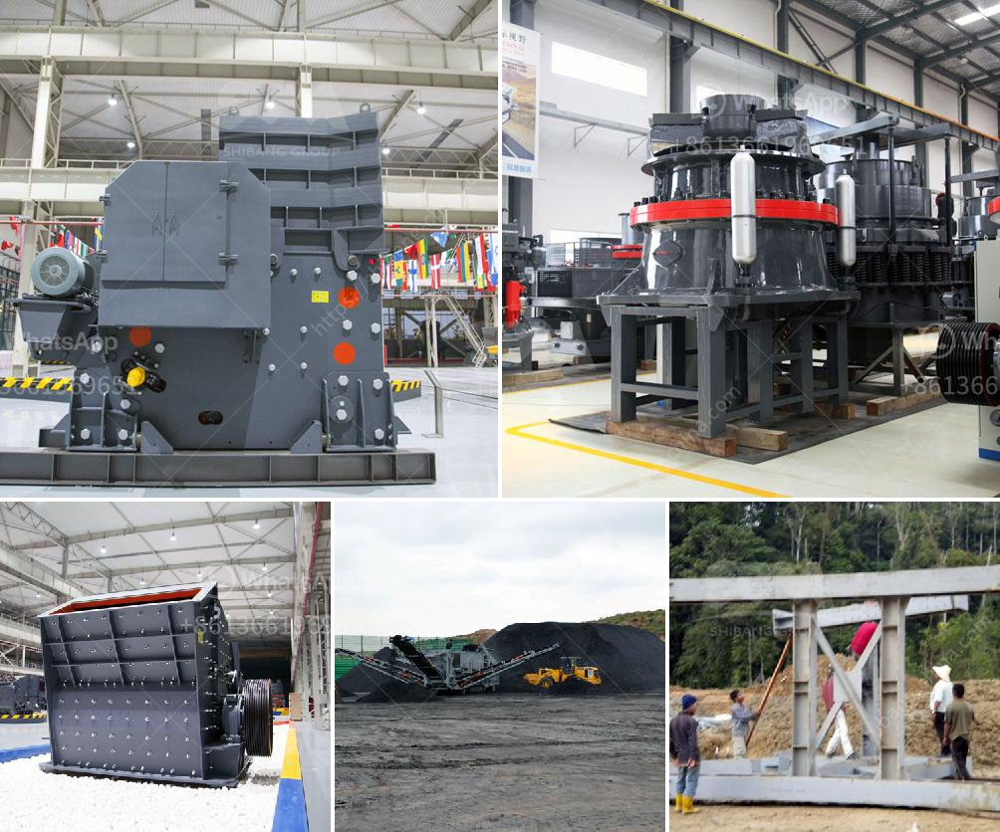

<h3>granite aggregate quarry machinary for sale</h3>
Granite is a common type of igneous rock composed mainly of quartz, mica, and feldspar. This rock has been used for centuries as a building material due to its durability and aesthetic appeal. One of the key components of constructing buildings and infrastructure is granite aggregate, which is a crushed form of granite.

To extract granite aggregate, specialized machinery is required, and this is where granite aggregate quarry machinery comes into play. These heavy-duty machines are specifically designed to crush granite rocks into various sizes, suitable for different construction projects. From small-scale crushers suitable for residential projects to larger machines capable of producing large quantities of aggregate for major construction ventures, there is a wide range of machinery available in the market.

For those looking to invest in a granite aggregate quarry machinery, there are several options available. Many reputable manufacturers and dealers offer machinery for sale that caters to different budget ranges and project requirements. It is advisable to thoroughly research the market and compare various options in terms of machinery features, performance, pricing, and after-sales support.

When purchasing granite aggregate quarry machinery, it is crucial to consider factors such as the crushing capacity, type of crushers, power source, maintenance requirements, and overall operational costs. Additionally, selecting machines from reliable manufacturers ensures that the machinery is of good quality, durable, and designed to meet industry standards.

Investing in granite aggregate quarry machinery offers significant advantages. Firstly, having a dedicated machine on-site helps streamline the production process, increasing productivity and efficiency. This allows for more aggregate to be produced within a shorter timeframe, keeping up with project deadlines. Secondly, owning the machinery provides greater control over quality control, ensuring that the aggregate meets the required specifications.

In conclusion, granite aggregate quarry machinery is essential for the extraction and production of granite aggregate, which serves as a crucial material in construction projects. Investing in high-quality machinery will not only enhance productivity but also ensure that the produced aggregate meets industry standards. With various options available in the market, it is important to research, compare, and select the most suitable machinery for the specific project requirements.
<h3>Contact us</h3><ul><li><strong>Whatsapp:&nbsp;<a href="https://wa.me/8613661969651">+8613661969651</a></strong></li><li><a href="https://swt.shibang-china.com/?git&amp;zhl&amp;granite aggregate quarry machinary for sale"><strong>Online Service(chat now)</strong></a></li></ul><h3>Related</h3><ul><li><a href='ball mill pulverizer price.md'>ball mill pulverizer price</a></li><li><a href='used stone cursher machinery in uae.md'>used stone cursher machinery in uae</a></li><li><a href='jaw crusher technical parameter.md'>jaw crusher technical parameter</a></li><li><a href='germany stone crusher.md'>germany stone crusher</a></li><li><a href='looking for limestone crushing contractor.md'>looking for limestone crushing contractor</a></li></ul>