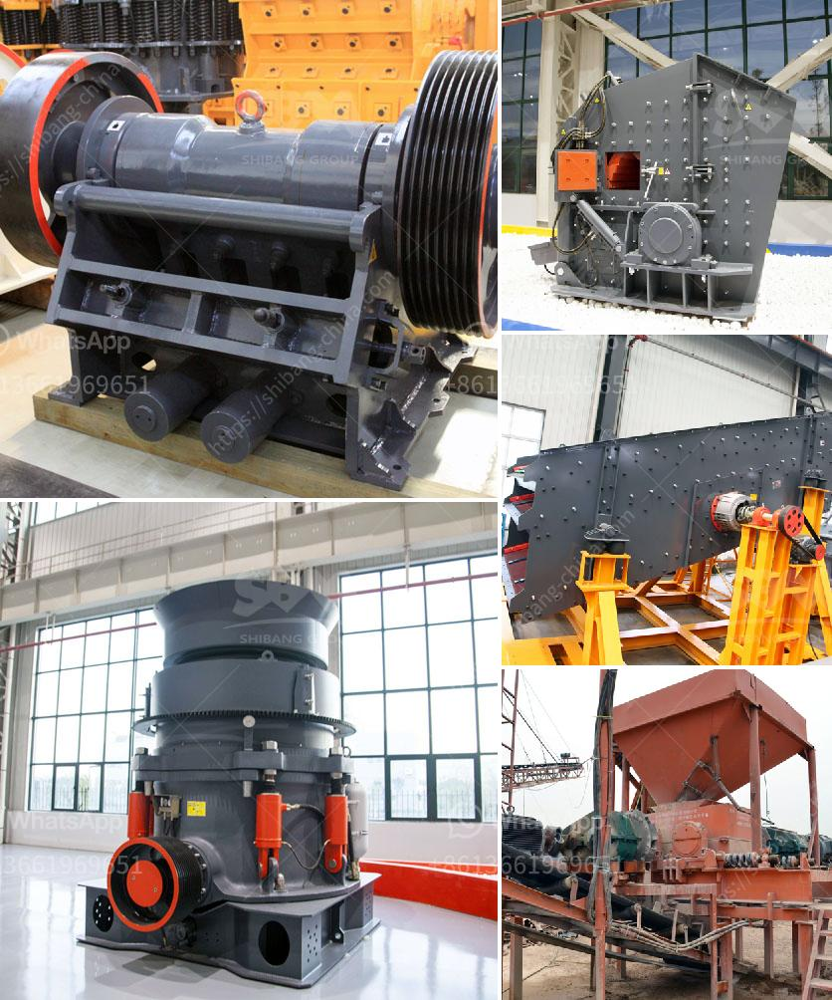

<h3>granite crusher machine companies</h3>
Granite is a natural stone that is primarily composed of quartz, feldspar, and mica. It is found in various colors, textures, and patterns, making it a popular choice for construction and decoration purposes. To extract granite from the earth and transform it into usable products, powerful machines are required. This is where granite crusher machine companies come into play.

Granite crusher machines are essential for the quarry and stone crushing industry. With the rapid development of infrastructure construction, the demand for sand and gravel is also increasing rapidly. It is not easy to get the required final material quality, and users also demand high standards from the products obtained. Therefore, more and more granite crusher machine manufacturers are established all over the world due to the fact that they can maintain their position in the fiercely competitive market.

These companies have advanced technology and equipment that enable them to produce high-quality granite crusher machines. Their machines are designed to crush stones into a specific size and shape, ensuring that they meet the required specifications for various construction projects. Additionally, they are equipped with durable components that can withstand the harsh conditions of a quarry or construction site, ensuring long-term reliability and durability.

One leading company that specializes in granite crusher machines is <Company Name>. With years of experience in the industry, they have developed advanced crushing technology and a team of skilled workers. Their machines are capable of efficiently crushing large quantities of granite into various sizes. Moreover, they offer custom solutions according to the specific requirements of their clients.

Another prominent granite crusher machine company is <Company Name>. They pride themselves on their dedication to quality and innovation. Their machines are known for their high performance, low maintenance, and user-friendly operation. Additionally, they offer a wide range of models to cater to different customer needs. Their machines are widely used in various construction projects worldwide.

In addition to producing high-quality machines, these granite crusher machine companies also provide excellent after-sales service. They have a team of experienced technicians who are available to assist their clients in case of any issues or technical difficulties. They also offer spare parts and regular maintenance services to ensure that their machines continue to operate efficiently.

Furthermore, these companies prioritize environmental impact during the production process. They strive to adopt sustainable manufacturing practices and reduce energy consumption and emissions. They are committed to promoting environmental awareness and contribute to a greener and healthier planet.

In conclusion, granite crusher machine companies play a crucial role in the quarry and stone crushing industry. They produce high-quality machines, designed to crush granite into various sizes for use in different construction projects. These companies are equipped with advanced technology and experienced professionals to meet the growing demands of the market. They also prioritize customer satisfaction, offering excellent after-sales service and promoting sustainable manufacturing practices. As the construction industry continues to grow, the demand for granite crusher machines will only increase, making these companies even more valuable.
<h3>Contact us</h3><ul><li><strong>Whatsapp:&nbsp;<a href="https://wa.me/8613661969651">+8613661969651</a></strong></li><li><a href="https://swt.shibang-china.com/?git&amp;zhl&amp;granite crusher machine companies"><strong>Online Service(chat now)</strong></a></li></ul><h3>Related</h3><ul><li><a href='gypsum plants in india.md'>gypsum plants in india</a></li><li><a href='how much crusher machine.md'>how much crusher machine</a></li><li><a href='used aggregate crusher for sale in india.md'>used aggregate crusher for sale in india</a></li><li><a href='crusher machine manufacturers in india.md'>crusher machine manufacturers in india</a></li><li><a href='limestone processing equipment in south africa.md'>limestone processing equipment in south africa</a></li></ul>