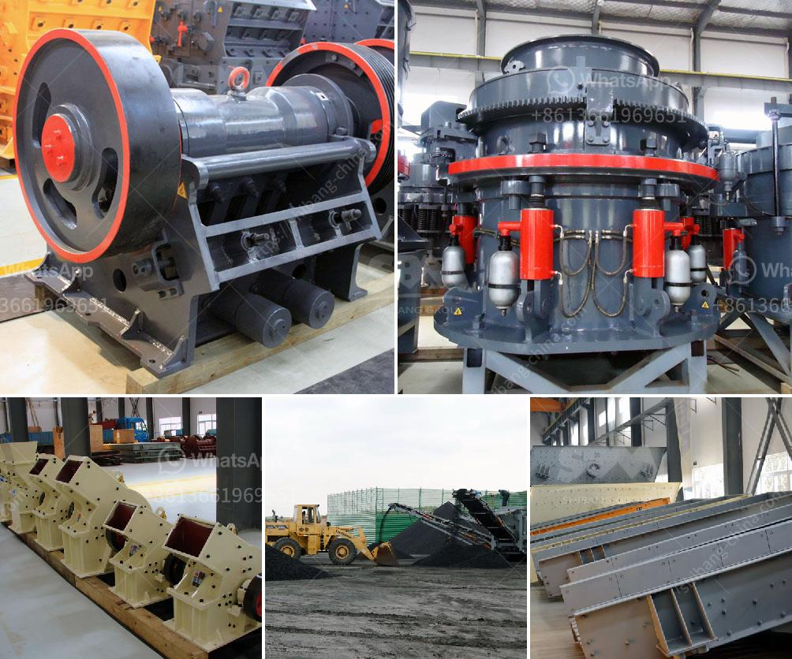

<h3>granite crushing line</h3>
Granite is a hard rock with a saturated uniaxial ultimate compressive strength greater than 30 MPa. For this type of rock, crushing process is performed to reduce its size so that it can be used for many practical purposes. The granite crushing line refers to the crushers and other auxiliary facilities, such as the vibrating feeder, vibrating screen, and belt conveyor. Granites are produced in many countries, but the world-leading producers are China, India, Italy, Brazil, Norway, and South Africa.

Granite is often used as a material for constructing roadways, foundations, and bridge piers. Its strength and durability make it a preferred option for heavy-duty applications. Additionally, granite can also be crushed and used as aggregate in asphalt and concrete production, which enhances the overall strength and quality of the material. Considering the potential demand for granite products in various industries, investing in a granite crushing line can be a lucrative opportunity.

The first step in establishing a granite crushing line is to choose the right crushing equipment for your application. There are different crushers available in the market, including jaw crushers, cone crushers, impact crushers, and vertical shaft impact crushers. Each type of crusher has its own advantages, so it is essential to determine the specific requirements of your project before making a selection. For example, if your project requires a high reduction ratio and cubical end products, a cone crusher or vertical shaft impact crusher may be the best choice.

Once the crusher is chosen, the next step is to design the granite crushing line. A proper layout plan is essential to ensure efficient operation and maximize production efficiency. The layout should consider factors such as the material's hardness, moisture content, and required final product sizes. In addition to the crusher, the auxiliary equipment, including the vibrating feeder, vibrating screen, and belt conveyor, should be carefully designed to facilitate the smooth flow of materials throughout the crushing process.

Another critical aspect of establishing a granite crushing line is to ensure proper maintenance and regular servicing of the equipment. Regular inspection and maintenance can prevent costly breakdowns, enhance equipment performance, and extend its lifespan. It is crucial to follow the manufacturer's recommendations and schedule maintenance activities accordingly.

Moreover, safety protocols must be strictly followed to ensure the well-being of the workforce and the equipment. Appropriate safety measures should be implemented, such as the use of protective gear, following proper procedures, and providing training to the workers.

In conclusion, investing in a granite crushing line can provide a great opportunity to tap into the growing demand for high-quality granite products. However, careful planning, appropriate equipment selection and design, regular maintenance, and adherence to safety protocols are crucial for a successful operation. With the right approach, a granite crushing line can be a profitable venture in the construction and infrastructure development industries.
<h3>Contact us</h3><ul><li><strong>Whatsapp:&nbsp;<a href="https://wa.me/8613661969651">+8613661969651</a></strong></li><li><a href="https://swt.shibang-china.com/?git&amp;zhl&amp;granite crushing line"><strong>Online Service(chat now)</strong></a></li></ul><h3>Related</h3><ul><li><a href='ball mill grinding.md'>ball mill grinding</a></li><li><a href='crusher pirdra crusher puedra.md'>crusher pirdra crusher puedra</a></li><li><a href='crusher machine for sale south africa.md'>crusher machine for sale south africa</a></li><li><a href='mobile crusher on hire in tamil nadu.md'>mobile crusher on hire in tamil nadu</a></li><li><a href='gypsum powder making plant.md'>gypsum powder making plant</a></li></ul>