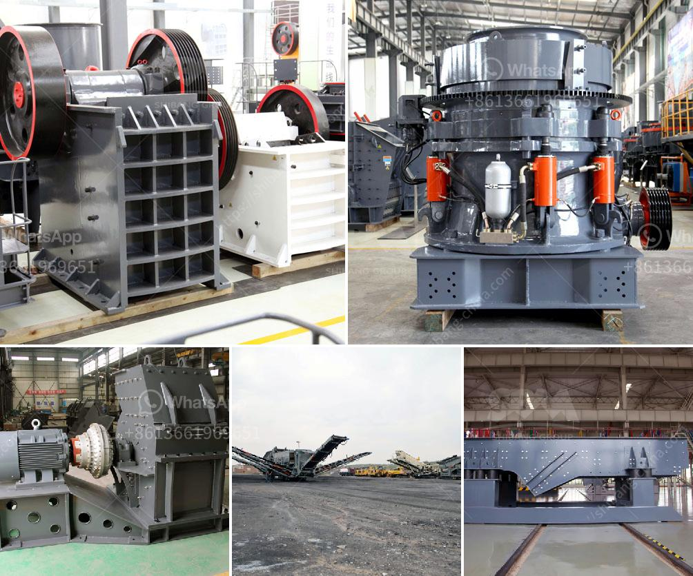

<h3>granite crushing per tonne</h3>
Granite is a common and widely occurring type of intrusive, felsic, igneous rock. Granite has a medium to coarse texture, making it a popular choice for construction projects. One of the main uses of granite is in the construction industry, where it is used as crushed stone and aggregate for various types of construction projects.

When it comes to crushing granite, the initial process is to feed the granite into the jaw crusher evenly and continuously. The jaw crusher is widely used in mining, metallurgy, construction, and other industries. Its crushing ratio is large, crushing efficiency is high, and the finished product is uniform. After primary crushing, the granite is transmitted to the impact crusher or cone crusher through the belt conveyor for secondary crushing.

The impact crusher and cone crusher are commonly used in the secondary crushing process. Both have a variety of models to choose from, with different crushing capacities and output sizes. The impact crusher has the advantages of high crushing ratio, cubic shape of finished product, and low energy consumption. The cone crusher, on the other hand, has the advantages of high efficiency, low energy consumption, and a larger crushing force. Generally, the cone crusher is more suitable for hard materials like granite.

The crushing capacity of a granite crushing plant is usually measured in tons per hour. This is based on the assumption that the average size of granite particles is 500 mm. Considering different specifications of granite, the unit weight of granite is about 2.6-3.3 tons per cubic meter, which means 1 cubic meter of granite weighs about 2.6-3.3 tons.

Granite is a hard and dense material, so the production cost of granite crushing is closely related to the configuration of crushing production line. Kefid is a leading manufacturer of crushing equipment and wear-resistant materials in China. It mainly specializes in producing various types of granite crushing equipment, including jaw crushers, impact crushers, cone crushers, sand making machines, etc. If you want to know more about granite crushing prices, please contact us online or leave a message.

To calculate the cost of crushing granite per tonne, the material weight of the granite shall be multiplied by the value of one cubic meter of granite, which is about 2.6 tons. The cost per tonne of crushing granite is calculated as follows:

On average, one tonne of granite contains about half a cubic meter of sand and about 2 cubic meters of gravel. To satisfy the volume requirement of sand and gravel in a cubic meter of concrete, the proportions of matrix, fine aggregate, and coarse aggregate in the concrete mix must be determined.

In conclusion, crushing granite per tonne can be a complicated process. The crushing capacity varies widely depending on the materials, project specifications, and configuration of the crushing production line. Understanding the specific needs and requirements of the project will help to determine the most suitable crushing equipment and optimize the crushing process to achieve maximum efficiency and cost-effectiveness.
<h3>Contact us</h3><ul><li><strong>Whatsapp:&nbsp;<a href="https://wa.me/8613661969651">+8613661969651</a></strong></li><li><a href="https://swt.shibang-china.com/?git&amp;zhl&amp;granite crushing per tonne"><strong>Online Service(chat now)</strong></a></li></ul><h3>Related</h3><ul><li><a href='5mm limestones grinding to powder.md'>5mm limestones grinding to powder</a></li><li><a href='industrial roller mills.md'>industrial roller mills</a></li><li><a href='clinker plant cost.md'>clinker plant cost</a></li><li><a href='gypsum grinding mill for chalk factory.md'>gypsum grinding mill for chalk factory</a></li><li><a href='list of equipment used in iron ore mining.md'>list of equipment used in iron ore mining</a></li></ul>