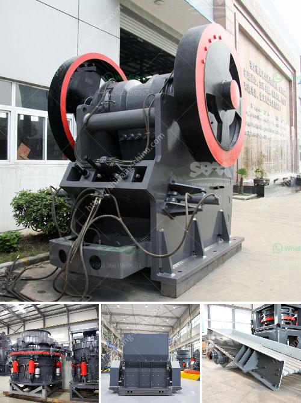

<h3>granite grinder and crushers</h3>
Granite is a popular choice for homes and businesses due to its durability, beauty, and versatility. Whether it’s used as kitchen countertops, flooring, or as decorative pieces, granite adds a touch of refinement to any space. However, working with granite requires specialized tools, such as grinders and crushers, to ensure that the stone is cut and handled properly. In this article, we will explore the importance of granite grinders and crushers in the stone-working industry.

Granite grinders are powerful machines used to perform tasks such as leveling, smoothing, and shaping granite surfaces. These machines use a rotating disc with diamond abrasive pads to grind down the granite until it achieves the desired finish. One of the main advantages of granite grinders is their ability to remove rough surfaces, stains, and scratches from the stone, giving it a polished and uniform appearance.

Furthermore, granite grinders are also essential for shaping granite edges, whether it’s creating bevels, ogee edges, or other decorative profiles. These tools allow craftsmen to achieve precise cuts and curves, enhancing the overall aesthetics of the granite. Moreover, grinders can also be used for removing excess material and thinning granite slabs, making them easier to transport and install.

In addition to grinders, crushers are equally important tools in the stone-working industry. Crushers are heavy-duty machines designed to crush large rocks into smaller, more manageable pieces. They are typically used in quarries and stone processing plants to reduce the size of granite blocks and slabs before they are further processed.

Crushers come in various types, including jaw crushers, cone crushers, and impact crushers. Each type has its unique characteristics and advantages, depending on the specific application and desired end result. For example, jaw crushers are commonly used in primary crushing stages, while cone crushers are often used for secondary or tertiary crushing.

The primary purpose of crushers is to reduce the size of granite so that it can be easily transported and processed later on. Smaller granite pieces are more manageable and can be used for various purposes, such as aggregates for construction, road bases, or even as crushed stone for landscaping projects.

Granite grinders and crushers are essential tools in the stone-working industry, enabling craftsmen to shape, polish, and process granite efficiently. Without these machines, working with granite would be challenging, time-consuming, and could result in less-than-desirable outcomes.

When working with granite, it is crucial to choose the right grinder and crusher for the job. Consider factors such as the size and hardness of the granite, the desired finish or shape, and the specific application requirements. Additionally, proper safety measures and equipment should be used to minimize the risk of accidents or injuries.

In conclusion, granite grinders and crushers play a crucial role in the stone-working industry. These tools provide craftsmen with the ability to shape, polish, and process granite efficiently, resulting in beautiful and durable products. Whether it’s leveling surfaces, shaping edges, or reducing the size of granite blocks, grinders and crushers are essential for achieving the desired outcomes. So, the next time you admire a stunning granite countertop or flooring, remember the hard work and precision that went into its creation with the help of grinders and crushers.
<h3>Contact us</h3><ul><li><strong>Whatsapp:&nbsp;<a href="https://wa.me/8613661969651">+8613661969651</a></strong></li><li><a href="https://swt.shibang-china.com/?git&amp;zhl&amp;granite grinder and crushers"><strong>Online Service(chat now)</strong></a></li></ul><h3>Related</h3><ul><li><a href='jaw crusher supplier in jakarta.md'>jaw crusher supplier in jakarta</a></li><li><a href='cost of belt conveyor coal transport.md'>cost of belt conveyor coal transport</a></li><li><a href='vertical mill rock.md'>vertical mill rock</a></li><li><a href='small scale tin mining design.md'>small scale tin mining design</a></li><li><a href='raymond 5 roller mill.md'>raymond 5 roller mill</a></li></ul>