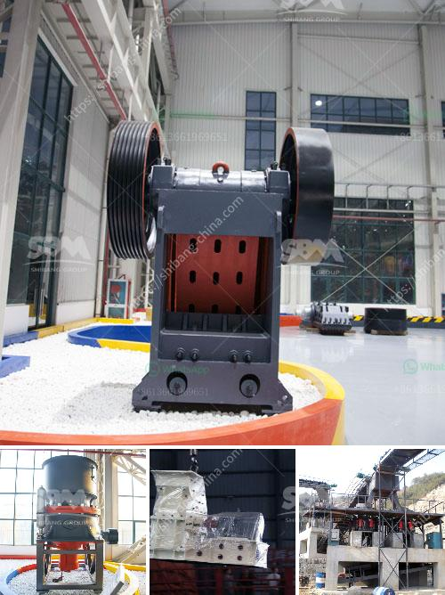

<h3>granite processing plant</h3>
Granite is a natural stone that is widely used in construction and other applications due to its durability, beauty, and versatility. To meet the growing demand for granite, many processing plants have been set up to process granite slabs into various sizes and finishes.

A typical granite processing plant is a combination of several machines such as crushers, screens, conveyors, and feeders to facilitate the crushing, screening, and loading process. The raw materials are unloaded by trucks or excavators into the primary crusher, where oversized pieces of granite are crushed into smaller sizes. The crushed granite is then screened to separate the desired sizes.

After the initial processing, the granite slabs may undergo further treatment to improve their appearance or durability. This includes polishing, honing, or flame finishing the surfaces. These processes involve using specialized machines that smooth the surface of the granite and bring out its natural color and pattern. Additionally, some granite slabs may be treated with sealants to protect them from stains or moisture.

Apart from processing the raw materials, a granite processing plant also takes care of waste management. It is common for processing plants to produce a significant amount of waste material during the cutting, shaping, and finishing processes. This waste, known as granite residue or sludge, can be harmful to the environment if not properly managed. Therefore, it is essential for a granite processing plant to have proper waste management systems in place.

One common practice in managing granite residue is recycling. The sludge can be recycled and used in various applications such as road construction, cement production, or as a raw material for making other stone products. Recycling not only reduces the environmental impact of the waste but also provides a cost-effective solution for the granite processing plant.

In addition to waste management, safety is another crucial aspect of a granite processing plant. The machines used in the processing of granite can be large and powerful, posing potential safety risks to workers. Therefore, all employees should receive proper training on the operation and maintenance of the machinery. Safety measures such as personal protective equipment, machine guarding, and regular inspections should be implemented to ensure a safe working environment for everyone.

In conclusion, a granite processing plant plays a vital role in meeting the demand for granite in various applications. Through the use of specialized machinery and processes, raw granite is transformed into high-quality slabs with different finishes. Waste management and safety are also important considerations for a granite processing plant to minimize its environmental impact and ensure the well-being of its employees. As the demand for granite continues to rise, these processing plants will remain important to the industry.
<h3>Contact us</h3><ul><li><strong>Whatsapp:&nbsp;<a href="https://wa.me/8613661969651">+8613661969651</a></strong></li><li><a href="https://swt.shibang-china.com/?git&amp;zhl&amp;granite processing plant"><strong>Online Service(chat now)</strong></a></li></ul><h3>Related</h3><ul><li><a href='barite bulking process.md'>barite bulking process</a></li><li><a href='mica minerals powder grinding unit in kenya.md'>mica minerals powder grinding unit in kenya</a></li><li><a href='used stone crushers for sale from uae.md'>used stone crushers for sale from uae</a></li><li><a href='conveyor belts in merida.md'>conveyor belts in merida</a></li><li><a href='impact crusher ld pfw.md'>impact crusher ld pfw</a></li></ul>