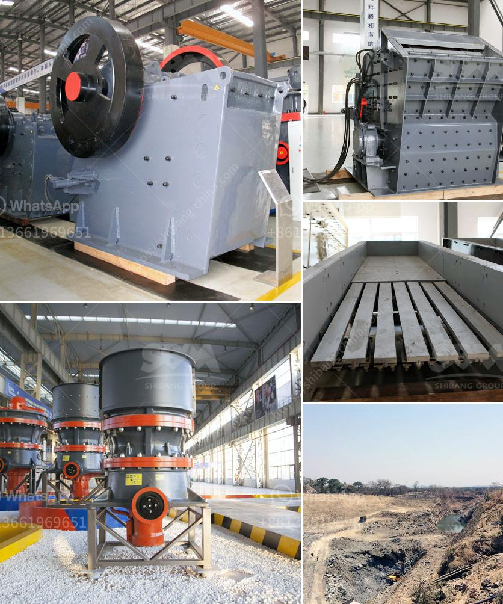

<h3>granite quarry plant in sri lanka</h3>
Granite is a hard, coarse-grained rock that is commonly used for construction purposes. The primary minerals found in granite are mica, quartz, and feldspar, making it an ideal material for a variety of applications. According to estimates, Sri Lanka has over 10 billion tons of granite reserves.

This abundance of granite makes it a highly sought-after resource for both local and international markets. As a result, granite quarrying has become a major industry in Sri Lanka, with numerous quarries spread across the island.

One such quarry is located in Karapitiya, Galle District. The quarry plant, established in 1920, is one of the oldest in the country and was initially operated as a manual quarry. However, with the advancements in technology and machinery, it has since transformed into an automated operation.

The granite extracted from this quarry is of premium quality, known for its durability and aesthetic appeal. It is primarily used as a building material for both residential and commercial projects. The demand for granite in Sri Lanka has been steadily increasing as the construction industry thrives in the country.

The granite quarry plant in Karapitiya employs skilled workers who are proficient in quarrying techniques and the operation of heavy machinery. The quarrying process involves drilling, blasting, and crushing the granite for extraction. Excavators, loaders, and dump trucks are utilized to transport the granite from the quarry to the processing area.

Once the granite has been extracted, it undergoes several processes to enhance its quality and appearance. The blocks are cut into specific dimensions using diamond wire saw machines. These precision cuts ensure that the granite can be used efficiently during construction, reducing wastage.

After cutting, the granite slabs undergo polishing to give them a smooth, glossy finish. This process involves grinding the surface with a series of abrasive stones and pads until it achieves the desired shine. The polished slabs are then ready to be used for various applications, such as flooring, countertops, and wall cladding.

In addition to its commercial use, granite from Sri Lanka is also exported to several countries. The high quality and variety of granite available make it a popular choice for international buyers. Sri Lankan granite is particularly sought after in countries such as India, China, and the Middle East.

While the granite quarry plant in Karapitiya has contributed significantly to the local economy and employment, it is essential to ensure that the quarrying process is conducted sustainably. Quarrying should be done in an environmentally responsible manner, taking into account the impact on local ecosystems.

Implementing proper waste management systems and adhering to strict regulations can help minimize the negative effects of quarrying on the environment. It is also crucial to rehabilitate the quarry sites once extraction is complete, ensuring that the land is restored to its natural state.

The granite quarry plant in Sri Lanka plays a vital role in the construction and infrastructure development of the country. With the increasing demand for granite both locally and internationally, it is essential to ensure sustainable quarrying practices to safeguard the environment for future generations.
<h3>Contact us</h3><ul><li><strong>Whatsapp:&nbsp;<a href="https://wa.me/8613661969651">+8613661969651</a></strong></li><li><a href="https://swt.shibang-china.com/?git&amp;zhl&amp;granite quarry plant in sri lanka"><strong>Online Service(chat now)</strong></a></li></ul><h3>Related</h3><ul><li><a href='used cone crushers zambia.md'>used cone crushers zambia</a></li><li><a href='hydrosizer sand making machine in south africa.md'>hydrosizer sand making machine in south africa</a></li><li><a href='ore crushers benoni.md'>ore crushers benoni</a></li><li><a href='crushed gravel supplier in negros oriental.md'>crushed gravel supplier in negros oriental</a></li><li><a href='limestone process plant.md'>limestone process plant</a></li></ul>