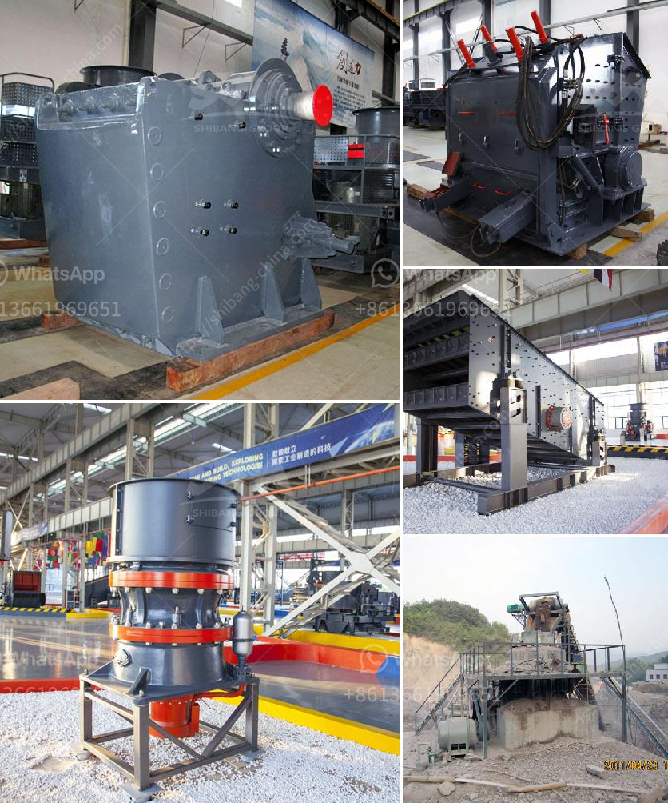

<h3>granite stone hand engraving machine in india</h3>
The art of hand engraving on granite stone has been a traditional practice in India for centuries, with artisans skillfully etching intricate designs onto the hard surface. However, with advancements in technology, the introduction of granite stone hand engraving machines has transformed this age-old craft, making it more efficient and accessible to a wider audience.

Granite stone hand engraving machines offer a range of advantages over manual engraving techniques. The most significant advantage is the precision and speed with which these machines can complete engravings. The machines are equipped with high-speed rotary spindles and diamond-tipped tools that can create intricate patterns and designs with utmost accuracy. This eliminates the human error factor that is inherent in hand engraving, resulting in consistent and flawless engravings every time.

Another advantage of using hand engraving machines is the significant reduction in time and effort required for the completion of a project. Hand engraving on granite stone can be an extremely laborious process, as it requires the artisan to exert a considerable amount of pressure on the stone surface to create the desired design. However, with the use of a machine, the engraver can simply guide the machine along the surface, allowing it to do the heavy work. This not only speeds up the engraving process but also reduces the physical strain on the engraver, making it a more sustainable option.

Furthermore, hand engraving machines offer a greater level of versatility and flexibility compared to manual techniques. These machines usually feature adjustable settings for speed, depth, and other parameters, allowing the engraver to customize the engraving process according to their specific requirements. Additionally, the machines can handle a wide range of stone sizes and shapes, enabling the engraver to work on various projects, from small personalized items to large architectural pieces.

In terms of market availability, granite stone hand engraving machines are becoming increasingly popular in India. With the rise in demand for customized stone engravings, many manufacturers have started producing these machines, catering to the needs of both professional engravers and hobbyists. These machines are now readily available in the market, with a range of models and brands to choose from, offering different features and price points.

The introduction of granite stone hand engraving machines in India has undoubtedly revolutionized the traditional art form. It has not only enhanced the precision and efficiency of the engraving process but has also made it more accessible to a larger audience. Whether it is for creating personalized gifts, memorial plaques, or intricate architectural designs, these machines have opened up a world of possibilities for artisans and enthusiasts alike. As the technology continues to evolve, we can expect even more advanced features and capabilities in the future, further pushing the boundaries of what can be achieved in the art of hand engraving on granite stone.
<h3>Contact us</h3><ul><li><strong>Whatsapp:&nbsp;<a href="https://wa.me/8613661969651">+8613661969651</a></strong></li><li><a href="https://swt.shibang-china.com/?git&amp;zhl&amp;granite stone hand engraving machine in india"><strong>Online Service(chat now)</strong></a></li></ul><h3>Related</h3><ul><li><a href='power draw calculator of ball mill.md'>power draw calculator of ball mill</a></li><li><a href='jaw crusher application.md'>jaw crusher application</a></li><li><a href='cement mill plant design drawings.md'>cement mill plant design drawings</a></li><li><a href='crusher price of nigeria.md'>crusher price of nigeria</a></li><li><a href='grinding mill machine roller mill size.md'>grinding mill machine roller mill size</a></li></ul>