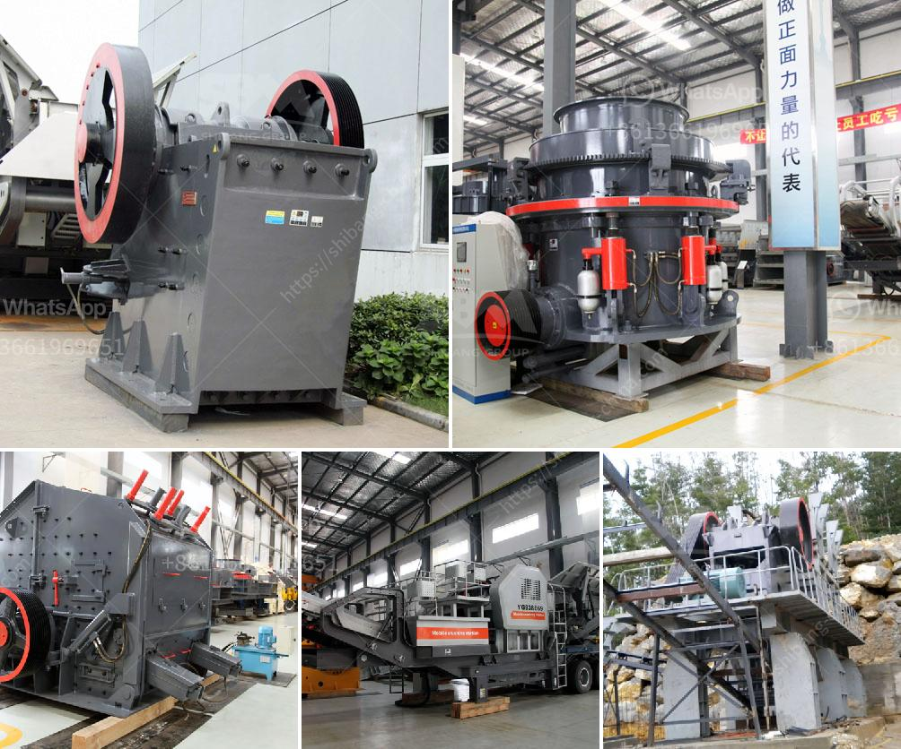

<h3>graphite ball mill</h3>
Graphite ball mills are commonly used in the production of various materials, including cement, silicates, refractory materials, fertilizers, glass, and ceramics. These mills excel at grinding different types of ores, minerals, rocks, and other materials, making them essential tools for many industries.

A graphite ball mill operates by rotating a cylinder filled with spherical grinding media, such as steel or ceramic balls. The material to be ground is added to the cylinder along with the grinding media and mixed thoroughly by the rotating action. As the cylinder rotates, the grinding media cascade and tumble, grinding the material into a fine powder.

One of the primary advantages of using a graphite ball mill is its ability to produce a uniform and fine grind. The grinding media inside the mill effectively reduce the particle size of the material being ground. This ensures that the final product is consistent in size, density, and composition. Moreover, the even and precise grind obtained through ball milling improves the performance of downstream processes, such as flotation or leaching.

Graphite ball mills are known for their versatility, as they can perform a wide range of grinding operations. They can handle both wet and dry grinding, making them suitable for batch and continuous operations. This flexibility allows manufacturers to adapt their processes to different materials, production volumes, and desired particle sizes.

Another advantage of graphite ball mills is their relatively simple construction and low maintenance requirements. These mills typically consist of a cylindrical shell, which contains the grinding media and material. The shell is often lined with wear-resistant materials to protect it from abrasion. The rotation of the mill is driven by a motor, which can be easily controlled to vary the grinding speed and ensure optimal performance.

Despite their numerous benefits, graphite ball mills also have some limitations. For instance, they are not suitable for grinding heat-sensitive or explosive materials due to the high energy input and possible risk of ignition. Additionally, the production of fine powders can be time-consuming and energy-intensive, especially when dealing with materials with high hardness or abrasiveness.

To maximize the efficiency of graphite ball mills, manufacturers often introduce innovative features and technologies. For example, some mills are equipped with mechanisms to control the temperature inside the mill, ensuring that the grinding process remains within specific temperature limits. Others come with advanced control systems that allow precise adjustment of the grinding parameters, such as ball size, rotation speed, and milling time.

In conclusion, graphite ball mills offer numerous advantages in the production of various materials. They deliver a uniform and fine grind, allowing for better control of product properties. They are versatile and can handle both wet and dry grinding operations. While there are limitations to their use, continuous advancements in design and technology are helping to overcome these challenges. As a result, graphite ball mills remain indispensable tools in many industries, contributing to the development of numerous products and processes.
<h3>Contact us</h3><ul><li><strong>Whatsapp:&nbsp;<a href="https://wa.me/8613661969651">+8613661969651</a></strong></li><li><a href="https://swt.shibang-china.com/?git&amp;zhl&amp;graphite ball mill"><strong>Online Service(chat now)</strong></a></li></ul><h3>Related</h3><ul><li><a href='mini rock crusher manufacturer in china.md'>mini rock crusher manufacturer in china</a></li><li><a href='mobile gold processing plant in germany.md'>mobile gold processing plant in germany</a></li><li><a href='ball mill 25 tons per hour price.md'>ball mill 25 tons per hour price</a></li><li><a href='hammer grinder mill.md'>hammer grinder mill</a></li><li><a href='canadia crusher portable chassis.md'>canadia crusher portable chassis</a></li></ul>