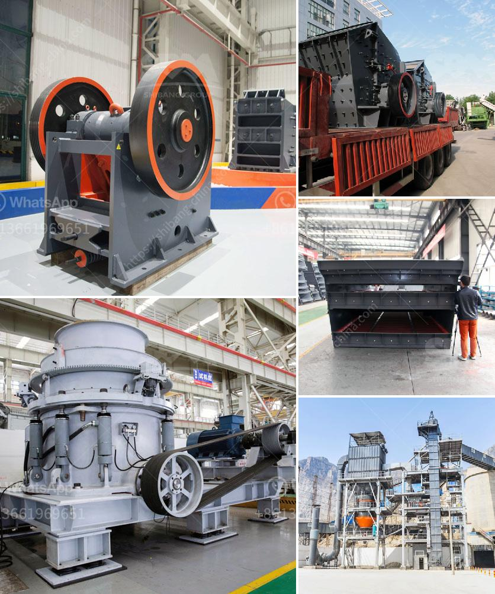

<h3>graphite powder processing equipment</h3>
Graphite is a valuable material used in a variety of industrial applications due to its unique properties. It is known for its high thermal conductivity, lubricating properties, and electrical conductivity. However, before graphite can be used in these applications, it needs to be processed into a powdered form. This article will discuss the equipment used in graphite powder processing.

One of the common methods used to process graphite is mechanical grinding. With advancements in technology, various grinding mills are available to manufacture different sizes of graphite powder. These mills include ball mills, Raymond mills, and vertical mills. Ball mills are commonly used for making small-sized powders, while Raymond mills and vertical mills are used for larger-sized powders.

Another important equipment in graphite powder processing is the classifier. It is used to separate coarse and fine particles in the powder. The classifier ensures that the desired particle size is achieved, which is crucial for the final product's performance. Some commonly used classifiers in graphite processing include air classifiers, centrifugal classifiers, and vibrating classifiers.

After grinding and classifying, the graphite powder may undergo further processes such as drying and purification. Drying equipment, such as rotary dryers, fluidized bed dryers, and spray dryers, are used to remove moisture from the graphite powder. Purification equipment, such as flotation cells and hydrocyclones, are used to eliminate impurities and ensure a high-quality end product.

In recent years, there has been an increased focus on sustainable and energy-efficient processes in graphite powder processing. To meet these demands, advanced technologies have been introduced. One such technology is jet milling, which utilizes high-speed jets of compressed air or steam to grind the graphite into a fine powder. Jet mills are known for their energy efficiency and ability to produce fine, uniform particles.

Aside from conventional grinding and milling equipment, new innovations in graphite powder processing include the use of nano-sized particles. Nano-graphite has unique properties compared to regular-sized graphite, such as increased thermal and electrical conductivity. Nano-sized graphite is produced using methods like high-energy ball milling or chemical vapor deposition.

In conclusion, graphite powder processing requires specialized equipment to achieve the desired particle size, remove impurities, and ensure high-quality end products. Mechanical grinding mills, classifiers, and drying and purification equipment are essential components of the graphite processing industry. Additionally, newer technologies, such as jet milling and the production of nano-sized graphite, are gaining popularity due to their energy efficiency and unique properties. As the demand for graphite continues to grow in various industries, advancements in graphite powder processing equipment will continue to enhance its applications and performance.
<h3>Contact us</h3><ul><li><strong>Whatsapp:&nbsp;<a href="https://wa.me/8613661969651">+8613661969651</a></strong></li><li><a href="https://swt.shibang-china.com/?git&amp;zhl&amp;graphite powder processing equipment"><strong>Online Service(chat now)</strong></a></li></ul><h3>Related</h3><ul><li><a href='crushing and screening costs.md'>crushing and screening costs</a></li><li><a href='aggregate screens for sale.md'>aggregate screens for sale</a></li><li><a href='concrete crusher machine.md'>concrete crusher machine</a></li><li><a href='limestone processing equipment in south africa.md'>limestone processing equipment in south africa</a></li><li><a href='ball mill capacity 100 tph in gujarat.md'>ball mill capacity 100 tph in gujarat</a></li></ul>