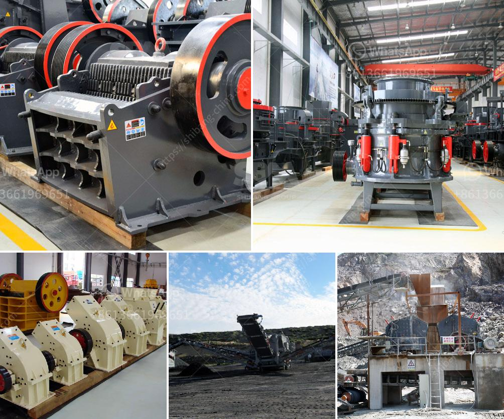

<h3>gravel conveyors and scales for sale</h3>
Gravel conveyors and scales are essential in the mining and construction industries. They play a crucial role in transporting and measuring materials efficiently, saving time and increasing productivity on job sites. Whether you are working on a small-scale project or a large mining operation, investing in high-quality gravel conveyors and scales for sale can significantly benefit your business.

Gravel conveyors, also known as gravel elevators or gravel stackers, are mechanical machines used to transport granular materials such as sand, gravel, and crushed stone. These conveyor systems are designed to move bulk materials quickly and accurately from one location to another. They are commonly used in construction sites, quarries, and mining operations to transport materials to crushers, stockpiles, or trucks for further processing or distribution.

One of the significant advantages of using gravel conveyors is their ability to eliminate manual labor, reducing the risk of injuries and increasing productivity. Instead of relying on manual wheelbarrow operations or expensive cranes, gravel conveyors can handle heavy materials effortlessly. They are designed with durable belts, sturdy frames, and reliable motors to handle various types of gravel efficiently.

Additionally, gravel conveyors can provide a continuous flow of materials, reducing bottlenecks and enhancing workflow on job sites. They can be customized to fit specific project requirements, including length, width, and incline angles. This flexibility allows for efficient material handling, reducing unnecessary downtime and increasing overall productivity.

Moreover, investing in scales for sale alongside gravel conveyors can further optimize efficiency in the material processing and distribution process. Scales are used to accurately measure the weight of materials being transported, ensuring that the right quantities are delivered to the desired locations. This not only helps maintain quality control but also assists in managing inventory and logistics effectively.

Accurate weight measurements are crucial for various applications, from estimating costs and billing clients to meeting regulatory requirements. Scales integrated with gravel conveyors provide real-time data, allowing operators to monitor and adjust material flow as needed. Some advanced systems even feature digital displays and remote monitoring capabilities, enhancing convenience and operational control.

When considering the purchase of gravel conveyors and scales for sale, it is essential to choose reputable manufacturers and suppliers. Look for equipment that is built to withstand harsh working environments and frequent use. Reliable manufacturers typically offer warranties, after-sales service, and spare parts availability.

In conclusion, gravel conveyors and scales provide significant benefits to the mining and construction industries. By investing in these high-quality machines, businesses can streamline material handling, reduce labor costs, and enhance productivity. Whether you are working on a small-scale project or a large mining operation, these efficient systems are a valuable addition to any job site.
<h3>Contact us</h3><ul><li><strong>Whatsapp:&nbsp;<a href="https://wa.me/8613661969651">+8613661969651</a></strong></li><li><a href="https://swt.shibang-china.com/?git&amp;zhl&amp;gravel conveyors and scales for sale"><strong>Online Service(chat now)</strong></a></li></ul><h3>Related</h3><ul><li><a href='crusher supplier pakistan.md'>crusher supplier pakistan</a></li><li><a href='granite aggregate quarry machinary for sale.md'>granite aggregate quarry machinary for sale</a></li><li><a href='rock crushing machine price in india.md'>rock crushing machine price in india</a></li><li><a href='20 ton peru mobile crushing plant.md'>20 ton peru mobile crushing plant</a></li><li><a href='placer mining wash plant operating costs.md'>placer mining wash plant operating costs</a></li></ul>