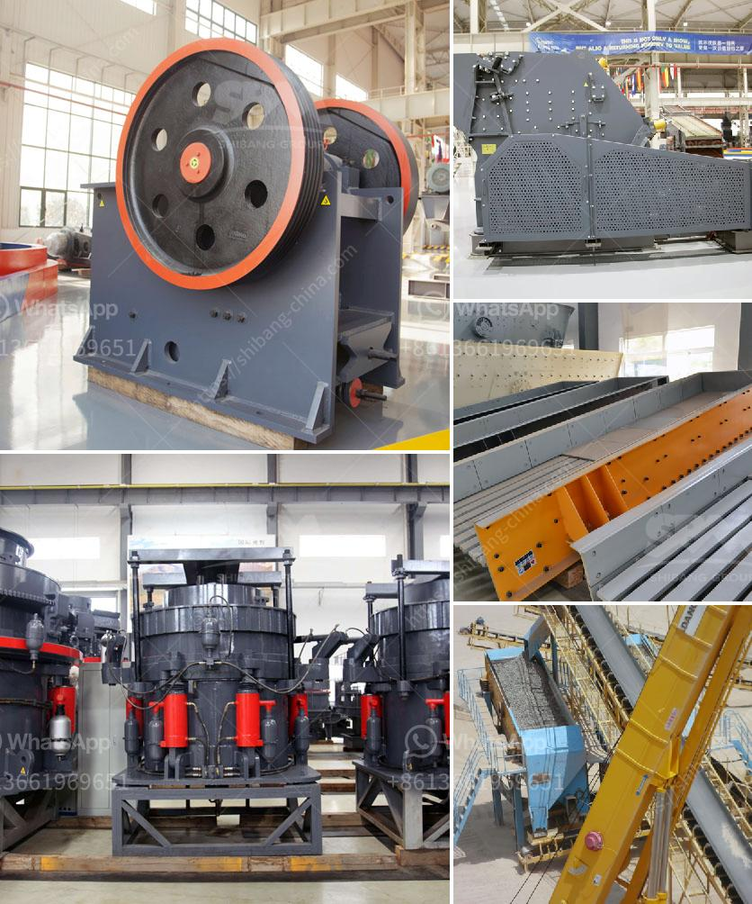

<h3>gravel crushers manufacturers</h3>
Gravel crushers are machines that are widely used to crush and reshape materials for construction purposes. Every rock-crushing machinery being sold in the market is a good product but choosing the best one is what matters the most. One needs to have a good understanding of the features and functionality of the product before making the final decision. Here, we will discuss the top gravel crusher manufacturers in the market.

The competition in the gravel crusher market is fierce. There are many manufacturers who produce durable and reliable gravel crushers in the market, and they all have their own advantages. Therefore, with so many choices, it is necessary to understand the machine's features and choose the one that suits your needs. This article will provide information about some of the top gravel crusher manufacturers.

Firstly, top gravel crusher manufacturers typically provide comprehensive after-sales service, which not only includes installation and commissioning but also includes training on equipment operation and maintenance. Good after-sales service can effectively reduce the downtime and maintenance cost of the equipment and improve its overall lifespan.

In addition, the top gravel crusher manufacturers focus on producing machines that are energy-saving and environmentally friendly. Energy-saving crushers not only reduce production costs but also benefit the environment. Manufacturers are now using advanced technology to develop crushers with lower energy consumption and higher productivity.

Furthermore, the top gravel crusher manufacturers offer customized solutions to meet specific customer needs. They provide a wide range of options for customers to choose the size and type of equipment, as well as provide professional advice based on the customer's production requirements. Customized machines can greatly improve production efficiency and reduce production costs.

Moreover, the top gravel crusher manufacturers prioritize quality and reliability. They use superior materials and advanced manufacturing techniques to ensure the durability and stability of their machines. High-quality crushers can provide better performance and longer service life, which greatly reduce the replacement frequency and maintenance costs.

Lastly, the top gravel crusher manufacturers have a strong research and development team. They continuously invest in technology research and product innovation to keep up with the market demand. These manufacturers constantly improve product performance and develop new crushers to meet the changing needs of customers.

To sum up, when choosing gravel crushers, it is essential to consider factors such as comprehensive after-sales service, energy-saving and environmentally friendly features, customization options, and quality and reliability. By selecting a gravel crusher from one of the top manufacturers, you can ensure that you will get a high-quality machine that meets your specific requirements.
<h3>Contact us</h3><ul><li><strong>Whatsapp:&nbsp;<a href="https://wa.me/8613661969651">+8613661969651</a></strong></li><li><a href="https://swt.shibang-china.com/?git&amp;zhl&amp;gravel crushers manufacturers"><strong>Online Service(chat now)</strong></a></li></ul><h3>Related</h3><ul><li><a href='tonne stone crusher price for hire in cardiff.md'>tonne stone crusher price for hire in cardiff</a></li><li><a href='rubble crushers for sale.md'>rubble crushers for sale</a></li><li><a href='manganese limestone processing unit.md'>manganese limestone processing unit</a></li><li><a href='harga mobile crusher in indonesia.md'>harga mobile crusher in indonesia</a></li><li><a href='ball mill dry grinding 100mt hr capacity.md'>ball mill dry grinding 100mt hr capacity</a></li></ul>