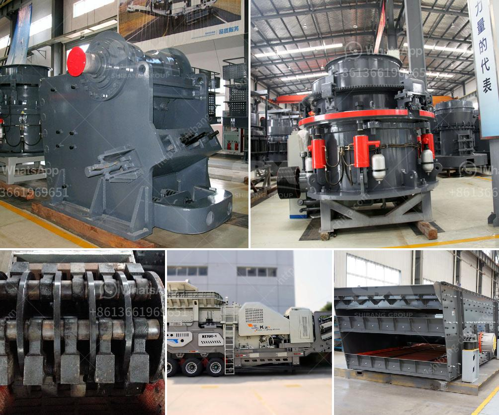

<h3>green rock quarry in sariaya</h3>
The Green Rock Quarry in Sariaya is a prime destination for nature lovers and adventure seekers. Situated in the heart of Quezon province, this 49-hectare quarry boasts crystal clear turquoise waters surrounded by lush greenery, making it a picturesque spot that feels like a hidden paradise.

One of the main attractions of the Green Rock Quarry is its emerald-hued lagoon, which is perfect for swimming and snorkeling. Visitors can take a refreshing dip in the cool waters or explore the underwater world teeming with colorful corals and marine life. Snorkeling gear can be rented on-site, allowing visitors to fully immerse themselves in the beauty beneath the surface.

For those craving more adventure, the Green Rock Quarry offers exciting cliff diving opportunities. Daredevils can leap from the towering cliffs into the deep waters below, experiencing an adrenaline rush like no other. Safety precautions are in place, ensuring that visitors can enjoy this thrilling activity in a secure environment.

Aside from its stunning natural attractions, the Green Rock Quarry also offers a tranquil respite for those seeking solace in nature. The area is surrounded by verdant forests and towering limestone formations, providing the perfect backdrop for a peaceful hike or picnic. The clean and fresh air coupled with the calming sounds of nature make it an ideal place for relaxation and rejuvenation.

Moreover, the Green Rock Quarry is committed to sustainable tourism practices. They prioritize the preservation and conservation of the surrounding ecosystem, ensuring that visitors can enjoy a pristine and eco-friendly environment. They actively participate in reforestation efforts and promote the responsible use of natural resources.

In conclusion, the Green Rock Quarry in Sariaya is a hidden gem that offers a unique blend of natural beauty, adventure, and sustainability. Whether you're looking for a thrilling cliff diving experience, a serene swim in turquoise waters, or simply a peaceful escape into nature, this quarry has something to offer for everyone. So, pack your swimming gear and get ready to immerse yourself in the wonders of the Green Rock Quarry.
<h3>Contact us</h3><ul><li><strong>Whatsapp:&nbsp;<a href="https://wa.me/8613661969651">+8613661969651</a></strong></li><li><a href="https://swt.shibang-china.com/?git&amp;zhl&amp;green rock quarry in sariaya"><strong>Online Service(chat now)</strong></a></li></ul><h3>Related</h3><ul><li><a href='ball mill for size reduct.md'>ball mill for size reduct</a></li><li><a href='stone crusher in uk.md'>stone crusher in uk</a></li><li><a href='crusher machine for sale south africa.md'>crusher machine for sale south africa</a></li><li><a href='manufacturer of barite in pakistan.md'>manufacturer of barite in pakistan</a></li><li><a href='crushing plant coal machine.md'>crushing plant coal machine</a></li></ul>