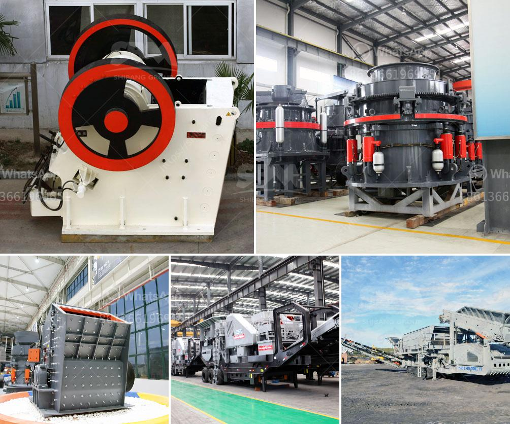

<h3>grinding and sorting equipment sand gravel</h3>
In the construction and mining industries, sand and gravel are essential materials used for various purposes. However, to achieve the desired particle size and quality, these materials often require grinding and sorting. This is where grinding and sorting equipment comes into play, offering a systematic and efficient solution for processing sand and gravel.

Grinding equipment, such as crushers and mills, is used to reduce the size of materials to a suitable range for further processing. These machines utilize force and pressure to break down larger pieces into smaller particles, making them more manageable and ensuring consistent quality. Crushers, for instance, apply mechanical force to compress and deform the materials, while mills use grinding media such as balls or rods to perform size reduction.

Proper grinding not only ensures the desired size but also helps improve the product's overall performance. A well-controlled grinding process allows better chemical reactions and mixing, creating a more homogenous material. This uniformity paves the way for better downstream processes, such as sorting and classifying.

Sorting equipment plays a crucial role in separating sand and gravel based on their particle size and other properties. These machines not only enhance the quality of the processed materials but also improve operational efficiency by reducing waste and optimizing resource usage. Common sorting equipment includes screens, classifiers, and hydrocyclones.

Screens are commonly used in sand and gravel operations to separate materials into different size fractions. They consist of a vibrating surface with various-sized openings, enabling the passage of particles falling within those sizes. Screens can be used in multiple stages, ensuring precise classification and maximizing the recovery of valuable materials.

Classifiers are another type of sorting equipment frequently employed in sand and gravel operations. These machines sort materials based on their size and density, utilizing processes like water-based cyclones, gravitational separation, and air classifiers. Classifiers are crucial for removing fine particles and producing high-quality products with specific size distributions.

Hydrocyclones, a type of centrifugal classifier, use centrifugal force to separate particles based on size and density. They are particularly useful for their high efficiency and ability to handle high volumes of material. Hydrocyclones are commonly used in sand and gravel operations to remove fine particles and improve the quality of the final product.

The combination of grinding and sorting equipment enables sand and gravel operations to achieve efficient and high-quality processing. By reducing the size of materials through grinding, the subsequent sorting process becomes more manageable, leading to better resource utilization and product quality. Moreover, these machines offer versatility, allowing operators to adjust parameters to meet specific requirements and optimize production.

In conclusion, grinding and sorting equipment play a crucial role in sand and gravel operations. These machines help achieve the desired particle size and quality, ensuring better performance of the processed materials. By reducing waste and optimizing resource usage, grinding and sorting equipment enhance operational efficiency, ultimately leading to cost savings and improved customer satisfaction.
<h3>Contact us</h3><ul><li><strong>Whatsapp:&nbsp;<a href="https://wa.me/8613661969651">+8613661969651</a></strong></li><li><a href="https://swt.shibang-china.com/?git&amp;zhl&amp;grinding and sorting equipment sand gravel"><strong>Online Service(chat now)</strong></a></li></ul><h3>Related</h3><ul><li><a href='second hand quarry equipment price philippines.md'>second hand quarry equipment price philippines</a></li><li><a href='crushed aggregates supplier in negros.md'>crushed aggregates supplier in negros</a></li><li><a href='concrete cube crushing machine price.md'>concrete cube crushing machine price</a></li><li><a href='enquiry about sand making machine.md'>enquiry about sand making machine</a></li><li><a href='ball milling price.md'>ball milling price</a></li></ul>