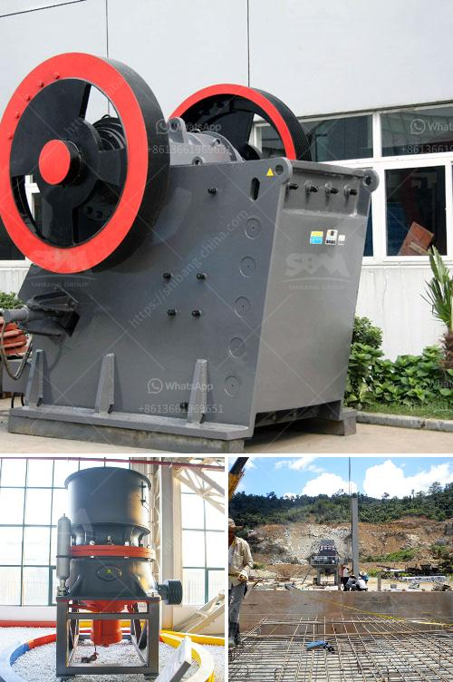

<h3>grinding machines for zinc stearate</h3>
Zinc stearate is a widely used chemical compound that serves as an effective lubricant in various industrial applications. Its unique properties make it an ideal choice for industries such as plastics, rubber, and cosmetics. To achieve the desired characteristics of zinc stearate, manufacturers rely on high-quality grinding machines.

Grinding machines play a crucial role in the production of zinc stearate. They help in reducing the particle size of the material, enabling it to mix and blend easily with other components. The process involves the use of mechanical force to break down the larger particles into smaller, uniform sizes, ensuring uniform dispersion throughout the end product.

One of the primary reasons why grinding machines are essential in zinc stearate production is to enhance efficiency. With the help of these machines, manufacturers can achieve consistent particle size reduction, resulting in a more homogeneous product. This consistency is vital as it ensures that the zinc stearate performs its intended functions efficiently.

Moreover, grinding machines for zinc stearate play a significant role in enhancing productivity. These machines are designed to handle large volumes of material, allowing manufacturers to meet their production targets effectively. By automating the grinding process, manufacturers can minimize manual labor and reduce the risk of human error, resulting in higher output rates and improved overall productivity.

When selecting grinding machines for zinc stearate production, several factors need to be considered. First and foremost, it is crucial to choose machines that are specifically designed for the task. These machines should be capable of handling the unique properties of the material, ensuring a high level of efficiency and productivity.

Another important factor to consider is the quality of the grinding machines. Investing in high-quality machines can significantly impact the production process. These machines should be durable, reliable, and able to withstand continuous use. Poorly constructed machines may result in frequent breakdowns, leading to costly repairs and production delays.

Furthermore, the grinding machines should be equipped with advanced features to optimize the grinding process. For instance, adjustable grinding speed and pressure can be beneficial in achieving the desired particle size distribution. Additionally, machines with built-in cooling systems can prevent overheating, ensuring the integrity of the zinc stearate during grinding.

Regular maintenance and servicing of grinding machines are equally important. Proper maintenance of these machines can extend their lifespan, reduce downtime, and ensure consistent performance. It is essential to lubricate moving parts, inspect for wear and tear, and clean the machines regularly. By following a maintenance schedule, manufacturers can avoid unexpected breakdowns and maintain a smooth production flow.

In conclusion, grinding machines for zinc stearate play a critical role in enhancing efficiency and productivity in the manufacturing process. These machines enable manufacturers to achieve consistent particle size reduction, yielding a more uniform end product. By investing in high-quality machines and implementing proper maintenance, manufacturers can optimize their production processes, resulting in a cost-effective and reliable supply of zinc stearate for various industries.
<h3>Contact us</h3><ul><li><strong>Whatsapp:&nbsp;<a href="https://wa.me/8613661969651">+8613661969651</a></strong></li><li><a href="https://swt.shibang-china.com/?git&amp;zhl&amp;grinding machines for zinc stearate"><strong>Online Service(chat now)</strong></a></li></ul><h3>Related</h3><ul><li><a href='granite crusher machine companies.md'>granite crusher machine companies</a></li><li><a href='staalmeester hammer mills.md'>staalmeester hammer mills</a></li><li><a href='france used conveyor belts for sale.md'>france used conveyor belts for sale</a></li><li><a href='iron ore crusher in pakistan.md'>iron ore crusher in pakistan</a></li><li><a href='silica sand mine owners in pakistan.md'>silica sand mine owners in pakistan</a></li></ul>