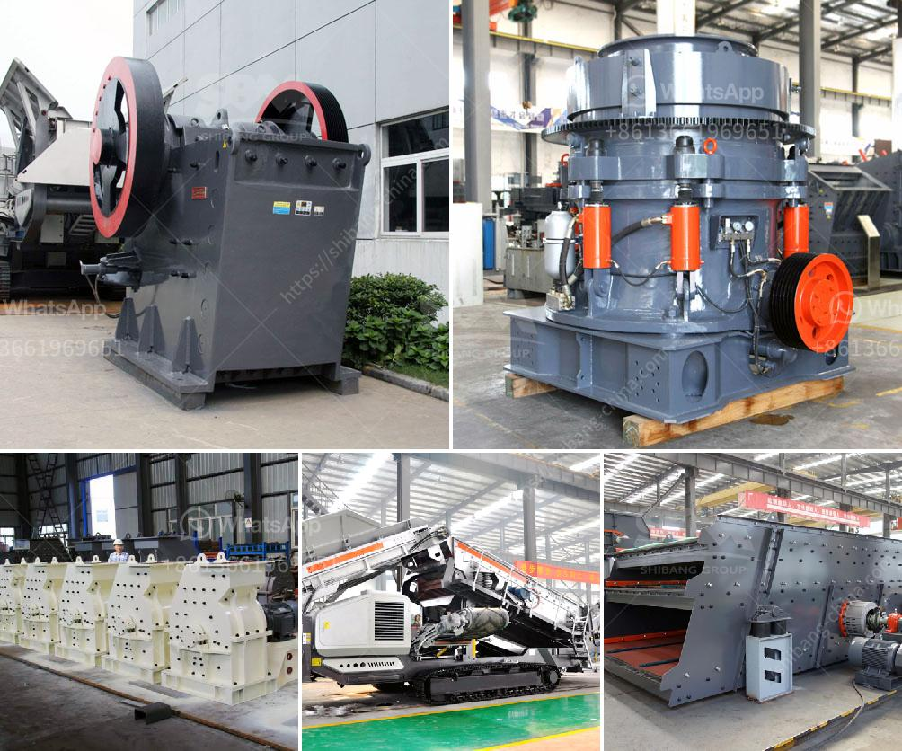

<h3>grinding mill installation operation</h3>
Grinding mill installation and operation are important for the efficient operation of the mill equipment. Proper installation and operation can ensure the smooth operation of the mill and extend its service life.

Firstly, before installation, the foundation of the grinding mill must be laid. The equipment should be placed on a flat and solid foundation to ensure the stability of the equipment during operation. The foundation should be able to withstand the weight of the equipment and any additional load that may be applied during operation.

After the foundation is laid, the grinding mill should be installed according to the manufacturer's instructions. The installation process typically includes the installation of the main unit, feeder, classifier, blower, and other auxiliary equipment. It is important to carefully follow the installation steps and check the equipment for any damage or defects before proceeding.

Once the installation is complete, the grinding mill should be properly connected to the power supply. The power supply should meet the requirements specified by the manufacturer to avoid any potential safety hazards. It is also important to check the electrical connections for any loose or damaged wires.

Before starting the grinding mill, it is necessary to conduct a comprehensive inspection of the equipment. This includes checking the lubrication system, the tightness of the bolts, and inspecting the wear parts such as grinding rollers and grinding rings. Any damaged or worn parts should be replaced to ensure the smooth operation of the mill.

When starting the grinding mill, it is important to gradually increase the speed and load to avoid sudden overloading. The mill should be operated within the recommended range of speed and load to avoid equipment damage or reduced efficiency. It is also important to monitor the temperature and vibration of the mill during operation. Any abnormal temperature or vibration should be addressed immediately to prevent further damage.

Regular maintenance and lubrication are essential for the proper operation of the grinding mill. The lubrication system should be checked and the oil levels should be maintained according to the manufacturer's recommendations. The grinding parts should be regularly inspected for any wear or damage and replaced if necessary. Additionally, the mill should be regularly cleaned to prevent the accumulation of debris, which can affect the efficiency of the grinding process.

In conclusion, proper installation and operation are crucial for the efficient and reliable operation of a grinding mill. Following the manufacturer's instructions, conducting regular inspections, and performing routine maintenance can ensure the longevity and optimal performance of the equipment.
<h3>Contact us</h3><ul><li><strong>Whatsapp:&nbsp;<a href="https://wa.me/8613661969651">+8613661969651</a></strong></li><li><a href="https://swt.shibang-china.com/?git&amp;zhl&amp;grinding mill installation operation"><strong>Online Service(chat now)</strong></a></li></ul><h3>Related</h3><ul><li><a href='industrial rotary dryers for sale india.md'>industrial rotary dryers for sale india</a></li><li><a href='grinding tools dealers in nigeria.md'>grinding tools dealers in nigeria</a></li><li><a href='crusher price china.md'>crusher price china</a></li><li><a href='sale of stone crushers.md'>sale of stone crushers</a></li><li><a href='jaw crusher application.md'>jaw crusher application</a></li></ul>