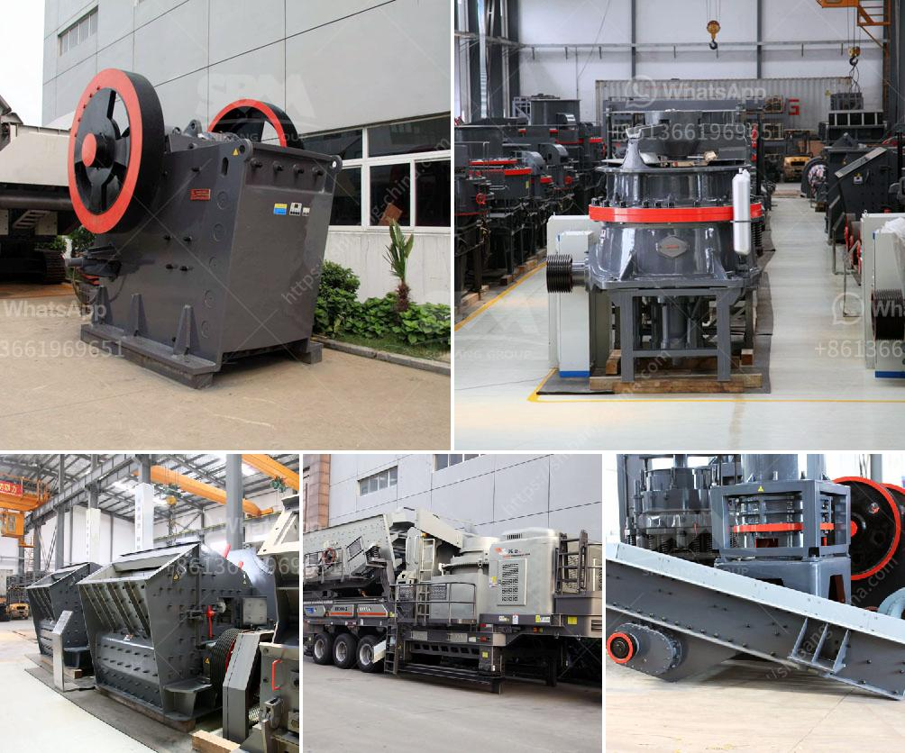

<h3>grinding mill machine roller mill size</h3>
Grinding mill machines have revolutionized the manufacturing industry, making it easier to produce quality products faster. Among the most commonly used grinding machines, roller mills have gained significant popularity due to their superior operational efficiency and unbeatable performance. Whether in the food processing, mining, or pharmaceutical industries, roller mills have become an indispensable tool.

One crucial factor that determines the effectiveness of a roller mill machine is its size. The roller mill size plays a significant role in enhancing the efficiency and productivity of the grinding process. In this article, we will delve into the importance of roller mill size and its impact on industrial productivity.

To start with, roller mills are designed with a set of cylindrical rollers that rotate around their axis in a horizontal or vertical orientation. These rollers are crucial in the grinding process as they crush and grind materials into desired sizes. The size of the rollers directly affects the output and grinding capabilities of the machine.

A roller mill with a larger size typically offers greater productivity. The larger the rollers, the higher the grinding capacity of the mill. With more substantial material-handling capabilities, larger roller mills can process larger volumes of materials within a shorter time frame. This is vital for industries that require high production outputs to keep up with growing demands.

Furthermore, roller mill size also impacts the fineness and uniformity of the ground materials. Smaller roller mills with finer sizes are more suited for grinding delicate and fragile materials. They ensure that the materials are finely-ground without being excessively crushed, preserving their quality and characteristics. On the other hand, larger roller mills are ideal for grinding denser, tough, and abrasive materials efficiently.

In industries such as mining and construction, roller mill size influences the particle size distribution of the ground materials. A roller mill with smaller-sized rollers can produce a narrower particle size distribution, resulting in a more consistent grind. This ensures that all particles are uniformly reduced in size, yielding a product of higher quality and consistency.

Moreover, roller mill size is closely associated with energy efficiency. Smaller roller mills generally require less energy to operate. This translates to cost savings in terms of electricity consumption. However, it's important to strike a balance between roller mill size and energy efficiency to ensure optimal performance. Selecting an oversized roller mill for a specific application may lead to excessive energy consumption, while an undersized one may result in reduced grinding capacity and increased wear and tear.

Finally, the size of the roller mills also influences their maintenance and operational costs. Larger roller mills often require more significant investments upfront, but they usually have lower maintenance costs in the long run. Their size enables them to withstand heavy workloads without compromising their performance. Conversely, smaller roller mills may have lower initial costs but could require more frequent maintenance due to their limitations in handling higher volumes.

In conclusion, the size of a grinding mill machine, specifically roller mills, significantly impacts the efficiency and productivity of industrial operations. Larger roller mills offer higher grinding capacities, allowing for increased production outputs. Furthermore, roller mill size affects the quality, uniformity of the ground materials, and energy consumption. By understanding the importance of roller mill size, industries can make informed decisions to optimize their grinding processes for enhanced efficiency and productivity.
<h3>Contact us</h3><ul><li><strong>Whatsapp:&nbsp;<a href="https://wa.me/8613661969651">+8613661969651</a></strong></li><li><a href="https://swt.shibang-china.com/?git&amp;zhl&amp;grinding mill machine roller mill size"><strong>Online Service(chat now)</strong></a></li></ul><h3>Related</h3><ul><li><a href='bentonite processing unit.md'>bentonite processing unit</a></li><li><a href='how much is a crusher mincer in malaysia.md'>how much is a crusher mincer in malaysia</a></li><li><a href='work of conveyor belts in peru.md'>work of conveyor belts in peru</a></li><li><a href='model project of stone powder.md'>model project of stone powder</a></li><li><a href='list of equipment used in iron ore mining.md'>list of equipment used in iron ore mining</a></li></ul>