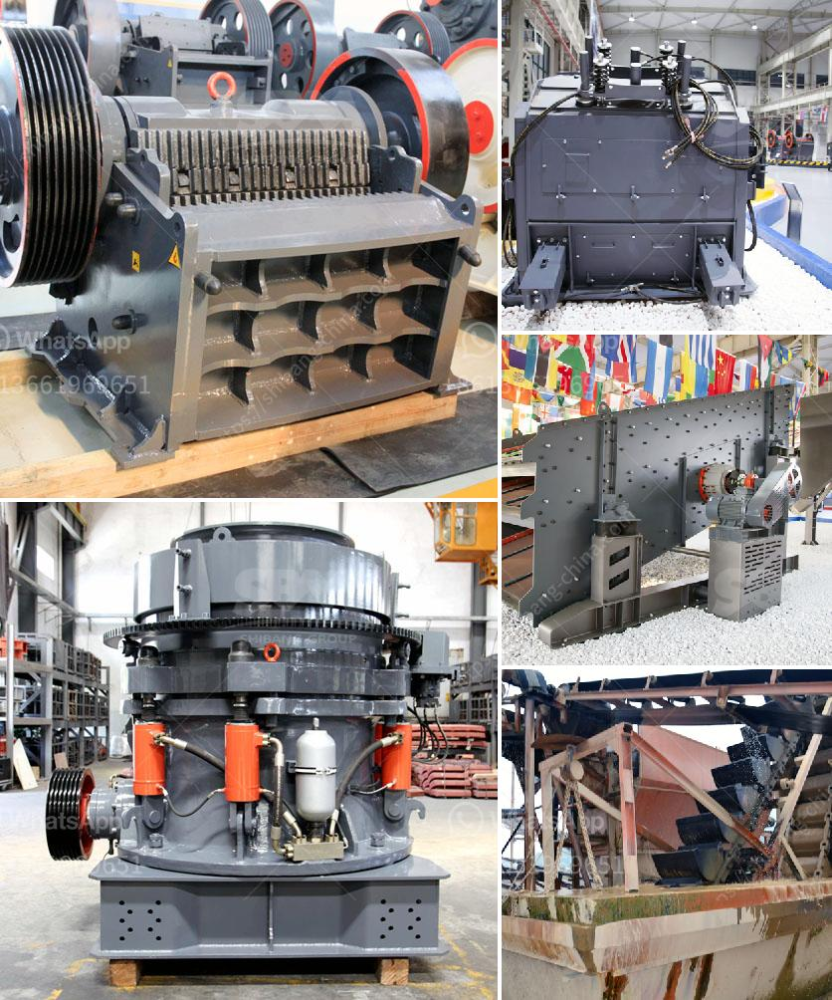

<h3>grinding mills ata</h3>
The mining industry plays a vital role in the global economy by extracting valuable minerals from the Earth's crust. As technology continues to advance, the need for efficient and reliable equipment becomes crucial to enhance productivity. One such equipment is the grinding mill, a key component in the mining process. In this article, we will explore the benefits of using ATA grinding mills and how they contribute to the overall efficiency in mining operations.

ATA, a leading manufacturer of industrial machinery, has been revolutionizing the mining industry with its high-quality grinding mills. These mills are specifically designed to grind and crush various types of minerals, such as gold, copper, iron ore, and limestone. They are built with precision and engineered to withstand the harsh conditions of mining operations, ensuring durability and longevity.

One of the significant advantages of ATA grinding mills is their ability to produce fine and uniform particles. In the mining process, raw materials are usually crushed into smaller particles to extract the desired minerals. ATA mills utilize advanced technology, including precision grinding mechanisms and high-speed rotations, to achieve this. By producing finer particles, the mills enhance the extraction process, resulting in increased mineral yield and reduced waste.

Furthermore, ATA grinding mills are highly energy-efficient, providing substantial cost savings for mining companies. Traditional grinding mills consume a considerable amount of energy, contributing to the overall operational expenses. However, ATA mills are designed with energy-saving features, such as specialized motors and advanced control systems, which optimize energy consumption. This not only reduces the environmental impact but also ensures significant savings on energy bills, making them a sustainable choice for mining operations.

Another noteworthy feature of ATA grinding mills is their versatility. They can be customized according to specific mining requirements, allowing for the effective processing of different minerals. ATA mills are available in various sizes, capacities, and configurations, enabling mining companies to select the most suitable mill for their needs. Whether it is dry or wet grinding, ATA mills provide flexibility and adaptability, ensuring maximum productivity and throughput.

Moreover, ATA mills are designed for easy maintenance and operation, minimizing downtime and maximizing uptime. Mining operations often require continuous processing, and any equipment failure can result in costly delays. ATA mills are engineered with user-friendly features, such as quick and easy access to internal components and intuitive control systems. This allows for efficient maintenance and troubleshooting, ensuring smooth and uninterrupted operations.

In conclusion, ATA grinding mills have become an integral part of the mining industry, enhancing efficiency and productivity. Their ability to produce fine and uniform particles, energy-saving features, versatility, and ease of maintenance make them a preferred choice for mining operations. With the ongoing advancements in technology, ATA continues to innovate and develop grinding mills that cater to the evolving needs of the mining industry. As a result, mining companies can maximize their mineral extraction while minimizing costs and environmental impact.
<h3>Contact us</h3><ul><li><strong>Whatsapp:&nbsp;<a href="https://wa.me/8613661969651">+8613661969651</a></strong></li><li><a href="https://swt.shibang-china.com/?git&amp;zhl&amp;grinding mills ata"><strong>Online Service(chat now)</strong></a></li></ul><h3>Related</h3><ul><li><a href='stone crusher machine for sale.md'>stone crusher machine for sale</a></li><li><a href='jaw crusher with different size supplier in india.md'>jaw crusher with different size supplier in india</a></li><li><a href='quarry dust in concrete sand making stone quarry.md'>quarry dust in concrete sand making stone quarry</a></li><li><a href='handmade stone crusher.md'>handmade stone crusher</a></li><li><a href='talc grinding mills usa.md'>talc grinding mills usa</a></li></ul>