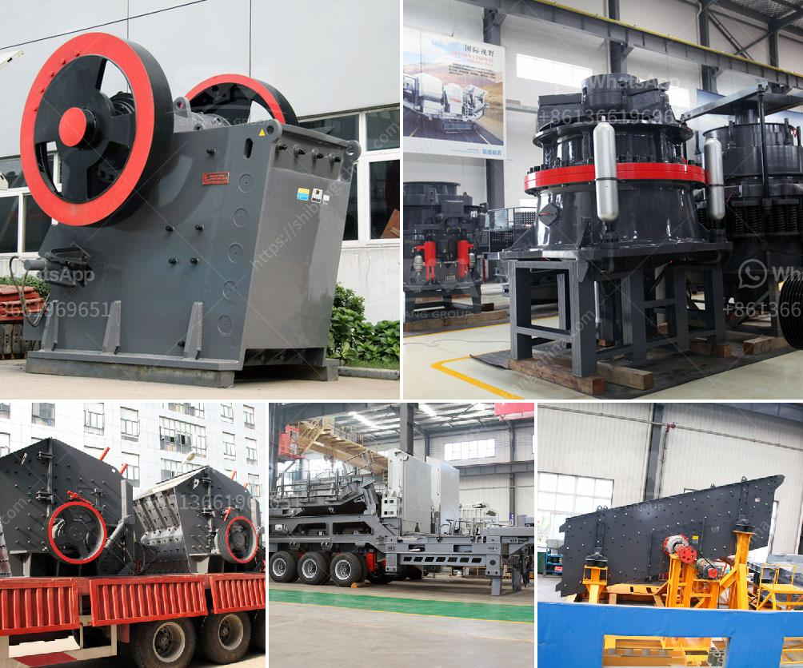

<h3>grinding mills for sale in harare</h3>
Harare, known until 1982 as Salisbury, is the capital and largest city of Zimbabwe. Located in the northeastern part of the country, Harare is a bustling metropolitan area renowned for its vibrant culture, infrastructure, and economy. As the economic hub of Zimbabwe, Harare is also home to a variety of industries, including mining, manufacturing, agriculture, and more. Among these industries, the milling industry plays a crucial role in providing essential products such as mealie meal, flour, and stock feed. In this article, we will explore the availability of grinding mills for sale in Harare, the capital city.

Grinding mills are equipment designed to break solid materials into small, manageable pieces. They are commonly used in the mining industry to process ore and extract valuable metals, such as gold and copper. However, grinding mills are also widely utilized in other industries, such as agriculture, food processing, and construction, to grind materials like grains, animal feed, cement, and more.

In Harare, grinding mills are in high demand due to the prevalence of agriculture and the need to process diverse raw materials into consumable products. The agricultural sector of Zimbabwe heavily relies on grinding mills to transform harvested crops into mealie meal, a staple food consumed by the majority of the population. Additionally, grinding mills are crucial in producing stock feed for livestock, ensuring their optimum health and productivity.

Finding quality grinding mills for sale in Harare can be a daunting task, given the numerous options available. However, with adequate research and knowledge, you can make an informed decision based on your specific needs and preferences. Here are a few factors to consider when searching for grinding mills in Harare:

1. Quality and Durability: Look for grinding mills made from high-quality materials and ensured to withstand the wear and tear of continuous processing. Mills made from robust materials like cast iron or stainless steel tend to offer better performance and longevity.

2. Efficiency and Power Consumption: Grinding mills should have high grinding efficiency to minimize energy consumption. Look for mills with efficient motor systems or those that can be operated using renewable energy sources such as solar power.

3. Size and Capacity: Consider the required capacity of the grinding mill based on your intended usage. Whether you need to process small or large quantities, there are different mills available to suit your specific needs.

4. After-Sales Services: Opt for a reputable supplier that offers reliable after-sales services and technical support. This ensures that any issues or maintenance requirements can be efficiently addressed to minimize downtime and maximize productivity.

5. Price and Affordability: Determine your budget and compare prices from different suppliers. While cost is an important factor, ensure that you prioritize quality and performance to make a wise investment.

In conclusion, grinding mills are essential equipment in various industries, particularly in agriculture and mining. In Harare, grinding mills are readily available to cater to the diverse processing needs of its inhabitants. By considering factors such as quality, efficiency, and after-sales services, you can find the ideal grinding mill that suits your requirements and contributes to the growth of your business.
<h3>Contact us</h3><ul><li><strong>Whatsapp:&nbsp;<a href="https://wa.me/8613661969651">+8613661969651</a></strong></li><li><a href="https://swt.shibang-china.com/?git&amp;zhl&amp;grinding mills for sale in harare"><strong>Online Service(chat now)</strong></a></li></ul><h3>Related</h3><ul><li><a href='jaw crushers manufacturers europe.md'>jaw crushers manufacturers europe</a></li><li><a href='harga stone crusher plant merk.md'>harga stone crusher plant merk</a></li><li><a href='propel stone crusher.md'>propel stone crusher</a></li><li><a href='crushing production line in equipment.md'>crushing production line in equipment</a></li><li><a href='jaw crusher size and capacity.md'>jaw crusher size and capacity</a></li></ul>