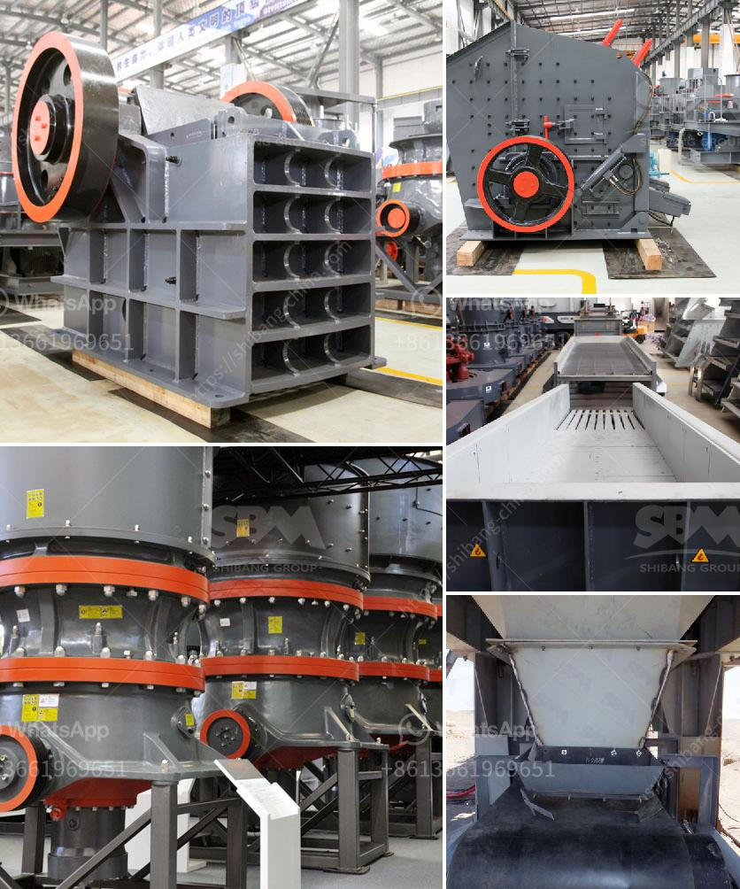

<h3>grinding plant improvement</h3>
Grinding plants are vital infrastructures in various industries, including cement, mining, and minerals processing. These plants are responsible for the crucial task of reducing raw materials into granules or fine powders, enabling the production of essential products. However, as technology advances and industry demands evolve, there is a continuous need to enhance grinding plants to enhance efficiency and productivity. This article explores various strategies and innovations to improve grinding plant operations.

One key area of improvement lies in the integration of automation and digitalization technologies. This enables real-time monitoring, control, and optimization of grinding processes, resulting in improved plant performance. By implementing advanced sensor technologies and data analysis tools, operators can accurately assess plant conditions, identify inefficiencies, and make necessary adjustments promptly. Automation also helps minimize human error, thus increasing productivity and reducing downtime.

Regularly upgrading grinding equipment is essential to improving plant performance. Introducing state-of-the-art machinery, such as more efficient ball mills, roll presses, or high-pressure grinding rolls (HPGR), can lead to significant productivity gains. These upgrades often involve enhancing wear resistance, reducing energy consumption, and ensuring better particle size distribution. Additionally, improving equipment maintenance practices and implementing proactive refurbishment programs can minimize unexpected breakdowns and improve overall reliability.

Energy consumption is a significant aspect that affects the overall efficiency of grinding plants. Implementing energy-efficient technologies, like vertical roller mills (VRM) or the use of grinding aids, allows for the reduction of power requirements while maintaining or improving quality. Incorporating technologies that recover and reuse waste heat generated during the grinding process can further enhance energy efficiency. Such measures not only reduce operational costs but also contribute to environmental sustainability goals.

Efficient material handling and proper storage are critical for grinding plant performance. Optimization techniques, such as advanced conveyor systems, automated stockyard management, and real-time inventory control, minimize downtime and improve throughput. Utilizing high-capacity storage facilities, including silos or domes, reduces material degradation risks and ensures consistent feed quality. Implementing measures to prevent material caking, lump formation, or moisture accumulation will enhance plant efficiency even further.

While technological advancements play a vital role in improving grinding plants, investing in staff training and skill development is equally important. Well-trained operators have a deep understanding of process parameters, enabling them to make better decisions and troubleshoot effectively when issues arise. Regular workshops, seminars, and hands-on training sessions help update knowledge and remain up to date with the latest industry practices, resulting in improved plant performance and long-term sustainability.

Grinding plant improvement is a continuous process to meet the ever-evolving needs of various industries. By embracing automation, upgrading equipment, adopting energy-efficient approaches, optimizing material handling and storage, and investing in staff training, grinding plants can achieve enhanced efficiency and productivity. These improvements not only increase profitability but also contribute to a more sustainable and environmentally friendly operation. It is crucial for industry stakeholders to proactively explore and implement these innovative strategies to stay competitive and meet the challenges of the future.
<h3>Contact us</h3><ul><li><strong>Whatsapp:&nbsp;<a href="https://wa.me/8613661969651">+8613661969651</a></strong></li><li><a href="https://swt.shibang-china.com/?git&amp;zhl&amp;grinding plant improvement"><strong>Online Service(chat now)</strong></a></li></ul><h3>Related</h3><ul><li><a href='jaw crusher supplier in jakarta.md'>jaw crusher supplier in jakarta</a></li><li><a href='mini mobile crusher.md'>mini mobile crusher</a></li><li><a href='granite stone hand engraving machine in india.md'>granite stone hand engraving machine in india</a></li><li><a href='kenya sand making machine.md'>kenya sand making machine</a></li><li><a href='rock quarry equipment for sale.md'>rock quarry equipment for sale</a></li></ul>