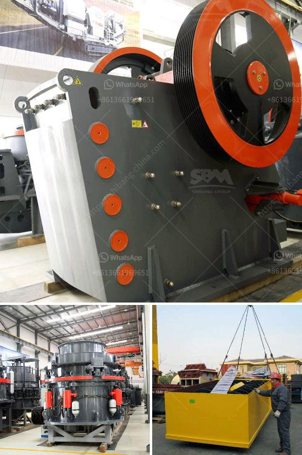

<h3>grinding raymond mill</h3>
Raymond mill, also known as Raymond grinding mill, is a versatile machine widely used in mineral grinding and industrial milling. This mill is known for its flexibility and ease of operation, making it a popular choice for grinding various materials.

One of the key features of the Raymond mill is its ability to grind both hard and soft materials. From limestone to gypsum, from talc to coal, this mill can effortlessly grind a wide range of materials with different hardness levels. This flexibility makes it a go-to solution for many industries, including mining, construction, chemical, and metallurgy.

The grinding process in the Raymond mill is based on the principle of material being ground by the action of the rotating rollers and the grinding ring. The grinding rollers rotate around the grinding chamber and exert a force on the material, crushing it against the grinding ring. The crushed material then passes through the classifier to achieve the desired fineness.

Aside from its versatility, the Raymond mill is also known for its high efficiency. The selected motor power and advanced grinding principle ensure that the mill operates at optimal speed, resulting in high processing capacity and low energy consumption. This not only saves operational costs but also reduces environmental impact.

Furthermore, the Raymond mill is equipped with a comprehensive set of safety features. The automatic control system monitors the grinding process and adjusts the operation parameters to ensure stable and safe operation. This guarantees the continuous production and minimizes the downtime caused by unexpected malfunctions.

In conclusion, the grinding Raymond mill is a reliable and efficient solution for various material grinding needs. Its versatility, high efficiency, and safety features make it a valuable asset for many industries. With proper operation and maintenance, this mill can provide consistent and high-quality grinding results for years to come. Whether it's for small-scale production or large-scale industrial operations, the Raymond mill is an excellent choice.
<h3>Contact us</h3><ul><li><strong>Whatsapp:&nbsp;<a href="https://wa.me/8613661969651">+8613661969651</a></strong></li><li><a href="https://swt.shibang-china.com/?git&amp;zhl&amp;grinding raymond mill"><strong>Online Service(chat now)</strong></a></li></ul><h3>Related</h3><ul><li><a href='calculation of cement ball mill capacity.md'>calculation of cement ball mill capacity</a></li><li><a href='price limestone rock crusher.md'>price limestone rock crusher</a></li><li><a href='how to specify a jaw crusher.md'>how to specify a jaw crusher</a></li><li><a href='stone quarries crusher in uganda.md'>stone quarries crusher in uganda</a></li><li><a href='proppant sand crusher manufacturing process.md'>proppant sand crusher manufacturing process</a></li></ul>