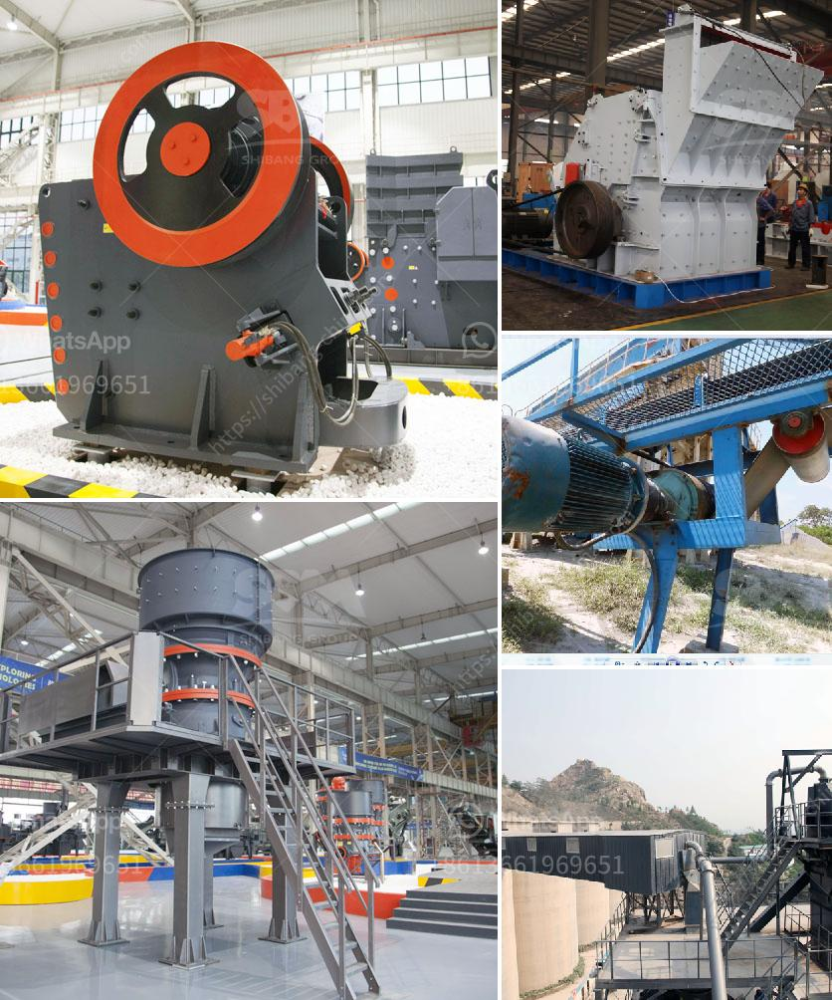

<h3>grinding tools dealers in nigeria</h3>
When it comes to industries in Nigeria, one cannot overlook the significance of grinding tools. From construction to manufacturing, grinding tools play a crucial role in shaping and finishing various materials. These tools are essential for achieving precise results and enhancing overall product quality. In the Nigerian market, there are numerous grinding tools dealers who cater to the diverse needs of industries across the country.

Grinding tools come in a variety of shapes and sizes, each designed for specific applications. From grinding wheels to disc grinders, these tools are used to grind, cut, and polish various materials such as metal, concrete, or wood. Grinding tools are pivotal in industries like construction, automotive, marine, and manufacturing.

One prominent grinding tools dealer in Nigeria is XYZ Industrial Equipment Ltd. With a proven track record and a wide range of grinding tools, XYZ Industrial Equipment Ltd is renowned for its quality products and exceptional customer service. They offer top-of-the-line grinding tools that are manufactured by leading brands, ensuring reliability, durability, and high performance.

Another notable grinding tools dealer is United Technical Equipment Co. Ltd. They have established themselves as a trusted supplier of grinding tools in Nigeria. United Technical Equipment Co. Ltd provides a comprehensive range of grinding tools, including surface grinding wheels, diamond grinding wheels, and abrasive discs. They are known for their prompt delivery and competitive pricing, catering to both small-scale businesses and large industrial units.

In addition to XYZ Industrial Equipment Ltd and United Technical Equipment Co. Ltd, there are several other grinding tool dealers operating in Nigeria. These dealers specialize in different types of grinding tools, enabling industries to find the specific tools they require for their unique applications.

The presence of grinding tool dealers in Nigeria not only provides easy access to these essential tools but also contributes to the productivity and efficiency of industries. By offering a diverse range of grinding tools, these dealers facilitate the smooth operations of a wide range of sector, including construction, manufacturing, and fabrication.

The grinding tools offered by these dealers are equipped with advanced features, such as precision control, powerful motors, and ergonomic designs. These features ensure easy handling, increased accuracy, and reduced downtime, thus enabling industries to increase their productivity and meet project deadlines effectively.

Furthermore, grinding tool dealers also offer after-sales support and maintenance services, ensuring that the tools remain in optimal condition. This support includes training on tool usage and safety protocols, as well as assistance with any technical issues that may arise.

In conclusion, the grinding tools dealers in Nigeria play a pivotal role in enhancing industrial productivity. With their extensive range of high-quality grinding tools, these dealers ensure that industries have access to the right tools for their specific needs. By providing top-notch products and reliable services, grinding tools dealers contribute to the growth and success of various industries in Nigeria.
<h3>Contact us</h3><ul><li><strong>Whatsapp:&nbsp;<a href="https://wa.me/8613661969651">+8613661969651</a></strong></li><li><a href="https://swt.shibang-china.com/?git&amp;zhl&amp;grinding tools dealers in nigeria"><strong>Online Service(chat now)</strong></a></li></ul><h3>Related</h3><ul><li><a href='cara mengelola debu crucher batu bara.md'>cara mengelola debu crucher batu bara</a></li><li><a href='stone crusher mobile plant di indonesia.md'>stone crusher mobile plant di indonesia</a></li><li><a href='ball mill in peru.md'>ball mill in peru</a></li><li><a href='jaw crusher prices saudi.md'>jaw crusher prices saudi</a></li><li><a href='silica sand washing steps.md'>silica sand washing steps</a></li></ul>