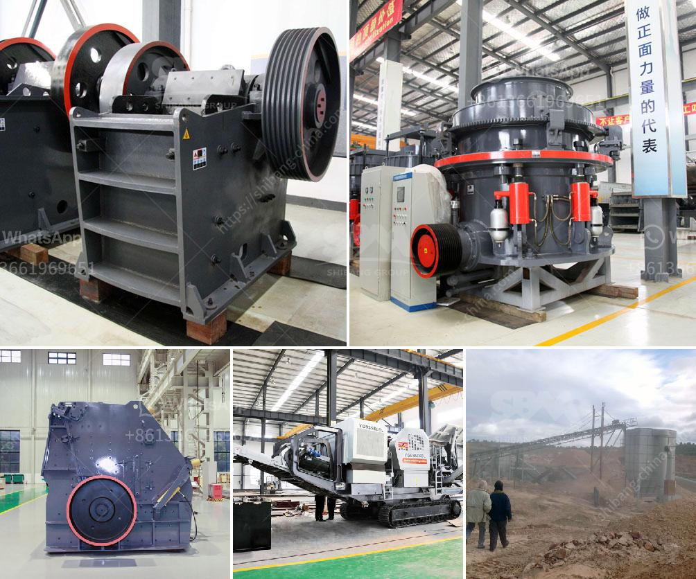

<h3>gypsum board connection machine</h3>
In the world of construction, time is money. Any delay or inefficiency can result in increased costs and lost opportunities. It is no wonder that construction companies are constantly on the lookout for innovative solutions that can help streamline their processes and improve productivity. One such solution is the gypsum board connection machine, a cutting-edge technology that is revolutionizing the field of drywall installation.

Also known as a drywall screw gun or a drywall screwdriver, the gypsum board connection machine is specifically designed to automate the process of attaching gypsum boards to the metal or wood studs. Traditionally, drywall installation has been a labor-intensive task, requiring skilled workers to manually drive screws into the studs. This process is not only time-consuming but also physically demanding, leading to fatigue and the risk of repetitive stress injuries among workers.

With the introduction of gypsum board connection machines, the entire process of drywall installation has been transformed. These machines are lightweight, ergonomically designed, and equipped with advanced technology that ensures precise and efficient screw driving. They can drive screws at a consistent speed and depth, greatly reducing the chances of over-driving or under-driving, which can compromise the integrity of the drywall.

One of the key advantages of using gypsum board connection machines is the significant improvement in productivity. These machines can drive screws much faster than manual methods, minimizing the time required to complete a project. This not only allows construction companies to meet tight deadlines but also enables them to take on more projects and increase their revenue. Moreover, the consistent and accurate screw driving achieved by these machines ensures a high-quality finish, reducing the need for rework and minimizing wastage of materials.

In addition to productivity gains, gypsum board connection machines also enhance worker safety. By automating the screw driving process, these machines eliminate the need for workers to physically exert themselves, reducing the risk of strain and injury. Furthermore, with their ergonomic design, these machines are comfortable to use, reducing operator fatigue during extended periods of use. This creates a safer and more conducive working environment, leading to increased job satisfaction among the construction workforce.

Furthermore, the gypsum board connection machines are relatively easy to operate and require minimal training. Their user-friendly interfaces and intuitive controls make them accessible to both experienced professionals and novice workers. This allows construction companies to quickly deploy these machines and reap the benefits of improved efficiency without significant delays or disruptions to ongoing projects.

In conclusion, the gypsum board connection machine is a game-changer in the field of drywall installation. Its ability to automate the screw driving process not only enhances productivity but also improves worker safety and ensures a high-quality finish. As the construction industry continues to evolve, embracing innovative technologies like the gypsum board connection machine will be crucial for companies looking to gain a competitive edge and deliver projects in a timely and cost-effective manner.
<h3>Contact us</h3><ul><li><strong>Whatsapp:&nbsp;<a href="https://wa.me/8613661969651">+8613661969651</a></strong></li><li><a href="https://swt.shibang-china.com/?git&amp;zhl&amp;gypsum board connection machine"><strong>Online Service(chat now)</strong></a></li></ul><h3>Related</h3><ul><li><a href='jaw crusher materials.md'>jaw crusher materials</a></li><li><a href='crusher manufactures in europe.md'>crusher manufactures in europe</a></li><li><a href='used small hand portable rock crusher.md'>used small hand portable rock crusher</a></li><li><a href='concrete crushing machines in kenya.md'>concrete crushing machines in kenya</a></li><li><a href='barite mining process with photos.md'>barite mining process with photos</a></li></ul>