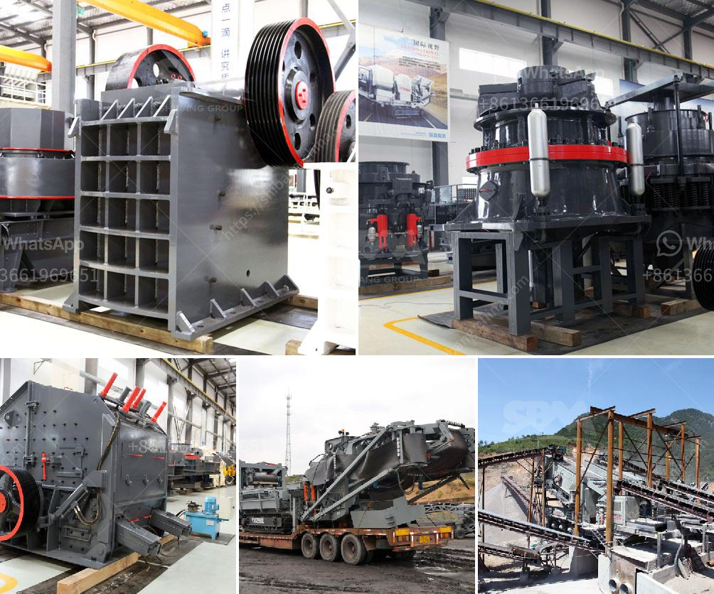

<h3>gypsum board machinery turkey manufacturers</h3>
Gypsum board, also known as drywall or plasterboard, is a common construction material used for walls and ceilings. It is made from a mineral called gypsum, which is a soft and lightweight rock that is crushed and mixed with water to form a paste. This paste is then spread onto a paper backing and dried to create gypsum board panels.

Turkey, a country located at the crossroads of Eastern Europe and Western Asia, has a thriving construction industry. As a result, it is home to several gypsum board machinery manufacturers that produce high-quality equipment for the production of gypsum board.

One such manufacturer is ABC Machinery, which is based in Istanbul, Turkey. ABC Machinery has been in the business of manufacturing gypsum board machinery for over 20 years. They offer a wide range of machinery, including gypsum board production lines, gypsum powder production lines, gypsum block production lines, and plaster of Paris production lines.

ABC Machinery takes pride in their ability to provide customized solutions to meet the specific needs of their clients. They have a team of experienced engineers and technicians who work closely with their customers to design and manufacture machinery that is not only efficient but also cost-effective.

Another reputable gypsum board machinery manufacturer in Turkey is V-Soon Industrial. V-Soon Industrial has been manufacturing gypsum board machinery for more than 10 years. They offer a comprehensive range of machinery, including gypsum board production lines, gypsum powder production lines, gypsum block production lines, and gypsum board laminating machines.

V-Soon Industrial is known for their dedication to quality and customer satisfaction. They use advanced technology and materials in the manufacturing process to ensure that their machinery is of the highest standard. They also provide excellent after-sales service, including installation, training, and maintenance support.

One more notable manufacturer in Turkey is Alke Makina. Alke Makina has been in the gypsum board machinery manufacturing business for over 30 years. They specialize in the production of gypsum board production lines and gypsum powder production lines.

Alke Makina takes pride in their commitment to innovation and continuous improvement. They invest heavily in research and development to stay ahead of the competition and deliver cutting-edge machinery to their customers. Their machinery is known for its reliability, efficiency, and long service life.

In conclusion, Turkey is home to several reputable gypsum board machinery manufacturers that offer a wide range of machinery for the production of gypsum board. These manufacturers, such as ABC Machinery, V-Soon Industrial, and Alke Makina, have years of experience, a commitment to quality, and a dedication to customer satisfaction. They are trusted by construction companies in Turkey and around the world for their reliable and efficient machinery.
<h3>Contact us</h3><ul><li><strong>Whatsapp:&nbsp;<a href="https://wa.me/8613661969651">+8613661969651</a></strong></li><li><a href="https://swt.shibang-china.com/?git&amp;zhl&amp;gypsum board machinery turkey manufacturers"><strong>Online Service(chat now)</strong></a></li></ul><h3>Related</h3><ul><li><a href='how to setting up of stone crusher unit.md'>how to setting up of stone crusher unit</a></li><li><a href='small scale gold cip processing.md'>small scale gold cip processing</a></li><li><a href='gold refining plant italia setup.md'>gold refining plant italia setup</a></li><li><a href='crusher mobile stone.md'>crusher mobile stone</a></li><li><a href='stone powder milling small machine.md'>stone powder milling small machine</a></li></ul>