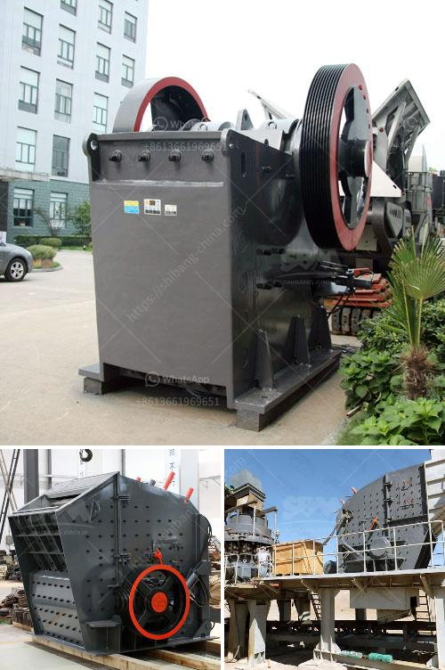

<h3>gypsum board manufacturing machine india</h3>
Gypsum board, also known as drywall or plasterboard, is widely used in construction projects as a primary building material for walls, ceilings, and partitions. It offers several advantages such as fire resistance, soundproofing, durability, and ease of installation. In India, the demand for gypsum board has been steadily growing due to the rapid urbanization and industrialization taking place in the country.

To meet the increasing demand, manufacturers in India have been investing in advanced gypsum board manufacturing machines. These machines are designed to automate the production process, ensuring higher productivity and efficiency. They are equipped with advanced technology that enables precise cutting, shaping, and drying of gypsum boards.

The manufacturing process of gypsum boards involves several steps. First, gypsum rock is crushed into smaller pieces and heated to remove excess moisture, resulting in a fine powder known as gypsum. This is then mixed with additives such as starch, foam agents, and paper fibers to enhance its properties. The mixture is then poured onto a moving paper surface, where it is covered with another layer of paper. The two paper layers sandwich the gypsum core, forming a rigid board. These boards are then cut into the desired sizes and dried in a kiln.

Gypsum board manufacturing machines in India are designed to automate these processes, reducing labor costs and ensuring consistent product quality. These machines have a high production capacity, allowing manufacturers to cater to the increasing demand for gypsum boards in the construction industry. Additionally, the machines are built to be energy-efficient, reducing overall operational costs and promoting sustainability.

Some of the leading manufacturers of gypsum board manufacturing machines in India include Saint-Gobain Gyproc, Knauf India, Everest Industries, and USG Boral India. These companies offer a wide range of machines that can be customized according to the specific requirements of the manufacturers. They also provide after-sales support, including installation, training, and maintenance services.

In conclusion, the demand for gypsum board in India has led to the development of advanced manufacturing machines. These machines offer numerous benefits such as increased productivity, efficiency, and cost savings for manufacturers. With the growth of the construction industry in India, the demand for gypsum board manufacturing machines is expected to continue to rise in the coming years.
<h3>Contact us</h3><ul><li><strong>Whatsapp:&nbsp;<a href="https://wa.me/8613661969651">+8613661969651</a></strong></li><li><a href="https://swt.shibang-china.com/?git&amp;zhl&amp;gypsum board manufacturing machine india"><strong>Online Service(chat now)</strong></a></li></ul><h3>Related</h3><ul><li><a href='hammer mills for bricks and blocks.md'>hammer mills for bricks and blocks</a></li><li><a href='industrial vibrating feeder.md'>industrial vibrating feeder</a></li><li><a href='bauxite beneficiation process.md'>bauxite beneficiation process</a></li><li><a href='gold milling equipment prices.md'>gold milling equipment prices</a></li><li><a href='runner crusher china price.md'>runner crusher china price</a></li></ul>