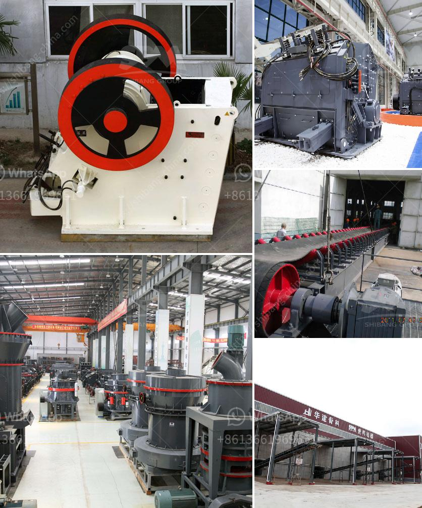

<h3>gypsum board plant</h3>
With the rapid growth of the construction industry, the demand for high-quality building materials has increased exponentially. One material that has gained immense popularity is gypsum board. Also known as drywall or plasterboard, gypsum board is a versatile construction material that is used for wall and ceiling construction.

At the heart of producing gypsum board lies the gypsum board plant. These manufacturing facilities are responsible for converting gypsum into a rigid board that can be easily installed in a variety of construction projects. The plant consists of several key components, including a gypsum calcination system, mixer, forming station, drying oven, cutter, and packaging unit.

The gypsum calcination system plays a vital role in creating the gypsum plaster. It involves the heating of the raw gypsum, which results in the removal of excess water and the transformation of the gypsum into a dry powder. This powder is then mixed with various additives and processed into a slurry in the mixer.

The slurry is then poured onto a moving belt where it passes through the forming station. Here, the slurry is sandwiched between two sheets of paper, forming a continuous board. The board is then transferred to a drying oven where the excess moisture is removed, ensuring a rigid and durable final product.

After the drying process, the board is cut into specific sizes using a cutter and packaged for distribution. These gypsum boards are conveniently lightweight, fire-resistant, and soundproof, making them an ideal choice for both residential and commercial buildings.

Apart from its excellent physical properties, gypsum board also contributes to sustainable building practices. Gypsum is a naturally occurring mineral, and the manufacturing process of gypsum board consumes less energy compared to other construction materials. Additionally, the gypsum board can be recycled multiple times, reducing waste and its impact on the environment.

In conclusion, the gypsum board plant is revolutionizing the construction industry by providing a reliable and sustainable solution for wall and ceiling construction. This versatile material not only ensures high-quality and durable structures but also contributes to reducing environmental impact. As the demand for gypsum board continues to rise, these plants play a crucial role in meeting the needs of the growing construction industry.
<h3>Contact us</h3><ul><li><strong>Whatsapp:&nbsp;<a href="https://wa.me/8613661969651">+8613661969651</a></strong></li><li><a href="https://swt.shibang-china.com/?git&amp;zhl&amp;gypsum board plant"><strong>Online Service(chat now)</strong></a></li></ul><h3>Related</h3><ul><li><a href='used stone crusher in germany.md'>used stone crusher in germany</a></li><li><a href='dolomite mining crusher process.md'>dolomite mining crusher process</a></li><li><a href='ball mill machine in pakistan.md'>ball mill machine in pakistan</a></li><li><a href='sand making crusher.md'>sand making crusher</a></li><li><a href='crushers and screeners for hire in usa.md'>crushers and screeners for hire in usa</a></li></ul>