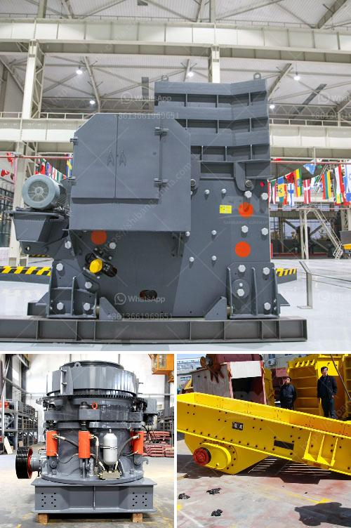

<h3>gypsum board preparation process</h3>
Gypsum board, also known as drywall or plasterboard, is a commonly used material in the construction industry. It is widely used for wall and ceiling installations due to its flexibility, fire resistance, and relatively easy installation process. However, before you can start applying gypsum board to your walls or ceilings, it is crucial to prepare the surface properly. In this article, we will explore the gypsum board preparation process, which involves planning, inspection, and surface treatment.

The first step in the gypsum board preparation process is to carefully plan the layout and measurement. Determine where the gypsum board will be installed and measure the dimensions accurately. Take into consideration any architectural features, such as windows, doors, or corners, and make sure to mark them on your plan. This step is crucial as it will help you estimate the quantity of gypsum board required and minimize wastage.

Once the planning is complete, it is important to conduct a thorough inspection of the surface where the gypsum board will be installed. Check for any existing damage, such as cracks, holes, or unevenness. These should be repaired before proceeding with the gypsum board installation. Use joint compound or spackling paste to fill in any holes or cracks and sand the surface until smooth. This will ensure a seamless finish once the gypsum board is in place.

After completing the surface repair, the next step is to clean the surface thoroughly. Remove any dirt, dust, or debris using a broom or vacuum cleaner. It is crucial to have a clean surface, as any particles left on the wall or ceiling can affect the adhesion of the gypsum board. Additionally, ensure that the surface is dry before proceeding with the installation.

Now comes the surface treatment stage. Apply a primer to the entire surface where the gypsum board will be installed. The primer serves multiple purposes: it helps improve the adhesion of the gypsum board, seals the surface, and provides a more uniform finish. Allow the primer to dry completely before moving forward.

Once the surface is primed and dry, it is time to start installing the gypsum board. Measure and cut the gypsum board panels to fit the dimensions of your plan, ensuring a snug fit. Begin by attaching the first panel to the corner or edge of the wall, using screws or nails. Make sure to leave a small gap between panels for expansion. Continue attaching the panels, ensuring they are level and plumb, until the entire surface is covered.

Finally, it is essential to finish the gypsum board installation by applying joint compound and tape to the seams between the panels. This process helps create a seamless appearance and strengthens the structural integrity of the gypsum board. Use a trowel to apply the joint compound and embed the tape into it. Smooth out any excess compound and let it dry. Once dry, sand the compound until it is smooth and apply additional layers if necessary.

In conclusion, the gypsum board preparation process is a vital step in achieving a flawless and durable finish. Proper planning, thorough inspection, surface treatment, and precise installation techniques play a crucial role in the success of your gypsum board installation. Take the time to prepare the surface adequately, and you will be rewarded with a beautiful and long-lasting result.
<h3>Contact us</h3><ul><li><strong>Whatsapp:&nbsp;<a href="https://wa.me/8613661969651">+8613661969651</a></strong></li><li><a href="https://swt.shibang-china.com/?git&amp;zhl&amp;gypsum board preparation process"><strong>Online Service(chat now)</strong></a></li></ul><h3>Related</h3><ul><li><a href='limestone mining crusher industry in nepal.md'>limestone mining crusher industry in nepal</a></li><li><a href='marble powder plant price pakistan.md'>marble powder plant price pakistan</a></li><li><a href='crushing plant manufacturers.md'>crushing plant manufacturers</a></li><li><a href='gold milling equipment prices.md'>gold milling equipment prices</a></li><li><a href='impact crusher vsi price alibaba.md'>impact crusher vsi price alibaba</a></li></ul>