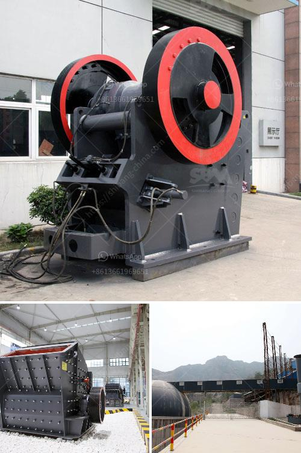

<h3>gypsum calcination processing plant equipments</h3>
Gypsum, a mineral found in sedimentary rock formations, is used in various industries such as construction, agriculture, and medicine. It is commonly used as a soil amendment, in the production of construction materials like plaster and drywall, and in the manufacturing of cement. To obtain high-quality gypsum for these applications, the mineral undergoes a calcination process in a gypsum calcination processing plant.

The gypsum calcination processing plant equipments mainly include crusher, grinding mill, conveyor, elevator, powder collector, dust remover, and control system. Depending on the different calcination methods employed, the system can be designed to use vertical kettle furnace, rotary kiln, or vertical boiling furnace.

The crusher machine breaks the large-sized gypsum ore into small pieces of less than 30mm. The conveyor transfers the crushed gypsum rock into the grinding mill evenly. The grinding mill reduces the gypsum into a fine powder, which is collected by the powder collector system. The powder collector system separates the gypsum powder from the airflow and stores it in a silo for further usage.

During the calcination process, the gypsum powder is heated in a kiln or furnace at a specific temperature. This temperature is critical as it determines the physical properties of the final product. The furnace is usually fueled by natural gas, coal, or biomass. The calcined gypsum, also known as plaster of Paris, is collected at the bottom of the furnace and sent to a cooling system.

The cooling system reduces the temperature of the calcined gypsum and prepares it for further processing. A conveyor or elevator system transfers the cooled gypsum to a storage area or directly to packaging and distribution.

To ensure environmental compliance, a dust removal system is an essential part of the gypsum calcination processing plant. The system filters out any dust or particulate matter generated during the crushing, grinding, and calcination processes. This helps to mitigate air pollution and maintain a clean and safe working environment.

In addition to the main processing equipment, a control system is employed to monitor and regulate the entire gypsum calcination process. The control system ensures optimal performance, efficient energy usage, and adherence to the desired production specifications.

With the appropriate gypsum calcination processing plant equipments, the gypsum industry can produce high-quality gypsum products for a wide range of applications. These equipments not only enhance the efficiency of the production process but also minimize energy consumption and reduce environmental impact.

In conclusion, the gypsum calcination processing plant equipments play a crucial role in the extraction and processing of gypsum ore. By utilizing these equipment, gypsum can be transformed into valuable products that benefit various industries.
<h3>Contact us</h3><ul><li><strong>Whatsapp:&nbsp;<a href="https://wa.me/8613661969651">+8613661969651</a></strong></li><li><a href="https://swt.shibang-china.com/?git&amp;zhl&amp;gypsum calcination processing plant equipments"><strong>Online Service(chat now)</strong></a></li></ul><h3>Related</h3><ul><li><a href='coal screening process.md'>coal screening process</a></li><li><a href='vertical mill working principle of the hydraulic.md'>vertical mill working principle of the hydraulic</a></li><li><a href='tph stationery stone crushing plant.md'>tph stationery stone crushing plant</a></li><li><a href='manufacturing cost of 6mm rolling mill.md'>manufacturing cost of 6mm rolling mill</a></li><li><a href='small gravel crushers.md'>small gravel crushers</a></li></ul>